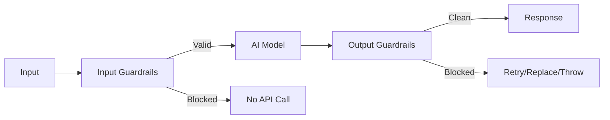

# AI SDK Guardrails

Production-ready input and output guardrails for the Vercel AI SDK. Stop wasteful requests, enforce quality, and protect sensitive data without changing how you use your models.

[](https://www.npmjs.com/package/ai-sdk-guardrails)
[](https://www.npmjs.com/package/ai-sdk-guardrails)
[](https://bundlephobia.com/package/ai-sdk-guardrails)
[](./LICENSE)


## Why this matters

- Save money by blocking low-value requests before they hit your model
- Ensure quality and safety on every response
- Drop-in middleware for any AI SDK model, making it easy to integrate

## TL;DR

Copy/paste minimal setup:

```ts
import { generateText } from 'ai';
import { openai } from '@ai-sdk/openai';
import { wrapWithGuardrails } from 'ai-sdk-guardrails';
import { piiDetector } from 'ai-sdk-guardrails/guardrails/input';
import { minLengthRequirement } from 'ai-sdk-guardrails/guardrails/output';

const model = wrapWithGuardrails(openai('gpt-4o'), {
  inputGuardrails: [piiDetector()],
  outputGuardrails: [minLengthRequirement(160)],
});

const { text } = await generateText({
  model,
  prompt: 'Write a friendly intro email.',
});
```

See runnable examples: [examples/README.md](./examples/README.md)

## Quickstart (30 seconds)

Install with your provider (OpenAI shown):

```bash
pnpm add ai-sdk-guardrails ai @ai-sdk/openai
# or: npm i ai-sdk-guardrails ai @ai-sdk/openai
# or: yarn add ai-sdk-guardrails ai @ai-sdk/openai
```

Wrap your model and keep using `generateText` as usual:

```ts
import { generateText } from 'ai';
import { openai } from '@ai-sdk/openai';
import { wrapWithGuardrails } from 'ai-sdk-guardrails';
import { piiDetector } from 'ai-sdk-guardrails/guardrails/input';

const model = wrapWithGuardrails(openai('gpt-4o'), {
  inputGuardrails: [piiDetector()],
});

const { text } = await generateText({
  model,
  prompt: 'Write a friendly intro email.',
});
```

## Contents

- Overview
- Concepts
- Installation
- Usage
  - Define a guardrail
  - Built-in helpers
- Streaming
- Auto Retry (utility and middleware)
- Error Handling
- API
- Examples
- Compatibility
- Architecture
- Contributing

## Concepts

- Input guardrails: Validate or block prompts to save cost and enforce rules before the call.
- Output guardrails: Check results for quality and safety. Block, replace, or retry as needed.
- Middleware: Guardrails wrap any model via AI SDK middleware. Your app code stays the same.

## Installation

See Quickstart for installation commands. Add providers you use as needed (e.g., `@ai-sdk/openai`, `@ai-sdk/mistral`).

## Usage

### Create custom guardrails

```ts
import { openai } from '@ai-sdk/openai';
import {
  defineInputGuardrail,
  defineOutputGuardrail,
  wrapWithGuardrails,
} from 'ai-sdk-guardrails';

const businessHours = defineInputGuardrail({
  name: 'business-hours',
  execute: async () => {
    const hr = new Date().getHours();
    return hr >= 9 && hr <= 17
      ? { tripwireTriggered: false }
      : { tripwireTriggered: true, message: 'Outside business hours' };
  },
});

const minQuality = defineOutputGuardrail({
  name: 'min-quality',
  execute: async ({ result }) => {
    return (result.text ?? '').length >= 80
      ? { tripwireTriggered: false }
      : { tripwireTriggered: true, message: 'Response too short' };
  },
});

const model = wrapWithGuardrails(openai('gpt-4o'), {
  inputGuardrails: [businessHours],
  outputGuardrails: [minQuality],
});
```

### Built-in helpers

```ts
import { openai } from '@ai-sdk/openai';
import { wrapWithGuardrails } from 'ai-sdk-guardrails';
import {
  piiDetector,
  blockedKeywords,
  contentLengthLimit,
} from 'ai-sdk-guardrails/guardrails/input';
import {
  sensitiveDataFilter,
  minLengthRequirement,
  confidenceThreshold,
} from 'ai-sdk-guardrails/guardrails/output';

const model = wrapWithGuardrails(openai('gpt-4o'), {
  inputGuardrails: [
    piiDetector(),
    blockedKeywords(['test', 'spam']),
    contentLengthLimit(4000),
  ],
  outputGuardrails: [
    sensitiveDataFilter(),
    minLengthRequirement(160),
    confidenceThreshold(0.6),
  ],
});
```

## Streaming

Works out of the box. By default, guardrails run after the stream ends (buffer mode). For early blocking, enable progressive mode.

```ts
import { streamText } from 'ai';
import { openai } from '@ai-sdk/openai';
import { wrapWithGuardrails } from 'ai-sdk-guardrails';
import { minLengthRequirement } from 'ai-sdk-guardrails/guardrails/output';

const model = wrapWithGuardrails(openai('gpt-4o'), {
  outputGuardrails: [minLengthRequirement(120)],
  // Evaluate as tokens arrive; stop or replace early when blocked
  streamMode: 'progressive',
  replaceOnBlocked: true,
});

const { textStream } = await streamText({
  model,
  prompt: 'Tell me a short story about a robot.',
});

for await (const delta of textStream) process.stdout.write(delta);
```

## Auto Retry

Choose what fits your flow:

- Standalone utility: Use `retry()` to wrap any generation function with your own validator and backoff.
- Middleware option: Add `retry` to output guardrails so retries run automatically when a check fails.

### Utility

```ts
import { retry } from 'ai-sdk-guardrails';
import { generateText } from 'ai';
import { openai } from '@ai-sdk/openai';

const result = await retry({
  generate: (params) => generateText({ model: openai('gpt-4o'), ...params }),
  params: { prompt: 'Explain backpropagation in depth.' },
  validate: (r) => ({
    blocked: (r.text ?? '').length < 500,
    message: 'Response too short',
  }),
  buildRetryParams: ({ lastParams }) => ({
    ...lastParams,
    maxOutputTokens: Math.max(800, (lastParams.maxOutputTokens ?? 400) + 300),
  }),
  maxRetries: 2,
});
```

### Middleware

```ts
import { generateText } from 'ai';
import { openai } from '@ai-sdk/openai';
import {
  wrapWithOutputGuardrails,
  defineOutputGuardrail,
} from 'ai-sdk-guardrails';
import { extractContent } from 'ai-sdk-guardrails/guardrails/output';

const minLengthGuardrail = defineOutputGuardrail<{ minChars: number }>({
  name: 'min-output-length',
  execute: async ({ result }) => {
    const { text } = extractContent(result);
    const minChars = text.length + 1;
    return text.length < minChars
      ? {
          tripwireTriggered: true,
          severity: 'medium',
          message: `Answer too short: ${text.length} < ${minChars}`,
          metadata: { minChars },
        }
      : { tripwireTriggered: false };
  },
});

const guarded = wrapWithOutputGuardrails(
  openai('gpt-4o'),
  [minLengthGuardrail],
  {
    replaceOnBlocked: false,
    retry: {
      maxRetries: 1,
      buildRetryParams: ({ summary, lastParams }) => ({
        ...lastParams,
        maxOutputTokens: Math.max(
          800,
          (lastParams.maxOutputTokens ?? 400) + 300,
        ),
        prompt: [
          ...(Array.isArray(lastParams.prompt) ? lastParams.prompt : []),
          {
            role: 'user' as const,
            content: [
              {
                type: 'text' as const,
                text: `Note: The previous answer ${summary.blockedResults[0]?.message}. Provide a comprehensive, detailed answer with examples.`,
              },
            ],
          },
        ],
      }),
    },
  },
);

const { text } = await generateText({
  model: guarded,
  prompt: 'Explain the significance of the Turing Test in AI history.',
});
```

Tip: Use backoff helpers if you need delays between retries: `exponentialBackoff`, `linearBackoff`, `fixedBackoff`, `jitteredExponentialBackoff`, or `backoffPresets`.

## Error Handling

Set `throwOnBlocked: true` to throw structured errors you can catch and turn into friendly messages.

```ts
import { isGuardrailsError } from 'ai-sdk-guardrails';

try {
  const { text } = await generateText({ model, prompt: '...' });
} catch (err) {
  if (isGuardrailsError(err)) {
    console.error('Guardrail blocked:', err.message);
    // err.results gives you details per guardrail
  } else {
    console.error('Unexpected error:', err);
  }
}
```

## API

| Export                                                                                                | Description                                                                      |
| ----------------------------------------------------------------------------------------------------- | -------------------------------------------------------------------------------- |
| `defineInputGuardrail`, `defineOutputGuardrail`                                                       | Create guardrails with clear messages, severity, and metadata.                   |
| `wrapWithInputGuardrails`, `wrapWithOutputGuardrails`, `wrapWithGuardrails`                           | Attach guardrails to any AI SDK model via middleware.                            |
| `executeInputGuardrails`, `executeOutputGuardrails`                                                   | Run guardrails programmatically (outside middleware) and get structured results. |
| `retry`, `retryHelpers`                                                                               | Standalone auto-retry utilities with validation and backoff.                     |
| `GuardrailsError`, `InputBlockedError`, `OutputBlockedError`, `isGuardrailsError`, `extractErrorInfo` | Structured errors and helpers for robust handling.                               |
| `exponentialBackoff`, `linearBackoff`, `fixedBackoff`, `jitteredExponentialBackoff`, `backoffPresets` | Backoff strategies to control retry pacing.                                      |

See source for built-in helpers:

- Input helpers: `./src/guardrails/input.ts`
- Output helpers: `./src/guardrails/output.ts`

## Examples

Browse runnable examples for streaming, compliance, safety, and more:

- Index and commands: [examples/README.md](./examples/README.md)

Quick starts

| Example                    | Description                     | File                                                                              |
| -------------------------- | ------------------------------- | --------------------------------------------------------------------------------- |
| Simple combined protection | Minimal input and output setup  | [07a-simple-combined-protection.ts](./examples/07a-simple-combined-protection.ts) |
| Auto retry on output       | Retry until output meets a rule | [32-auto-retry-output.ts](./examples/32-auto-retry-output.ts)                     |
| LLM judge auto-retry       | Judge feedback drives retry     | [33-judge-auto-retry.ts](./examples/33-judge-auto-retry.ts)                       |
| Expected tool use retry    | Enforce/guide tool usage        | [34-expected-tool-use-retry.ts](./examples/34-expected-tool-use-retry.ts)         |
| Weather assistant          | End-to-end input/output + retry | [33-blog-post-weather-assistant.ts](./examples/33-blog-post-weather-assistant.ts) |

Input safety

| Example            | Description                         | File                                                            |
| ------------------ | ----------------------------------- | --------------------------------------------------------------- |
| Input length limit | Enforce max input length            | [01-input-length-limit.ts](./examples/01-input-length-limit.ts) |
| Blocked keywords   | Block specific terms                | [02-blocked-keywords.ts](./examples/02-blocked-keywords.ts)     |
| PII detection      | Detect PII before calling the model | [03-pii-detection.ts](./examples/03-pii-detection.ts)           |
| Rate limiting      | Simple per-user rate limit          | [13-rate-limiting.ts](./examples/13-rate-limiting.ts)           |

Output safety

| Example                 | Description                         | File                                                                      |
| ----------------------- | ----------------------------------- | ------------------------------------------------------------------------- |
| Output length check     | Require min/max output length       | [04-output-length-check.ts](./examples/04-output-length-check.ts)         |
| Sensitive output filter | Filter secrets and PII in responses | [05-sensitive-output-filter.ts](./examples/05-sensitive-output-filter.ts) |
| Hallucination detection | Flag uncertain factual claims       | [19-hallucination-detection.ts](./examples/19-hallucination-detection.ts) |

Streaming

| Example           | Description                        | File                                                                              |
| ----------------- | ---------------------------------- | --------------------------------------------------------------------------------- |
| Streaming limits  | Apply limits in buffered streaming | [11-streaming-limits.ts](./examples/11-streaming-limits.ts)                       |
| Streaming quality | Quality checks with streaming      | [12-streaming-quality.ts](./examples/12-streaming-quality.ts)                     |
| Early termination | Stop streams early when blocked    | [28-streaming-early-termination.ts](./examples/28-streaming-early-termination.ts) |

Advanced

| Example                    | Description                   | File                                                                            |
| -------------------------- | ----------------------------- | ------------------------------------------------------------------------------- |
| Simple quality judge       | Cheaper model judges quality  | [15a-simple-quality-judge.ts](./examples/15a-simple-quality-judge.ts)           |
| Secret leakage scan        | Scan responses for secrets    | [18-secret-leakage-scan.ts](./examples/18-secret-leakage-scan.ts)               |
| SQL code safety            | Basic SQL safety checks       | [24-sql-code-safety.ts](./examples/24-sql-code-safety.ts)                       |
| Role hierarchy enforcement | Enforce role rules in prompts | [23-role-hierarchy-enforcement.ts](./examples/23-role-hierarchy-enforcement.ts) |

## Compatibility

- Runtime: Node.js 18+ recommended
- AI SDK: Compatible with AI SDK 5 (`ai@^5`); wraps any model
- For `generateObject`: for strict object validation, run `executeOutputGuardrails()` after generation

## Architecture



### Design principles

- Helper-first: simple, chainable APIs with great DX
- Composable: run multiple guardrails in any order
- Type-safe: rich TypeScript types and inference
- Sensible defaults: zero-config to start, full control when you need it

## Contributing

Issues and PRs are welcome.

## License

MIT © Jag Reehal. See LICENSE for details.
