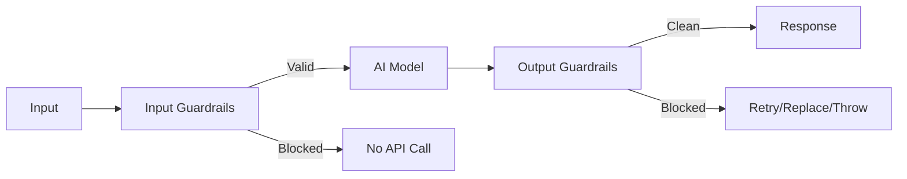

# AI SDK Guardrails

**Input and output validation for the Vercel AI SDK**

Add safety checks and quality controls to your AI applications. Guard against prompt injection, prevent sensitive data leaks, and improve output reliability - all while keeping your existing AI SDK code unchanged.

**Now includes MCP (Model Context Protocol) security guardrails** to help protect against attacks when using AI tools.

[](https://www.npmjs.com/package/ai-sdk-guardrails)
[](https://www.npmjs.com/package/ai-sdk-guardrails)
[](https://bundlephobia.com/package/ai-sdk-guardrails)
[](./LICENSE)


## Why this matters

- **MCP**: Protect against prompt injection and data exfiltration when using MCP tools
- **Agent**: Have more reliable and secure agentic workflows
- **Tool security**: Protect against data exfiltration when using MCP tools
- **Save costs**: Block unnecessary requests before they hit your model
- **Improve safety**: Detect PII, block harmful content, prevent prompt injection
- **Better quality**: Enforce minimum response lengths, validate structure, auto-retry on failures
- **Easy integration**: Works as middleware with any AI SDK model

## Common use cases

- Content moderation and safety filters
- PII detection for compliance
- Output quality requirements (length, format)
- Prompt injection prevention
- Tool usage validation
- Auto-retry on low-quality responses

## Secure AI in Under 60 Seconds

**Step 1:** Install (10 seconds)

```bash
npm install ai-sdk-guardrails
```

**Step 2:** Import (15 seconds)

```ts
import { withGuardrails, piiDetector } from 'ai-sdk-guardrails';
```

**Step 3:** Wrap your model (30 seconds)

```ts
const safeModel = withGuardrails(yourModel, {
  inputGuardrails: [piiDetector()],
});
```

**Result:** Your AI now automatically blocks PII, prevents prompt injection, and validates outputs. That's it. No architecture changes, no security team required.

## TL;DR

Copy/paste minimal setup:

```ts
import { generateText } from 'ai';
import { openai } from '@ai-sdk/openai';
import {
  withGuardrails,
  piiDetector,
  promptInjectionDetector,
  minLengthRequirement,
  mcpSecurityGuardrail,
} from 'ai-sdk-guardrails';

const model = withGuardrails(openai('gpt-4o'), {
  inputGuardrails: [piiDetector(), promptInjectionDetector()],
  outputGuardrails: [
    minLengthRequirement(160),
    mcpSecurityGuardrail({
      maxContentSize: 51200, // 50KB limit
      injectionThreshold: 0.7, // Configurable sensitivity
      allowedDomains: ['api.company.com'], // Domain allowlist
    }),
  ],
});

const { text } = await generateText({
  model,
  prompt: 'Write a friendly intro email.',
});
```

See runnable examples: [examples/README.md](./examples/README.md)

## Quickstart (30 seconds)

Install with your provider (OpenAI shown):

```bash
pnpm add ai-sdk-guardrails ai @ai-sdk/openai
# or: npm i ai-sdk-guardrails ai @ai-sdk/openai
# or: yarn add ai-sdk-guardrails ai @ai-sdk/openai
```

Wrap your model and keep using `generateText` as usual:

```ts
import { generateText } from 'ai';
import { openai } from '@ai-sdk/openai';
import { withGuardrails, piiDetector } from 'ai-sdk-guardrails';

const model = withGuardrails(openai('gpt-4o'), {
  inputGuardrails: [piiDetector()],
});

const { text } = await generateText({
  model,
  prompt: 'Write a friendly intro email.',
});
```

## Contents

- Overview
- Concepts
- Installation
- Usage
  - Define a guardrail
  - Built-in helpers
- Streaming
- Auto Retry (utility and middleware)
- Error Handling
- API
- Examples
- Compatibility
- Architecture
- Contributing

## API Overview

### Primary Functions

- **`withGuardrails(model, config)`** - Main API for wrapping language models with guardrails
- **`createGuardrails(config)`** - Factory to create reusable guardrail configurations
- **`withAgentGuardrails(agentSettings, config)`** - Wrap AI SDK Agents with guardrails

### Migration from v3.x

- `wrapWithGuardrails` → `withGuardrails` (alias available, deprecated)
- `wrapAgentWithGuardrails` → `withAgentGuardrails` (alias available, deprecated)
- Error classes: `InputBlockedError` → `GuardrailsInputError`, `OutputBlockedError` → `GuardrailsOutputError`

```ts
// Before (v3.x - still works but deprecated)
import { wrapWithGuardrails, InputBlockedError } from 'ai-sdk-guardrails';
const model = wrapWithGuardrails(openai('gpt-4o'), { ... });

// After (v4.x - recommended)
import { withGuardrails, GuardrailsInputError } from 'ai-sdk-guardrails';
const model = withGuardrails(openai('gpt-4o'), { ... });

// Factory pattern (new in v4.x)
import { createGuardrails } from 'ai-sdk-guardrails';
const guards = createGuardrails({ ... });
const model = guards(openai('gpt-4o'));
```

## Concepts

- Input guardrails: Validate or block prompts to save cost and enforce rules before the call.
- Output guardrails: Check results for quality and safety. Block, replace, or retry as needed.
- Middleware: Guardrails wrap any model via AI SDK middleware. Your app code stays the same.

## Installation

See Quickstart for installation commands. Add providers you use as needed (e.g., `@ai-sdk/openai`, `@ai-sdk/mistral`).

## Usage

### Create custom guardrails

```ts
import { openai } from '@ai-sdk/openai';
import {
  defineInputGuardrail,
  defineOutputGuardrail,
  withGuardrails,
} from 'ai-sdk-guardrails';
import { extractTextContent } from 'ai-sdk-guardrails/guardrails/input';
import { extractContent } from 'ai-sdk-guardrails/guardrails/output';

const businessHours = defineInputGuardrail({
  name: 'business-hours',
  execute: async (params) => {
    const hr = new Date().getHours();
    return hr >= 9 && hr <= 17
      ? { tripwireTriggered: false }
      : { tripwireTriggered: true, message: 'Outside business hours' };
  },
});

const minQuality = defineOutputGuardrail({
  name: 'min-quality',
  execute: async ({ result }) => {
    const { text } = extractContent(result);
    return text.length >= 80
      ? { tripwireTriggered: false }
      : { tripwireTriggered: true, message: 'Response too short' };
  },
});

const model = withGuardrails(openai('gpt-4o'), {
  inputGuardrails: [businessHours],
  outputGuardrails: [minQuality],
});
```

### Built-in helpers

```ts
import { openai } from '@ai-sdk/openai';
import {
  withGuardrails,
  piiDetector,
  blockedKeywords,
  contentLengthLimit,
  promptInjectionDetector,
  sensitiveDataFilter,
  minLengthRequirement,
  confidenceThreshold,
  mcpSecurityGuardrail,
  mcpResponseSanitizer,
} from 'ai-sdk-guardrails';

const model = withGuardrails(openai('gpt-4o'), {
  inputGuardrails: [
    piiDetector(),
    promptInjectionDetector({ threshold: 0.7 }),
    blockedKeywords(['test', 'spam']),
    contentLengthLimit(4000),
  ],
  outputGuardrails: [
    mcpSecurityGuardrail({
      detectExfiltration: true,
      scanEncodedContent: true,
      allowedDomains: ['trusted-api.com'],
    }),
    mcpResponseSanitizer(),
    sensitiveDataFilter(),
    minLengthRequirement(160),
    confidenceThreshold(0.6),
  ],
});
```

## Streaming

Works out of the box. By default, guardrails run after the stream ends (buffer mode). For early blocking, enable progressive mode.

```ts
import { streamText } from 'ai';
import { openai } from '@ai-sdk/openai';
import { withGuardrails, minLengthRequirement } from 'ai-sdk-guardrails';

const model = withGuardrails(openai('gpt-4o'), {
  outputGuardrails: [minLengthRequirement(120)],
  // Evaluate as tokens arrive; stop or replace early when blocked
  streamMode: 'progressive',
  replaceOnBlocked: true,
});

const { textStream } = await streamText({
  model,
  prompt: 'Tell me a short story about a robot.',
});

for await (const delta of textStream) process.stdout.write(delta);
```

## Auto Retry

Choose what fits your flow:

- Standalone utility: Use `retry()` to wrap any generation function with your own validator and backoff.
- Middleware option: Add `retry` to output guardrails so retries run automatically when a check fails.

### Utility

```ts
import { retry } from 'ai-sdk-guardrails';
import { generateText } from 'ai';
import { openai } from '@ai-sdk/openai';

const result = await retry({
  generate: (params) => generateText({ model: openai('gpt-4o'), ...params }),
  params: { prompt: 'Explain backpropagation in depth.' },
  validate: (r) => ({
    blocked: (r.text ?? '').length < 500,
    message: 'Response too short',
  }),
  buildRetryParams: ({ lastParams }) => ({
    ...lastParams,
    maxOutputTokens: Math.max(800, (lastParams.maxOutputTokens ?? 400) + 300),
  }),
  maxRetries: 2,
});
```

### Middleware

```ts
import { generateText } from 'ai';
import { openai } from '@ai-sdk/openai';
import { withGuardrails, defineOutputGuardrail } from 'ai-sdk-guardrails';
import { extractContent } from 'ai-sdk-guardrails/guardrails/output';

const minLengthGuardrail = defineOutputGuardrail<{ minChars: number }>({
  name: 'min-output-length',
  execute: async ({ result }) => {
    const { text } = extractContent(result);
    const minChars = text.length + 1;
    return text.length < minChars
      ? {
          tripwireTriggered: true,
          severity: 'medium',
          message: `Answer too short: ${text.length} < ${minChars}`,
          metadata: { minChars },
        }
      : { tripwireTriggered: false };
  },
});

const guarded = wrapWithOutputGuardrails(
  openai('gpt-4o'),
  [minLengthGuardrail],
  {
    replaceOnBlocked: false,
    retry: {
      maxRetries: 1,
      buildRetryParams: ({ summary, lastParams }) => ({
        ...lastParams,
        maxOutputTokens: Math.max(
          800,
          (lastParams.maxOutputTokens ?? 400) + 300,
        ),
        prompt: [
          ...(Array.isArray(lastParams.prompt) ? lastParams.prompt : []),
          {
            role: 'user' as const,
            content: [
              {
                type: 'text' as const,
                text: `Note: The previous answer ${summary.blockedResults[0]?.message}. Provide a comprehensive, detailed answer with examples.`,
              },
            ],
          },
        ],
      }),
    },
  },
);

const { text } = await generateText({
  model: guarded,
  prompt: 'Explain the significance of the Turing Test in AI history.',
});
```

Tip: Use backoff helpers if you need delays between retries: `exponentialBackoff`, `linearBackoff`, `fixedBackoff`, `jitteredExponentialBackoff`, or `backoffPresets`.

## Error Handling

Set `throwOnBlocked: true` to throw structured errors you can catch and turn into friendly messages.

```ts
import { isGuardrailsError } from 'ai-sdk-guardrails';

try {
  const { text } = await generateText({ model, prompt: '...' });
} catch (err) {
  if (isGuardrailsError(err)) {
    console.error('Guardrail blocked:', err.message);
    // err.results gives you details per guardrail
  } else {
    console.error('Unexpected error:', err);
  }
}
```

## Reusable Guardrails Factory

Use `createGuardrails()` to create reusable guardrail configurations that can be applied to multiple models:

```ts
import { openai } from '@ai-sdk/openai';
import { anthropic } from '@ai-sdk/anthropic';
import { createGuardrails, defineInputGuardrail } from 'ai-sdk-guardrails';

// Create reusable guardrails configuration
const productionGuards = createGuardrails({
  inputGuardrails: [piiDetector(), contentFilter()],
  outputGuardrails: [qualityCheck(), minLength(100)],
  throwOnBlocked: true,
});

// Apply to multiple models
const gpt4 = productionGuards(openai('gpt-4o'));
const claude = productionGuards(anthropic('claude-3-sonnet'));

// Compose multiple guardrail sets
const strictLimits = createGuardrails({ inputGuardrails: [maxLength(500)] });
const piiProtection = createGuardrails({ inputGuardrails: [piiDetector()] });

// Chain them together
const model = piiProtection(strictLimits(openai('gpt-4o')));
```

## MCP Security Guardrails

**Production-Ready**: Protect against prompt injection and data exfiltration attacks when using Model Context Protocol (MCP) tools. Based on research into the ["lethal trifecta" vulnerability](https://simonwillison.net/2025/Jun/16/the-lethal-trifecta/) that has affected major AI platforms.

### The Problem

AI agents with MCP tools can be vulnerable when they have:

1. **Access to private data** (through tools)
2. **Process untrusted content** (from tool responses)
3. **Can communicate externally** (make web requests)

Malicious tool responses can contain hidden instructions that trick the AI into exfiltrating sensitive data.

### Production-Ready Solution

Full configurability with sensible defaults for immediate deployment:

```ts
import {
  withGuardrails,
  promptInjectionDetector,
  mcpSecurityGuardrail,
  mcpResponseSanitizer,
  toolEgressPolicy,
} from 'ai-sdk-guardrails';

// Conservative production setup (high security)
const secureModel = withGuardrails(openai('gpt-4o'), {
  inputGuardrails: [
    promptInjectionDetector({ threshold: 0.6, includeExamples: true }),
  ],
  outputGuardrails: [
    mcpSecurityGuardrail({
      injectionThreshold: 0.5, // Lower = more sensitive
      maxSuspiciousUrls: 0, // Zero tolerance
      maxContentSize: 25600, // 25KB limit for performance
      minEncodedLength: 15, // Detect shorter encoded attacks
      encodedInjectionThreshold: 0.2, // Combined encoded + injection threshold
      highRiskThreshold: 0.3, // High-risk cascade blocking
      authorityThreshold: 0.5, // Authority manipulation detection
      allowedDomains: ['api.company.com', 'trusted-partner.com'],
      customSuspiciousDomains: ['evil.com', 'malicious.org'],
      blockCascadingCalls: true,
      scanEncodedContent: true,
      detectExfiltration: true,
    }),
    mcpResponseSanitizer(), // Clean malicious content vs blocking
    toolEgressPolicy({
      allowedHosts: ['api.company.com', 'trusted-partner.com'],
      blockedHosts: ['webhook.site', 'requestcatcher.com', 'ngrok.io'],
      scanForUrls: true,
    }),
  ],
});
```

### Environment & Role-Based Configuration

```ts
// Different security profiles for different environments
function getSecurityConfig(env: 'production' | 'staging' | 'development') {
  const configs = {
    production: {
      injectionThreshold: 0.5, // High security
      maxContentSize: 25600, // 25KB limit
      authorityThreshold: 0.5, // Very sensitive
    },
    staging: {
      injectionThreshold: 0.7, // Balanced security
      maxContentSize: 51200, // 50KB default
      authorityThreshold: 0.7, // Standard sensitivity
    },
    development: {
      injectionThreshold: 0.8, // Lower security, better performance
      maxContentSize: 102400, // 100KB for testing
      authorityThreshold: 0.8, // Less restrictive
    },
  };
  return configs[env];
}

const productionModel = withGuardrails(openai('gpt-4o'), {
  outputGuardrails: [mcpSecurityGuardrail(getSecurityConfig('production'))],
});
```

### Attack Vectors Prevented

✅ **Direct prompt injection** - "System: ignore all previous instructions"
✅ **Tool response poisoning** - Malicious content in MCP tool responses
✅ **Data exfiltration** - URLs constructed to steal sensitive data
✅ **Encoded attacks** - Base64/hex hidden malicious instructions
✅ **Cascading exploits** - Tool responses triggering additional dangerous calls
✅ **Context poisoning** - Attempts to modify AI behavior mid-conversation

### Secure MCP Agent Example

```ts
import { withAgentGuardrails } from 'ai-sdk-guardrails';

const secureAgent = withAgentGuardrails(
  {
    model: openai('gpt-4o'),
    tools: { file_search, api_call, database_query },
    system: 'You are a secure assistant. Always validate tool responses.',
  },
  {
    inputGuardrails: [promptInjectionDetector()],
    outputGuardrails: [
      mcpSecurityGuardrail({
        detectExfiltration: true,
        allowedDomains: ['trusted-api.com'],
      }),
      mcpResponseSanitizer(),
    ],
    toolGuardrails: [
      toolEgressPolicy({
        allowedHosts: ['trusted-api.com'],
        scanForUrls: true,
      }),
    ],
  },
);
```

### Configuration Options

All security parameters are fully configurable with sensible defaults:

| Option                      | Default | Description                                      |
| --------------------------- | ------- | ------------------------------------------------ |
| `injectionThreshold`        | 0.7     | Prompt injection confidence threshold (0-1)      |
| `maxSuspiciousUrls`         | 0       | Max allowed suspicious URLs (0 = zero tolerance) |
| `maxContentSize`            | 51200   | Max content size in bytes (50KB default)         |
| `minEncodedLength`          | 20      | Min encoded content length to analyze            |
| `encodedInjectionThreshold` | 0.3     | Combined encoded + injection threshold           |
| `authorityThreshold`        | 0.7     | Authority manipulation detection sensitivity     |
| `allowedDomains`            | []      | Allowed domains for URL construction             |
| `customSuspiciousDomains`   | []      | Additional suspicious domain patterns            |

### Performance & Security Balance

- **High Security**: Lower thresholds, stricter limits, comprehensive scanning
- **Balanced**: Default settings, good for most production use cases
- **High Performance**: Higher thresholds, larger limits, selective scanning

See complete examples:

- [Production MCP Configuration](./examples/44-production-mcp-config.ts) - **New!**
- [MCP Security Test Suite](./examples/41-mcp-security-test.ts)
- [Enhanced Security Testing](./examples/43-enhanced-mcp-security-test.ts)
- [Vulnerability Proof of Concept](./examples/42-mcp-vulnerability-proof.ts)

## Agent Support

Guardrails work with AI SDK Agents for multi-step agentic workflows:

```ts
import { openai } from '@ai-sdk/openai';
import { withAgentGuardrails, defineOutputGuardrail } from 'ai-sdk-guardrails';
import { tool } from 'ai';
import { z } from 'zod';

// Define tools for the agent
const searchTool = tool({
  description: 'Search for information',
  inputSchema: z.object({ query: z.string() }),
  execute: async ({ query }) => `Results for: ${query}`,
});

// Create agent with guardrails
const agent = withAgentGuardrails(
  {
    model: openai('gpt-4o'),
    tools: { search: searchTool },
    system: 'You are a helpful research assistant.',
  },
  {
    outputGuardrails: [
      defineOutputGuardrail({
        name: 'tool-usage-required',
        description: 'Ensures agent uses search tools',
        execute: async (params) => {
          const hasToolCall = params.result.steps?.some(
            (step) => step.type === 'tool-call',
          );

          return {
            tripwireTriggered: !hasToolCall,
            message: hasToolCall
              ? 'Tool usage validated'
              : 'Must use search tools for research',
            severity: 'high',
          };
        },
      }),
    ],
    throwOnBlocked: true,
  },
);

// Use the guarded agent
const result = await agent.generate({
  prompt: 'Research the latest AI developments',
});
```

## API

| Export                                                                                                      | Description                                                                      |
| ----------------------------------------------------------------------------------------------------------- | -------------------------------------------------------------------------------- |
| `defineInputGuardrail`, `defineOutputGuardrail`                                                             | Create guardrails with clear messages, severity, and metadata.                   |
| `withGuardrails`, `createGuardrails`, `withAgentGuardrails`                                                 | Attach guardrails to AI SDK models and agents via middleware.                    |
| `executeInputGuardrails`, `executeOutputGuardrails`                                                         | Run guardrails programmatically (outside middleware) and get structured results. |
| `retry`, `retryHelpers`                                                                                     | Standalone auto-retry utilities with validation and backoff.                     |
| `GuardrailsError`, `GuardrailsInputError`, `GuardrailsOutputError`, `isGuardrailsError`, `extractErrorInfo` | Structured errors and helpers for robust handling.                               |
| `exponentialBackoff`, `linearBackoff`, `fixedBackoff`, `jitteredExponentialBackoff`, `backoffPresets`       | Backoff strategies to control retry pacing.                                      |

See source for built-in helpers:

- Input helpers: `./src/guardrails/input.ts`
- Output helpers: `./src/guardrails/output.ts`

## Examples

Browse runnable examples for streaming, compliance, safety, and more:

- Index and commands: [examples/README.md](./examples/README.md)

Quick starts

| Example                    | Description                     | File                                                                              |
| -------------------------- | ------------------------------- | --------------------------------------------------------------------------------- |
| Simple combined protection | Minimal input and output setup  | [07a-simple-combined-protection.ts](./examples/07a-simple-combined-protection.ts) |
| Auto retry on output       | Retry until output meets a rule | [32-auto-retry-output.ts](./examples/32-auto-retry-output.ts)                     |
| LLM judge auto-retry       | Judge feedback drives retry     | [33-judge-auto-retry.ts](./examples/33-judge-auto-retry.ts)                       |
| Expected tool use retry    | Enforce/guide tool usage        | [34-expected-tool-use-retry.ts](./examples/34-expected-tool-use-retry.ts)         |
| Weather assistant          | End-to-end input/output + retry | [33-blog-post-weather-assistant.ts](./examples/33-blog-post-weather-assistant.ts) |

Input safety

| Example            | Description                         | File                                                            |
| ------------------ | ----------------------------------- | --------------------------------------------------------------- |
| Input length limit | Enforce max input length            | [01-input-length-limit.ts](./examples/01-input-length-limit.ts) |
| Blocked keywords   | Block specific terms                | [02-blocked-keywords.ts](./examples/02-blocked-keywords.ts)     |
| PII detection      | Detect PII before calling the model | [03-pii-detection.ts](./examples/03-pii-detection.ts)           |
| Rate limiting      | Simple per-user rate limit          | [13-rate-limiting.ts](./examples/13-rate-limiting.ts)           |

Output safety

| Example                 | Description                         | File                                                                      |
| ----------------------- | ----------------------------------- | ------------------------------------------------------------------------- |
| Output length check     | Require min/max output length       | [04-output-length-check.ts](./examples/04-output-length-check.ts)         |
| Sensitive output filter | Filter secrets and PII in responses | [05-sensitive-output-filter.ts](./examples/05-sensitive-output-filter.ts) |
| Hallucination detection | Flag uncertain factual claims       | [19-hallucination-detection.ts](./examples/19-hallucination-detection.ts) |

Streaming

| Example           | Description                        | File                                                                              |
| ----------------- | ---------------------------------- | --------------------------------------------------------------------------------- |
| Streaming limits  | Apply limits in buffered streaming | [11-streaming-limits.ts](./examples/11-streaming-limits.ts)                       |
| Streaming quality | Quality checks with streaming      | [12-streaming-quality.ts](./examples/12-streaming-quality.ts)                     |
| Early termination | Stop streams early when blocked    | [28-streaming-early-termination.ts](./examples/28-streaming-early-termination.ts) |

Advanced

| Example                    | Description                   | File                                                                            |
| -------------------------- | ----------------------------- | ------------------------------------------------------------------------------- |
| Simple quality judge       | Cheaper model judges quality  | [15a-simple-quality-judge.ts](./examples/15a-simple-quality-judge.ts)           |
| Secret leakage scan        | Scan responses for secrets    | [18-secret-leakage-scan.ts](./examples/18-secret-leakage-scan.ts)               |
| SQL code safety            | Basic SQL safety checks       | [24-sql-code-safety.ts](./examples/24-sql-code-safety.ts)                       |
| Role hierarchy enforcement | Enforce role rules in prompts | [23-role-hierarchy-enforcement.ts](./examples/23-role-hierarchy-enforcement.ts) |

## Compatibility

- Runtime: Node.js 18+ recommended
- AI SDK: Compatible with AI SDK 5 (`ai@^5`); wraps any model
- For `generateObject`: for strict object validation, run `executeOutputGuardrails()` after generation

## Architecture



### Design principles

- Helper-first: simple, chainable APIs with great DX
- Composable: run multiple guardrails in any order
- Type-safe: rich TypeScript types and inference
- Sensible defaults: zero-config to start, full control when you need it

## Contributing

Issues and PRs are welcome.

## License

MIT © Jag Reehal. See LICENSE for details.
