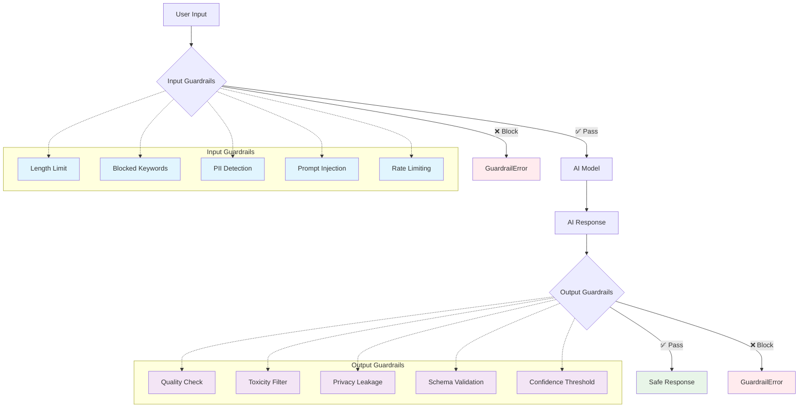

# AI SDK Guardrails

The safest way to build production AI applications with the Vercel AI SDK. A comprehensive TypeScript library that protects your AI systems with intelligent input and output validation, streaming safety, and enterprise-grade reliability.

[](https://www.npmjs.com/package/ai-sdk-guardrails)
[](https://www.npmjs.com/package/ai-sdk-guardrails)
[](https://www.typescriptlang.org/)
[](https://opensource.org/licenses/MIT)

## Why AI SDK Guardrails?

Building AI applications is exciting, but deploying them safely in production requires careful consideration. This library provides the safety net you need without sacrificing developer experience or performance.

### 🛡️ Complete Protection

Validate inputs before they reach your model and outputs before they reach users. Catch harmful content, PII, prompt injections, and more.

### ⚡ Real-time Streaming Safety

The only guardrails library with true streaming support. Monitor and stop streams in real-time when safety violations occur.

### 🎯 Built for Vercel AI SDK

First-class support for all AI SDK functions: `generateText`, `generateObject`, `streamText`, `streamObject`, and `embed`.

### 🔧 Developer Friendly

Simple API with TypeScript autocompletion, helpful error messages, and sensible defaults. Start safe in minutes, not hours.

## How It Works



## Installation

```bash
npm install ai-sdk-guardrails
# or
pnpm add ai-sdk-guardrails
# or
yarn add ai-sdk-guardrails
```

## Quick Start

Get started with production-ready guardrails in just a few lines:

```typescript
import { generateTextWithGuardrails } from 'ai-sdk-guardrails';
import { blockedKeywords } from 'ai-sdk-guardrails/guardrails/input';
import { outputLengthLimit } from 'ai-sdk-guardrails/guardrails/output';
import { openai } from '@ai-sdk/openai';

const result = await generateTextWithGuardrails(
  {
    model: openai('gpt-4-turbo'),
    prompt: 'Write a helpful response about web security',
  },
  {
    inputGuardrails: [blockedKeywords(['hack', 'exploit', 'vulnerability'])],
    outputGuardrails: [outputLengthLimit(500)],
  },
);

console.log(result.text);
```

## Core Concepts

### Input Guardrails

Input guardrails validate prompts before they reach your AI model. Use them to:

- Block harmful or inappropriate content
- Enforce length limits
- Detect prompt injection attempts
- Remove personally identifiable information (PII)
- Implement rate limiting

```typescript
import { createInputGuardrail } from 'ai-sdk-guardrails';

const mathHomeworkDetector = createInputGuardrail(
  'math-homework-detector',
  'Prevents direct homework solving requests',
  (context) => {
    const { prompt } = context;
    const homeworkPatterns = [
      /solve this equation/i,
      /what is \d+ [\+\-\*\/] \d+/i,
      /calculate the answer/i,
    ];

    const isHomework = homeworkPatterns.some((pattern) =>
      pattern.test(prompt || ''),
    );

    return {
      tripwireTriggered: isHomework,
      message: isHomework ? 'Direct homework solving detected' : undefined,
      suggestion: isHomework
        ? 'Try asking about the concepts instead'
        : undefined,
    };
  },
);
```

### Output Guardrails

Output guardrails validate AI responses before they reach users. Use them to:

- Ensure response quality
- Block sensitive information
- Enforce formatting requirements
- Validate against schemas
- Check confidence levels

```typescript
import { createOutputGuardrail } from 'ai-sdk-guardrails';

const sensitiveInfoFilter = createOutputGuardrail(
  'sensitive-info-filter',
  (context) => {
    const { text } = context.result;
    const sensitivePatterns = [
      /password:\s*\w+/i,
      /api[_-]?key:\s*\w+/i,
      /\b\d{3}-\d{2}-\d{4}\b/, // SSN format
    ];

    const hasSensitive = sensitivePatterns.some((pattern) =>
      pattern.test(text || ''),
    );

    return {
      tripwireTriggered: hasSensitive,
      message: hasSensitive
        ? 'Response contains sensitive information'
        : undefined,
      severity: hasSensitive ? 'critical' : 'low',
    };
  },
);
```

### Streaming Guardrails

Protect streaming responses in real-time. The stream automatically stops if guardrails detect violations:

```typescript
import { streamTextWithGuardrails } from 'ai-sdk-guardrails';

const stream = await streamTextWithGuardrails(
  {
    model: openai('gpt-4-turbo'),
    prompt: 'Generate a long story...',
  },
  {
    outputGuardrails: [
      outputLengthLimit(1000),
      blockedOutputContent(['inappropriate', 'offensive']),
    ],
    onOutputBlocked: (error) => {
      console.error('Stream blocked:', error.reason);
    },
  },
);

// The stream will automatically stop if guardrails trigger
for await (const chunk of stream.textStream) {
  process.stdout.write(chunk);
}
```

## Built-in Guardrails

### Input Guardrails

```typescript
import {
  lengthLimit,
  blockedWords,
  blockedKeywords,
  profanityFilter,
  promptInjectionDetector,
  piiDetector,
  toxicityDetector,
  mathHomeworkDetector,
  codeGenerationLimiter,
} from 'ai-sdk-guardrails/guardrails/input';

// Content filters
const contentGuardrails = [
  lengthLimit(1000),
  blockedWords(['spam', 'hack']),
  profanityFilter(['custom', 'words']),
  toxicityDetector(0.7), // threshold
];

// Security guardrails
const securityGuardrails = [promptInjectionDetector(), piiDetector()];

// Educational guardrails
const educationGuardrails = [
  mathHomeworkDetector(),
  codeGenerationLimiter(['javascript', 'python']),
];
```

### Output Guardrails

```typescript
import {
  lengthLimit,
  blockedContent,
  jsonValidation,
  confidenceThreshold,
  toxicityFilter,
  schemaValidation,
  tokenUsageLimit,
  performanceMonitor,
  hallucinationDetector,
  biasDetector,
  factualAccuracyChecker,
  privacyLeakageDetector,
  contentConsistencyChecker,
  complianceChecker,
} from 'ai-sdk-guardrails/guardrails/output';

// Quality guardrails
const qualityGuardrails = [
  lengthLimit(500),
  confidenceThreshold(0.8),
  hallucinationDetector(0.7),
  factualAccuracyChecker(true), // require sources
];

// Safety guardrails
const safetyGuardrails = [
  toxicityFilter(0.5),
  biasDetector(),
  privacyLeakageDetector(),
  complianceChecker(['GDPR', 'HIPAA']),
];

// Performance guardrails
const performanceGuardrails = [
  tokenUsageLimit(1000),
  performanceMonitor(5000), // max 5 seconds
];
```

## Integration with Autoevals

Use [Autoevals](https://github.com/braintrust-data/autoevals) for sophisticated AI quality evaluation as guardrails:

```typescript
import { Factuality, init } from 'autoevals';
import { createOutputGuardrail } from 'ai-sdk-guardrails';

function createFactualityGuardrail({
  expected,
  minScore,
}: {
  expected: string;
  minScore: number;
}) {
  return createOutputGuardrail('factuality-check', async (context) => {
    const { text } = extractContent(context.result);
    const { prompt } = extractTextContent(context.input);

    const evalResult = await Factuality({
      output: text,
      expected,
      input: prompt || '',
      model: MODEL_NAME,
    });

    const isFactual = (evalResult.score || 0) >= minScore;

    return {
      tripwireTriggered: !isFactual,
      message: isFactual
        ? `Factual content (score: ${evalResult.score})`
        : `Factual accuracy too low (score: ${evalResult.score}, required: ${minScore})`,
      severity: isFactual ? 'low' : 'high',
      metadata: {
        factualityScore: evalResult.score,
        rationale: evalResult.metadata?.rationale,
        expected,
        minScore,
      },
      suggestion: isFactual
        ? undefined
        : 'Please provide more accurate information',
    };
  });
}

// Usage
const result = await generateTextWithGuardrails(
  {
    model: openai('gpt-4-turbo'),
    prompt: 'Which country has the highest population?',
  },
  {
    outputGuardrails: [
      createFactualityGuardrail({
        expected: 'China',
        minScore: 0.7,
      }),
    ],
  },
);
```

## Error Handling

Guardrails provide rich error information to help you handle violations gracefully:

```typescript
import { GuardrailError } from 'ai-sdk-guardrails';

try {
  const result = await generateTextWithGuardrails(params, guardrails);
} catch (error) {
  if (error instanceof GuardrailError) {
    // Access detailed error information
    console.log('Guardrail triggered:', error.guardrailName);
    console.log('Reason:', error.reason);
    console.log('Type:', error.type); // 'input' or 'output'

    // Get all issues
    error.issues.forEach((issue) => {
      console.log(`${issue.guardrail}: ${issue.message}`);
      console.log('Severity:', issue.severity);
      console.log('Suggestion:', issue.suggestion);
    });

    // Use helper methods
    const summary = error.getSummary();
    console.log(`Total issues: ${summary.totalIssues}`);
    console.log(
      `Guardrails triggered: ${summary.guardrailsTriggered.join(', ')}`,
    );
  }
}
```

## Advanced Usage

### Custom Validation Logic

Create sophisticated guardrails for your specific needs:

```typescript
const businessLogicGuardrail = createInputGuardrail(
  'business-logic-validator',
  'Ensures requests meet business requirements',
  async (context) => {
    const { prompt, messages } = context;

    // Implement your custom logic
    const validationResult = await validateBusinessRules({
      content: prompt,
      history: messages,
    });

    return {
      tripwireTriggered: !validationResult.isValid,
      message: validationResult.error,
      metadata: validationResult.details,
      severity: validationResult.severity,
      suggestion: validationResult.suggestion,
    };
  },
);
```

### Composing Guardrails

Combine multiple guardrail configurations for different scenarios:

```typescript
// Development guardrails (more lenient)
const devGuardrails = {
  inputGuardrails: [lengthLimit(2000)],
  throwOnBlocked: false,
  onInputBlocked: (error) => console.warn('Dev warning:', error),
};

// Production guardrails (strict)
const prodGuardrails = {
  inputGuardrails: [lengthLimit(500), blockedKeywords(['test', 'debug'])],
  outputGuardrails: [confidenceThreshold(0.9), complianceChecker(['GDPR'])],
  throwOnBlocked: true,
};

// Use based on environment
const guardrails =
  process.env.NODE_ENV === 'production' ? prodGuardrails : devGuardrails;
```

### Object Generation with Schema Validation

Validate structured outputs with custom business logic:

```typescript
import { z } from 'zod';

const userSchema = z.object({
  name: z.string(),
  age: z.number().min(0).max(120),
  email: z.string().email(),
});

const schemaValidator = createOutputGuardrail(
  'schema-validator',
  async (context) => {
    const { object } = extractContent(context.result);
    try {
      userSchema.parse(object);
      return { tripwireTriggered: false };
    } catch (error) {
      return {
        tripwireTriggered: true,
        message: 'Schema validation failed',
        severity: 'high',
        metadata: { validationError: error.message },
      };
    }
  },
);

const result = await generateObjectWithGuardrails(
  {
    model: openai('gpt-4-turbo'),
    prompt: 'Create a user profile for John Doe, age 30',
    schema: userSchema,
  },
  {
    outputGuardrails: [schemaValidator],
  },
);
```

## Best Practices

### 1. Layer Your Defence

Use multiple guardrails for comprehensive protection:

```typescript
const guardrails = {
  inputGuardrails: [
    // First line: Block obvious threats
    promptInjectionDetector(),
    blockedKeywords(['malicious', 'exploit']),

    // Second line: Quality control
    lengthLimit(1000),

    // Third line: Business logic
    customBusinessRules(),
  ],
  outputGuardrails: [
    // Ensure quality
    confidenceThreshold(0.7),

    // Ensure safety
    toxicityFilter(),
    privacyLeakageDetector(),
  ],
};
```

### 2. Handle Errors Gracefully

Provide helpful feedback when guardrails trigger:

```typescript
onInputBlocked: (error) => {
  // Map technical errors to user-friendly messages
  const userMessage =
    {
      'content-length-limit': 'Your message is too long. Please shorten it.',
      'blocked-keywords': 'Your request contains restricted content.',
      'pii-detector': 'Please remove personal information from your request.',
    }[error.guardrailName] || 'Your request could not be processed.';

  return userMessage;
};
```

### 3. **Publishing Process (Using Changesets)**

You're already set up with **Changesets** which is the recommended approach. Here's the process:

#### **Step 1: Create a Changeset**

```bash
npx changeset
```

This will:

- Ask you what type of change (patch/minor/major)
- Let you write a summary of changes
- Create a changeset file

#### **Step 2: Version and Publish**

You have two options:

**Option A: Manual Control**

```bash
# 1. Run CI to ensure everything passes
npm run ci

# 2. Version the package (reads changesets and updates version)
npx changeset version

# 3. Publish to npm
npx changeset publish
```

**Option B: Use Your Local Release Script**

```bash
npm run local-release
```

This runs: `npm run ci && changeset version && changeset publish`

### 4. **First Release Steps**

For your first release, I recommend:

1. **Fix any remaining issues** (like the prettier formatting):

```bash
npm run format
```

2. **Create your first changeset**:

```bash
npx changeset
```

- Select "major" (since this is 0.0.1 → 1.0.0)
- Write: "Initial release of AI SDK Guardrails"

3. **Release it**:

```bash
npm run local-release
```

### 5. **Package Name Assessment**

**✅ `ai-sdk-guardrails` is excellent because:**

- Available on npm
- Descriptive and searchable
- Follows naming conventions
- Clearly indicates it's for AI SDK
- Professional sounding

### 6. **Additional Recommendations**

Consider these npm badges for your README:

```markdown
<code_block_to_apply_changes_from>
[](https://www.npmjs.com/package/ai-sdk-guardrails)
[](https://www.npmjs.com/package/ai-sdk-guardrails)
```

### 7. **GitHub Release Integration**

After publishing to npm, you might want to:

- Create GitHub releases that match your npm versions
- Set up GitHub Actions for automated publishing (optional)

**Would you like me to help you run through the first release process now?**

## All AI SDK Functions Supported

The library provides guarded versions of all AI SDK functions:

```typescript
import {
  generateTextWithGuardrails,
  generateObjectWithGuardrails,
  streamTextWithGuardrails,
  streamObjectWithGuardrails,
  embedWithGuardrails,
} from 'ai-sdk-guardrails';

// Generate text with guardrails
const textResult = await generateTextWithGuardrails(
  { model, prompt: 'Hello' },
  { inputGuardrails: [lengthLimit(100)] },
);

// Generate structured objects with guardrails
const objectResult = await generateObjectWithGuardrails(
  { model, prompt: 'Create user', schema: userSchema },
  { outputGuardrails: [schemaValidation(userSchema)] },
);

// Stream text with real-time guardrails
const textStream = await streamTextWithGuardrails(
  { model, prompt: 'Long response' },
  { outputGuardrails: [outputLengthLimit(1000)] },
);

// Stream objects with guardrails
const objectStream = await streamObjectWithGuardrails(
  { model, prompt: 'Stream data', schema: dataSchema },
  { outputGuardrails: [schemaValidation(dataSchema)] },
);

// Embed with input validation
const embedResult = await embedWithGuardrails(
  { model, value: 'Text to embed' },
  { inputGuardrails: [piiDetector()] },
);
```

## TypeScript Support

Full TypeScript support with intelligent type inference:

```typescript
// Types are automatically inferred
const result = await generateTextWithGuardrails(
  {
    model: openai('gpt-4-turbo'),
    prompt: 'Hello',
  },
  {
    inputGuardrails: [
      /* your guardrails */
    ],
  },
);

// result is fully typed as GenerateTextResult
console.log(result.text);
console.log(result.usage);
console.log(result.finishReason);
```

## Examples

Explore our comprehensive examples that demonstrate real-world usage patterns:

- **[Basic Guardrails](examples/basic-guardrails.ts)** - Simple input/output validation with math homework detection
- **[Streaming Guardrails](examples/streaming-guardrails.ts)** - Real-time stream protection with content filtering
- **[Object Guardrails](examples/object-guardrails.ts)** - Schema validation and custom object validation
- **[Autoevals Integration](examples/autoevals-guardrails.ts)** - AI quality evaluation with factuality checking
- **[Kitchen Sink](examples/kitchen-sink.ts)** - Advanced patterns, composition, and LLM-as-judge

Each example is fully functional and demonstrates different aspects of the library with practical use cases.

## Contributing

We welcome contributions! Please see our [Contributing Guide](CONTRIBUTING.md) for details.

## License

MIT © [Jag Reehal](https://github.com/jagreehal)

---

Built with ❤️ for the AI community. Star the repo if you find it helpful!
