# AI SDK Guardrails

A powerful middleware for the Vercel AI SDK that adds safety, quality control, and cost management to your AI applications by intercepting prompts and responses.

Block harmful inputs, filter low-quality outputs, and gain observability, all in just a few lines of code.


## ⚡ TL;DR

Quickly add input and output validation to any AI SDK-compatible model.

```typescript
import { openai } from '@ai-sdk/openai';
import { generateText } from 'ai';
import {
  wrapWithGuardrails,
  defineInputGuardrail,
  defineOutputGuardrail,
} from 'ai-sdk-guardrails';

// 1. Define your guardrails
const inputGuard = defineInputGuardrail({
  name: 'length-check',
  execute: async ({ prompt }) =>
    prompt.length > 100
      ? { tripwireTriggered: true, message: 'Input too long' }
      : { tripwireTriggered: false },
});

const outputGuard = defineOutputGuardrail({
  name: 'quality-check',
  execute: async ({ result }) =>
    result.text.length < 10
      ? { tripwireTriggered: true, message: 'Response too short' }
      : { tripwireTriggered: false },
});

// 2. Wrap your model
const guardedModel = wrapWithGuardrails(openai('gpt-4o'), {
  inputGuardrails: [inputGuard],
  outputGuardrails: [outputGuard],
});

// 3. Use it! Guardrails will run automatically.
const { text } = await generateText({
  model: guardedModel,
  prompt: 'A prompt that is definitely not too long.',
});
```

## How It Works

### Without Guardrails (Inefficient, Poor Quality)

```mermaid
flowchart LR
    A[User Input<br/>'hello'] --> B[AI Model] --> C[Response<br/>⚠️ Wastes resources<br/>😞 Often useless]
```



### With Input Guardrails (Save Resources)

```mermaid
flowchart LR
    A[User Input<br/>'hello'] --> B[Input Guardrails] --> C[❌ STOPPED<br/>✅ No API call made]
```



### With Output Guardrails (Ensure Quality)

```mermaid
flowchart LR
    A[AI Response<br/>'Here's my SSN: 123-45-6789'] --> B[Output Guardrails] --> C[❌ BLOCKED<br/>🛡️ Privacy protected]
```



### Complete Protection


That's it! Input guardrails optimize resource usage by stopping inefficient requests. Output guardrails ensure quality by filtering responses.

## 📦 Installation

```bash
npm install ai-sdk-guardrails

# or

yarn add ai-sdk-guardrails

# or

pnpm add ai-sdk-guardrails
```

## 🚀 Quick Start

Add smart validation to your AI applications in just 3 steps:

### 1. Prevent Unnecessary AI Calls

```typescript
import { generateText } from 'ai';
import { openai } from '@ai-sdk/openai';
import {
  wrapWithInputGuardrails,
  defineInputGuardrail,
} from 'ai-sdk-guardrails';
import { extractTextContent } from 'ai-sdk-guardrails/guardrails/input';

// Block inefficient requests before calling the AI model
const lengthGuard = defineInputGuardrail({
  name: 'blocked-keywords',
  execute: async (context) => {
    const { prompt } = extractTextContent(context);
    const blockedWords = ['spam', 'test', 'hello'];

    const foundWord = blockedWords.find((word) =>
      prompt.toLowerCase().includes(word.toLowerCase()),
    );

    if (foundWord) {
      return {
        tripwireTriggered: true,
        message: `Blocked keyword detected: ${foundWord}`,
        severity: 'medium',
      };
    }

    return { tripwireTriggered: false };
  },
});

const optimizedModel = wrapWithInputGuardrails(openai('gpt-4'), {
  inputGuardrails: [lengthGuard],
});

// This would normally waste an API call for a useless response
try {
  const result = await generateText({
    model: optimizedModel,
    prompt: 'hello', // ❌ Blocked - prevents unnecessary API call
  });
} catch (error) {
  console.log('Blocked request, saved money!');
}

// This generates valuable content
const goodResult = await generateText({
  model: optimizedModel,
  prompt: 'Write a product description for our new software', // ✅ This creates value
});
```

### 2. Ensure Quality Output

```typescript
import {
  wrapWithOutputGuardrails,
  defineOutputGuardrail,
} from 'ai-sdk-guardrails';
import { extractContent } from 'ai-sdk-guardrails/guardrails/output';

const qualityGuard = defineOutputGuardrail({
  name: 'sensitive-info-detector',
  execute: async (context) => {
    const { text } = extractContent(context.result);

    // Simple sensitive info patterns
    const sensitivePatterns = [
      /\b\d{3}-\d{2}-\d{4}\b/, // SSN
      /\b[\w\.-]+@[\w\.-]+\.\w+\b/, // Email
      /\b\d{3}-\d{3}-\d{4}\b/, // Phone
    ];

    const foundPattern = sensitivePatterns.find((pattern) =>
      pattern.test(text),
    );

    if (foundPattern) {
      return {
        tripwireTriggered: true,
        message: 'Sensitive information detected in response',
        severity: 'high',
      };
    }

    return { tripwireTriggered: false };
  },
});

const qualityModel = wrapWithOutputGuardrails(openai('gpt-4'), {
  outputGuardrails: [qualityGuard],
  onOutputBlocked: (results) => {
    console.log('Prevented sensitive data leak:', results[0]?.message);
  },
});

const result = await generateText({
  model: qualityModel,
  prompt: 'Create a user profile example',
});
// Automatically blocks responses containing emails, phone numbers, or SSNs
```

### 3. Custom Business Logic

```typescript
const businessHoursGuard = defineInputGuardrail({
  name: 'business-hours-only',
  execute: async () => {
    const hour = new Date().getUTCHours();
    // Only allow requests between 9 AM and 5 PM UTC
    if (hour < 9 || hour > 17) {
      return {
        tripwireTriggered: true,
        message:
          'Requests are only permitted during business hours (9:00-17:00 UTC).',
        severity: 'low',
      };
    }
    return { tripwireTriggered: false };
  },
});

const smartEducationModel = wrapWithInputGuardrails(openai('gpt-4'), {
  inputGuardrails: [businessHoursGuard],
});
```

**That's it!** Your AI application now optimizes resource usage, ensures quality, and prevents inappropriate responses automatically.

## ✨ Features

- 🛡️ **Input & Output Guardrails**: Enforce custom safety, compliance, and quality policies on both prompts and LLM responses.
- 💰 **Cost Control**: Block invalid or wasteful prompts before they are sent to your LLM provider, saving you money.
- 🎯 **Quality Improvement**: Automatically filter, flag, or retry low-quality or irrelevant model outputs.
- 🔄 **Streaming Support**: Works seamlessly with both streaming (streamText) and standard (generateText) API responses.
- 📊 **Observability Hooks**: Built-in callbacks (onInputBlocked, onOutputBlocked, etc.) for logging and monitoring.
- ⚙️ **Configurable Execution**: Run guardrails in parallel or sequentially and set custom timeouts.
- 🚀 **AI SDK Native**: Designed from the ground up to integrate cleanly with AI SDK middleware patterns.

## 📚 API Overview

| Function                     | Description                                                                   |
| ---------------------------- | ----------------------------------------------------------------------------- |
| `defineInputGuardrail()`     | Creates a guardrail to validate, inspect, or block prompts.                   |
| `defineOutputGuardrail()`    | Creates a guardrail to validate, filter, or re-route LLM outputs.             |
| `wrapWithGuardrails()`       | ⭐ **Recommended** - The easiest way to add both input and output guardrails. |
| `wrapWithInputGuardrails()`  | Attaches input-only guardrails to a model.                                    |
| `wrapWithOutputGuardrails()` | Attaches output-only guardrails to a model.                                   |
| `InputBlockedError`, etc.    | Custom, structured error types for easy try/catch handling.                   |

## 🧠 Design Philosophy

- ✅ **Helper-First**: Simple, chainable utility functions provide a great developer experience for fast adoption.
- 🧩 **Composable**: Multiple guardrails can be chained together and will run in your specified order (or in parallel).
- 🧾 **Type-Safe**: Full TypeScript support with contextual typing for guardrail inputs, outputs, and metadata.
- 🧪 **Sensible Defaults**: Get started quickly with zero-config default behaviors that can be easily overridden.

## Architecture Overview

The library leverages the Vercel AI SDK's middleware architecture to provide composable guardrails that integrate seamlessly with your existing AI applications:


## 🍳 Recipes & Use Cases

Guardrails can enforce any custom logic. Here are a few common patterns.

### Rate Limiting

Pass a userId in the metadata of your generateText call to enforce per-user rate limits.

```typescript
const rateLimitGuard = defineInputGuardrail({
  name: 'user-rate-limit',
  execute: async ({ metadata }) => {
    const userId = metadata?.userId ?? 'anonymous';
    const allowed = await checkRateLimit(userId); // Your rate-limiting logic

    return allowed
      ? { tripwireTriggered: false }
      : {
          tripwireTriggered: true,
          message: `Rate limit exceeded for user: ${userId}`,
        };
  },
});
```

### LLM-as-Judge for Quality Scoring

Use a cheaper, faster model to "judge" the output of a more powerful one.

```typescript
const qualityJudge = defineOutputGuardrail({
  name: 'llm-quality-judge',
  execute: async ({ result }) => {
    // Use a cheap model to score the primary model's output
    const judgement = await generateText({
      model: openai('gpt-3.5-turbo'),
      prompt: `Is the following response helpful and safe? Answer YES or NO. \n\nResponse: "${result.text}"`,
    });

    const isSafe = judgement.text.includes('YES');
    return isSafe
      ? { tripwireTriggered: false }
      : {
          tripwireTriggered: true,
          message: `Output failed LLM-as-judge quality check.`,
          metadata: { originalText: result.text },
        };
  },
});
```

### Advanced Input Validation

```typescript
import { extractTextContent } from 'ai-sdk-guardrails/guardrails/input';

const comprehensiveInputGuard = defineInputGuardrail({
  name: 'comprehensive-input-validation',
  execute: async (context) => {
    const { prompt } = extractTextContent(context);

    // Length validation
    if (prompt.length < 10) {
      return {
        tripwireTriggered: true,
        message: 'Input too short - likely to produce low-value response',
        severity: 'medium',
        suggestion: 'Please provide more detailed input for better results',
      };
    }

    if (prompt.length > 4000) {
      return {
        tripwireTriggered: true,
        message: 'Input too long - may exceed token limits',
        severity: 'high',
        suggestion: 'Break your request into smaller, focused parts',
      };
    }

    // Content quality checks
    const spamPatterns = [
      /^(.)\1{10,}$/, // Repeated characters
      /^(test|hello|hi|hey)$/i, // Common spam words
    ];

    const foundSpam = spamPatterns.find((pattern) => pattern.test(prompt));
    if (foundSpam) {
      return {
        tripwireTriggered: true,
        message: 'Low-quality input detected',
        severity: 'high',
      };
    }

    return { tripwireTriggered: false };
  },
});
```

### Professional Output Quality Control

```typescript
import { extractContent } from 'ai-sdk-guardrails/guardrails/output';

const professionalQualityGuard = defineOutputGuardrail({
  name: 'professional-quality-control',
  execute: async (context) => {
    const { text } = extractContent(context.result);

    const qualityIssues = [];

    // Check for unprofessional language
    const unprofessionalTerms = ['lol', 'wtf', 'omg', 'ur', 'u r'];
    const hasUnprofessional = unprofessionalTerms.some((term) =>
      text.toLowerCase().includes(term),
    );

    if (hasUnprofessional) {
      qualityIssues.push('Contains unprofessional language');
    }

    // Check for placeholder text
    const placeholders = ['[insert', '[add', '[your', 'TODO:', 'FIXME:'];
    const hasPlaceholders = placeholders.some((placeholder) =>
      text.includes(placeholder),
    );

    if (hasPlaceholders) {
      qualityIssues.push('Contains placeholder text - incomplete response');
    }

    // Check for excessive repetition
    const sentences = text.split(/[.!?]+/).filter((s) => s.trim());
    const uniqueSentences = new Set(
      sentences.map((s) => s.trim().toLowerCase()),
    );
    const repetitionRatio = uniqueSentences.size / sentences.length;

    if (sentences.length > 3 && repetitionRatio < 0.6) {
      qualityIssues.push('Excessive repetition detected');
    }

    if (qualityIssues.length > 0) {
      return {
        tripwireTriggered: true,
        message: `Quality issues found: ${qualityIssues.join(', ')}`,
        severity: 'medium',
        suggestion: 'Request a more professional, complete response',
        metadata: {
          issues: qualityIssues,
          quality_score: repetitionRatio,
        },
      };
    }

    return { tripwireTriggered: false };
  },
});
```

## 🔄 Streaming Support

Guardrails work with streams out-of-the-box. Output guardrails will run after the complete response has been streamed and generated.

```typescript
import { streamText } from 'ai';

const guardedModel = wrapWithGuardrails(openai('gpt-4o'), {
  outputGuardrails: [qualityJudge],
});

const { textStream } = await streamText({
  model: guardedModel,
  prompt: 'Tell me a short story about a robot.',
});

// Stream the response to the client
for await (const delta of textStream) {
  process.stdout.write(delta);
}

// The qualityJudge guardrail will run after the stream is complete.
```

## 🛠️ Error Handling

When `throwOnBlocked: true` (the default), you can catch structured errors to handle blocks gracefully.

```typescript
import { generateText } from 'ai';
import { isGuardrailsError } from 'ai-sdk-guardrails';

try {
  const result = await generateText({
    model: guardedModel,
    prompt: 'A prompt that might be blocked...',
  });
} catch (error) {
  if (isGuardrailsError(error)) {
    // Error was thrown by one of our guardrails
    console.error('Guardrail check failed:', error.message);
    console.error('Triggered Guards:', error.results);
  } else {
    // Some other error occurred
    console.error('An unexpected error occurred:', error);
  }
}
```

### User-Friendly Error Messages

Transform technical guardrail messages into user-friendly guidance:

```typescript
function createUserFriendlyMessage(guardrailResult): string {
  const guardrailName = guardrailResult.context?.guardrailName;

  switch (guardrailName) {
    case 'content-length-limit':
      return 'Your message is too long. Please keep it under 500 characters for the best response.';

    case 'blocked-keywords':
      return "I can't help with that topic. Try asking about something else I can assist with.";

    case 'user-rate-limit':
      return "You're sending requests too quickly. Please wait a moment before trying again.";

    default:
      return (
        guardrailResult.suggestion ||
        'Please refine your request and try again.'
      );
  }
}
```

## Complete AI SDK Integration

The library seamlessly integrates with all AI SDK functions:

```typescript
// Create your production-ready model once
const productionModel = wrapWithGuardrails(openai('gpt-4'), {
  inputGuardrails: [lengthGuard, spamGuard, rateLimitGuard],
  outputGuardrails: [qualityGuard, sensitiveInfoGuard],
  throwOnBlocked: false,
  onInputBlocked: (results) => {
    console.log('Input blocked:', results[0]?.message);
  },
  onOutputBlocked: (results) => {
    console.log('Output filtered:', results[0]?.message);
  },
});

// Use with any AI SDK function
const textResult = await generateText({
  model: productionModel,
  prompt: 'Write a professional email response',
});

const objectResult = await generateObject({
  model: productionModel,
  prompt: 'Create a user profile',
  schema: userProfileSchema,
});

const textStream = await streamText({
  model: productionModel,
  prompt: 'Explain our product features',
});
```

## Examples

Explore focused examples that demonstrate practical performance optimization and quality assurance:

### Core Examples

- **[Basic Composition](examples/basic-composition.ts)** - Simple input/output validation for efficiency and quality
- **[Basic Guardrails](examples/basic-guardrails.ts)** - Foundation patterns for input/output validation
- **[Business Logic](examples/business-logic.ts)** - Custom business rules, work hours, and professional standards
- **[LLM-as-Judge](examples/llm-as-judge.ts)** - AI-powered quality evaluation and scoring

### Additional Examples

- **[Object Guardrails](examples/object-guardrails.ts)** - Schema validation and structured output quality
- **[Streaming Guardrails](examples/streaming-guardrails.ts)** - Real-time quality monitoring
- **[Rate Limiting](examples/rate-limit-guardrail.ts)** - Smart rate limiting that prevents resource overuse
- **[Autoevals Integration](examples/autoevals-guardrails.ts)** - Advanced AI-powered evaluation

### Running Examples

```bash
# Install dependencies
pnpm install

# Interactive examples with better UX
tsx examples/basic-composition.ts     # Start here - simplest example
tsx examples/basic-guardrails.ts      # Core patterns with 8 examples
tsx examples/business-logic.ts        # Business-specific rules
tsx examples/llm-as-judge.ts          # AI-powered quality control

# Or run specific examples directly
tsx examples/basic-guardrails.ts 1    # Run first example only
tsx examples/streaming-guardrails.ts 3 # Run third streaming example
```

All examples feature interactive menus with arrow key navigation, multi-selection with checkboxes, and automatic return to the main menu.

## 🤝 Contributing

Contributions of all sizes are welcome! Please open issues and pull requests on [GitHub](https://github.com/jagreehal/ai-sdk-guardrails).

## 📄 License

MIT © [Jag Reehal](https://github.com/jagreehal) – See LICENSE for full details.
