# AI SDK Guardrails

Stop unnecessary AI calls. Optimize performance, improve quality, and prevent inappropriate AI responses with intelligent middleware for the Vercel AI SDK.

[](https://www.npmjs.com/package/ai-sdk-guardrails)
[](https://www.npmjs.com/package/ai-sdk-guardrails)
[](https://www.typescriptlang.org/)
[](https://opensource.org/licenses/MIT)

## Requirements

This library requires the Vercel AI SDK (v5 and above) for its composable middleware architecture:

```bash
pnpm add ai@latest ai-sdk-guardrails
```

## Why Use AI SDK Guardrails?

Every AI call consumes resources and carries risk. One inappropriate response can damage your reputation whilst inefficient requests waste valuable API resources. AI SDK Guardrails helps you:


### ⚡ **Optimize API Usage**

Block inefficient requests before they reach your AI model. Validate inputs, enforce length limits, detect spam, and prevent unnecessary calls that would have failed anyway.

### 🎯 **Improve Response Quality**

Ensure every AI response meets your standards. Filter out hallucinations, check factuality, enforce formatting requirements, and maintain consistent quality across your application.

### 🛡️ **Prevent Embarrassing Responses**

Stop your AI from saying things you'll regret. Block inappropriate content, filter sensitive information, detect bias, and maintain professional standards in all interactions.

### ⚡ **Focus AI Generations**

Guide your AI to stay on topic and provide useful responses. Prevent prompt injection, enforce business policies, and ensure responses align with your application's purpose.

## How It Works

### Without Guardrails (Inefficient, Poor Quality)

```mermaid
flowchart LR
    A[User Input<br/>'hello'] --> B[AI Model] --> C[Response<br/>⚠️ Wastes resources<br/>😞 Often useless]
```



### With Input Guardrails (Save Resources)

```mermaid
flowchart LR
    A[User Input<br/>'hello'] --> B[Input Guardrails] --> C[❌ STOPPED<br/>✅ No API call made]
```



### With Output Guardrails (Ensure Quality)

```mermaid
flowchart LR
    A[AI Response<br/>'Here's my SSN: 123-45-6789'] --> B[Output Guardrails] --> C[❌ BLOCKED<br/>🛡️ Privacy protected]
```



### Complete Protection


That's it! Input guardrails optimize resource usage by stopping inefficient requests. Output guardrails ensure quality by filtering responses.

## Installation

```bash
npm install ai-sdk-guardrails
# or
pnpm add ai-sdk-guardrails
# or
yarn add ai-sdk-guardrails
```

## Quick Start

Add smart validation to your AI applications in just 3 steps:

### 1. Prevent Unnecessary AI Calls

```typescript
import { generateText, wrapLanguageModel } from 'ai';
import { openai } from '@ai-sdk/openai';
import { createInputGuardrailsMiddleware } from 'ai-sdk-guardrails';
import { blockedKeywords } from 'ai-sdk-guardrails/guardrails/input';

// Block inefficient requests before calling the AI model
const optimizedModel = wrapLanguageModel({
  model: openai('gpt-4'),
  middleware: [
    createInputGuardrailsMiddleware({
      inputGuardrails: [blockedKeywords(['spam', 'test', 'hello'])],
    }),
  ],
});

// This would normally waste an API call for a useless response
const result = await generateText({
  model: optimizedModel,
  prompt: 'hello', // ❌ Blocked - prevents unnecessary API call
});
// → Throws GuardrailError: "Blocked keyword detected: hello"

// This generates valuable content
const goodResult = await generateText({
  model: optimizedModel,
  prompt: 'Write a product description for our new software', // ✅ This creates value
});
```

### 2. Ensure Quality Output

```typescript
import { createOutputGuardrailsMiddleware } from 'ai-sdk-guardrails';
import { sensitiveInfoDetector } from 'ai-sdk-guardrails/guardrails/output';

const qualityModel = wrapLanguageModel({
  model: openai('gpt-4'),
  middleware: [
    // Optimize by filtering inefficient inputs
    createInputGuardrailsMiddleware({
      inputGuardrails: [blockedKeywords(['spam', 'test'])],
    }),

    // Ensure quality outputs
    createOutputGuardrailsMiddleware({
      outputGuardrails: [sensitiveInfoDetector()], // Prevents data leaks
      onOutputBlocked: (results) => {
        console.log('Prevented embarrassing response:', results[0]?.message);
      },
    }),
  ],
});

const result = await generateText({
  model: qualityModel,
  prompt: 'Create a user profile example',
});
// Automatically blocks responses containing emails, phone numbers, or SSNs
// Prevents: "Here's a profile: john.doe@email.com, (555) 123-4567, SSN: 123-45-6789"
// Returns: "Here's a profile: [contact information], [phone number], [SSN removed]"
```

### 3. Custom Business Logic

```typescript
import { defineInputGuardrail } from 'ai-sdk-guardrails';
import { extractTextContent } from 'ai-sdk-guardrails/guardrails/input';

// Prevent inefficient homework help requests
const homeworkDetector = defineInputGuardrail({
  name: 'homework-detector',
  execute: async (context) => {
    const { prompt } = extractTextContent(context);

    if (prompt.includes('solve this equation') || prompt.includes('homework')) {
      return {
        tripwireTriggered: true,
        message: 'Homework help blocked - prevents inefficient API usage',
        suggestion: 'Ask about learning concepts instead',
      };
    }

    return { tripwireTriggered: false };
  },
});

const smartEducationModel = wrapLanguageModel({
  model: openai('gpt-4'),
  middleware: [
    createInputGuardrailsMiddleware({
      inputGuardrails: [homeworkDetector],
    }),
  ],
});
```

**That's it!** Your AI application now optimizes resource usage, ensures quality, and prevents inappropriate responses automatically.

### Smart API Optimization Strategy

Build intelligent resource management by combining multiple validation layers:

```typescript
// Layer 1: Immediate optimization - block inefficient requests
const optimizationLayer = [
  defineInputGuardrail({
    name: 'length-validator',
    description: 'Prevents expensive long requests that often fail',
    execute: async (params) => {
      const { prompt } = extractTextContent(params);
      if (typeof prompt === 'string') {
        // Block extremely short requests that waste resources
        if (prompt.trim().length < 10) {
          return {
            tripwireTriggered: true,
            message: 'Request too short - inefficient API usage',
            severity: 'medium',
          };
        }
        // Block extremely long requests that often hit limits anyway
        if (prompt.length > 8000) {
          return {
            tripwireTriggered: true,
            message: 'Request too long - would likely hit token limits',
            severity: 'medium',
            suggestion: 'Break into smaller, focused requests',
          };
        }
      }
      return { tripwireTriggered: false };
    },
  }),

  defineInputGuardrail({
    name: 'spam-detector',
    description: 'Blocks repetitive or low-value requests',
    execute: async (params) => {
      const { prompt } = extractTextContent(params);

      // Detect repetitive patterns that waste money
      const spamPatterns = [
        /^(.)\1{10,}$/, // Repeated characters
        /^(test|hello|hi|hey)$/i, // Common spam words
        /(.{1,20})\1{3,}/g, // Repetitive phrases
      ];

      if (
        typeof prompt === 'string' &&
        spamPatterns.some((pattern) => pattern.test(prompt))
      ) {
        return {
          tripwireTriggered: true,
          message:
            'Spam-like content blocked - preventing unnecessary API calls',
          severity: 'high',
        };
      }
      return { tripwireTriggered: false };
    },
  }),
];

// Layer 2: Quality assurance - ensure responses are useful
const qualityAssuranceLayer = [
  defineOutputGuardrail({
    name: 'response-value-checker',
    description: 'Ensures responses provide actual value',
    execute: async (context) => {
      const { text } = extractContent(context.result);

      // Check for low-value responses that waste resources
      const lowValueIndicators = [
        text.length < 20, // Too short to be useful
        /^(I don't know|I cannot|Sorry, I can't)/.test(text), // Refusal without help
        text.split(' ').length < 5, // Minimal effort response
      ];

      if (
        lowValueIndicators.some((indicator) => indicator === true || indicator)
      ) {
        return {
          tripwireTriggered: true,
          message: 'Low-value response detected - inefficient use of resources',
          severity: 'medium',
          suggestion: 'Rephrase request for more specific, actionable help',
        };
      }

      return { tripwireTriggered: false };
    },
  }),
];

// Smart model that optimizes performance and ensures quality
const smartModel = wrapLanguageModel({
  model: openai('gpt-4'),
  middleware: [
    createInputGuardrailsMiddleware({
      inputGuardrails: optimizationLayer,
      throwOnBlocked: true, // Stop wasteful requests immediately
    }),

    createOutputGuardrailsMiddleware({
      outputGuardrails: qualityAssuranceLayer,
      throwOnBlocked: false, // Log quality issues but don't break flow
      onOutputBlocked: (results) => {
        // Track quality metrics for optimization
        console.log(
          'Quality issue detected - optimizing for next time:',
          results[0]?.message,
        );
      },
    }),
  ],
});

// Example usage with cost tracking
const result = await generateText({
  model: smartModel,
  prompt: 'Write a comprehensive guide to software testing best practices',
  experimental_telemetry: {
    isEnabled: true,
    functionId: 'cost-optimised-generation',
    metadata: {
      resource_optimization: true,
      quality_checks: true,
    },
  },
});
```

## Error Handling and Response Strategies

When guardrails block requests or filter responses, your application needs to handle these situations gracefully. Understanding the middleware flow helps you implement proper error handling:

### Middleware Flow and Decision Points


The diagram shows two key decision points where your error handling strategies activate:

- **Input validation failures** → Trigger callbacks or throw errors
- **Output quality issues** → Filter responses and log concerns

Here's how to implement proper error handling for each scenario:

### Input Guardrail Errors

Input guardrails can either throw errors or trigger callbacks, depending on your configuration:

```typescript
const protectedModel = wrapLanguageModel({
  model: openai('gpt-4'),
  middleware: [
    createInputGuardrailsMiddleware({
      inputGuardrails: [lengthLimitGuardrail, spamFilterGuardrail],

      // Option 1: Handle via callbacks (recommended for production)
      throwOnBlocked: false,
      onInputBlocked: (results) => {
        results.forEach((result) => {
          console.warn(
            `Blocked by ${result.context?.guardrailName}: ${result.message}`,
          );

          // Log to monitoring system
          analytics.track('guardrail_blocked', {
            guardrail: result.context?.guardrailName,
            severity: result.severity,
            suggestion: result.suggestion,
          });

          // Notify user with helpful message
          notifyUser(
            result.suggestion || 'Please refine your request and try again',
          );
        });
      },
    }),
  ],
});

try {
  const result = await generateText({
    model: protectedModel,
    prompt: userInput,
  });

  // Handle successful response
  if (result.text) {
    return result.text;
  } else {
    // Request was blocked but handled gracefully
    return "I'm sorry, I couldn't process that request. Please try rephrasing.";
  }
} catch (error) {
  // Handle any unexpected errors
  console.error('Unexpected error:', error);
  return "I'm experiencing technical difficulties. Please try again later.";
}
```

### Output Guardrail Handling

Output guardrails typically filter or modify responses rather than throwing errors:

```typescript
const qualityModel = wrapLanguageModel({
  model: openai('gpt-4'),
  middleware: [
    createOutputGuardrailsMiddleware({
      outputGuardrails: [sensitiveInfoDetector, professionalToneChecker],
      throwOnBlocked: false, // Usually false for output guardrails
      onOutputBlocked: (results) => {
        results.forEach((result) => {
          // Log quality issues for continuous improvement
          console.log(`Quality issue: ${result.message}`);

          // Track metrics
          metrics.increment('output_filtered', {
            guardrail: result.context?.guardrailName,
            severity: result.severity,
          });

          // Optionally regenerate with stronger guidance
          if (result.severity === 'high') {
            scheduleRegeneration(result.suggestion);
          }
        });
      },
    }),
  ],
});
```

### User-Friendly Error Messages

Transform technical guardrail messages into user-friendly guidance:

```typescript
function createUserFriendlyMessage(guardrailResult: GuardrailResult): string {
  const guardrailName = guardrailResult.context?.guardrailName;

  switch (guardrailName) {
    case 'content-length-limit':
      return 'Your message is too long. Please keep it under 500 characters for the best response.';

    case 'blocked-keywords':
      return "I can't help with that topic. Try asking about something else I can assist with.";

    case 'rate-limit':
      return "You're sending requests too quickly. Please wait a moment before trying again.";

    case 'math-homework-detector':
      return "I'm designed to help you understand concepts, not solve homework directly. Ask me to explain the topic instead!";

    default:
      return (
        guardrailResult.suggestion ||
        'Please refine your request and try again.'
      );
  }
}
```

### Best Practices for Error Handling

1. **Use callbacks over exceptions** for better user experience
2. **Log guardrail events** for monitoring and improvement
3. **Provide helpful suggestions** rather than just blocking
4. **Track metrics** to understand usage patterns
5. **Implement fallback responses** for graceful degradation
6. **Consider retry logic** with exponential backoff for rate limits

## Understanding the Benefits

### Resource Optimization Through Input Validation

Input guardrails act as intelligent gatekeepers that prevent inefficient API calls that would likely fail or provide little value:

```typescript
import { defineInputGuardrail } from 'ai-sdk-guardrails';
import { extractTextContent } from 'ai-sdk-guardrails/guardrails/input';

// Prevent inefficient calls for common time-wasters
const resourceOptimizationGuardrail = defineInputGuardrail({
  name: 'resource-optimization',
  description: 'Prevents inefficient API calls that provide little value',
  execute: async (context) => {
    const { prompt } = extractTextContent(context);

    // Block requests that typically result in low-value responses
    const timeWasters = [
      /^(hi|hello|hey|test)$/i,
      /^.{1,5}$/, // Too short
      /just testing/i,
      /can you hear me/i,
    ];

    const foundWaste = timeWasters.find((pattern) =>
      pattern.test(prompt || ''),
    );
    if (foundWaste) {
      return {
        tripwireTriggered: true,
        message: `Blocked time-wasting request - prevented unnecessary API call`,
        severity: 'medium',
        metadata: {
          pattern: foundWaste.source,
          api_calls_prevented: 1,
        },
      };
    }

    // Block requests that often exceed token limits
    if (prompt && prompt.length > 12000) {
      return {
        tripwireTriggered: true,
        message:
          'Request likely to exceed token limits - preventing API failure',
        severity: 'high',
        suggestion:
          'Break into smaller, focused requests for better results and efficiency',
      };
    }

    return { tripwireTriggered: false };
  },
});
```

### Quality Assurance Through Output Validation

Output guardrails ensure every response meets your quality standards before reaching users:

```typescript
import { defineOutputGuardrail } from 'ai-sdk-guardrails';
import { extractContent } from 'ai-sdk-guardrails/guardrails/output';

// Ensure responses are professional and useful
const professionalQualityGuardrail = defineOutputGuardrail({
  name: 'professional-quality-control',
  description: 'Ensures responses meet professional standards',
  execute: async (context) => {
    const { text } = extractContent(context.result);

    const qualityIssues = [];

    // Check for unprofessional language
    const unprofessionalTerms = ['lol', 'wtf', 'omg', 'ur', 'u r'];
    const hasUnprofessional = unprofessionalTerms.some((term) =>
      text.toLowerCase().includes(term),
    );

    if (hasUnprofessional) {
      qualityIssues.push('Contains unprofessional language');
    }

    // Check for placeholder text that indicates incomplete response
    const placeholders = ['[insert', '[add', '[your', 'TODO:', 'FIXME:'];
    const hasPlaceholders = placeholders.some((placeholder) =>
      text.includes(placeholder),
    );

    if (hasPlaceholders) {
      qualityIssues.push('Contains placeholder text - incomplete response');
    }

    // Check for excessive repetition
    const sentences = text.split(/[.!?]+/).filter((s) => s.trim());
    const uniqueSentences = new Set(
      sentences.map((s) => s.trim().toLowerCase()),
    );
    const repetitionRatio = uniqueSentences.size / sentences.length;

    if (sentences.length > 3 && repetitionRatio < 0.6) {
      qualityIssues.push('Excessive repetition detected');
    }

    if (qualityIssues.length > 0) {
      return {
        tripwireTriggered: true,
        message: `Quality issues found: ${qualityIssues.join(', ')}`,
        severity: 'medium',
        suggestion: 'Request a more professional, complete response',
        metadata: {
          issues: qualityIssues,
          quality_score: repetitionRatio,
        },
      };
    }

    return { tripwireTriggered: false };
  },
});
```

### Streaming Intelligence: Real-Time Quality Control

For streaming responses, maintain quality while preserving the real-time experience:


```typescript
import { streamText, wrapLanguageModel } from 'ai';
import {
  createOutputGuardrailsMiddleware,
  defineOutputGuardrail,
} from 'ai-sdk-guardrails';
import { extractContent } from 'ai-sdk-guardrails/guardrails/output';

// Monitor streaming quality without interrupting the experience
const streamingQualityGuardrail = defineOutputGuardrail({
  name: 'streaming-quality-monitor',
  description: 'Monitors streaming content for quality and appropriateness',
  execute: async (context) => {
    const { text } = extractContent(context.result);

    // Quality checks that run after streaming completes
    const qualityMetrics = {
      coherence: calculateCoherence(text),
      completeness:
        text.endsWith('.') || text.endsWith('!') || text.endsWith('?'),
      appropriateness: !containsInappropriateContent(text),
      value: text.length > 50 && !isGenericResponse(text),
    };

    const issues = Object.entries(qualityMetrics)
      .filter(([_, passed]) => !passed)
      .map(([metric, _]) => metric);

    if (issues.length > 0) {
      return {
        tripwireTriggered: true,
        message: `Streaming quality issues: ${issues.join(', ')}`,
        severity: 'low', // Don't break user experience, just log
        metadata: {
          quality_metrics: qualityMetrics,
          stream_complete: true,
        },
      };
    }

    return { tripwireTriggered: false };
  },
});

// Helper functions for quality assessment
function calculateCoherence(text: string): boolean {
  // Simple coherence check - more sophisticated versions could use embeddings
  const sentences = text.split(/[.!?]+/).filter((s) => s.trim());
  return sentences.length > 1 && sentences.every((s) => s.trim().length > 10);
}

function containsInappropriateContent(text: string): boolean {
  const inappropriate = ['inappropriate', 'offensive', 'harmful'];
  return inappropriate.some((term) => text.toLowerCase().includes(term));
}

function isGenericResponse(text: string): boolean {
  const genericPhrases = [
    'I cannot help',
    "I don't have information",
    'I cannot provide',
    "Sorry, I can't",
  ];
  return genericPhrases.some((phrase) => text.includes(phrase));
}

const qualityStreamingModel = wrapLanguageModel({
  model: openai('gpt-4'),
  middleware: [
    createOutputGuardrailsMiddleware({
      outputGuardrails: [streamingQualityGuardrail],
      throwOnBlocked: false, // Log issues but don't interrupt streaming
      onOutputBlocked: (results) => {
        // Log for continuous improvement
        console.log('Stream quality feedback:', results[0]?.metadata);
      },
    }),
  ],
});

// Stream with quality monitoring
const enhancedStream = await streamText({
  model: qualityStreamingModel,
  prompt: 'Explain the benefits of automated testing',
  maxTokens: 1000,
});

// Users see real-time streaming
for await (const chunk of enhancedStream.textStream) {
  process.stdout.write(chunk);
}

// Quality analysis happens post-stream for continuous improvement
console.log('\nStream completed with quality monitoring');
```

## Production-Ready Performance and Quality Controls

### Smart Input Filtering

Access comprehensive input validation that optimizes performance while maintaining user experience:

```typescript
import {
  lengthLimit,
  rateLimitGuardrail,
  piiDetector,
  spamFilter,
} from 'ai-sdk-guardrails/guardrails/input';

const optimizedInputs = [
  // Prevent resource waste
  lengthLimit({
    minLength: 10, // Block "hi", "test", etc.
    maxLength: 4000, // Prevent token limit overruns
    encoding: 'tiktoken',
  }),

  spamFilter({
    detectRepetition: true,
    blockCommonWaste: ['test', 'hello', 'hi'],
    sensitivity: 'medium',
  }),

  // Smart rate limiting that adapts to user behavior
  rateLimitGuardrail({
    requestsPerMinute: 30,
    burstAllowance: 5,
    adaptiveThrottling: true, // Reduces limits for low-quality requests
  }),

  // Block requests containing sensitive data (often leads to refusals)
  piiDetector({
    redactionMode: 'block', // Stop the request entirely
    includeFinancial: true,
    strictMode: true,
  }),
];
```

### Advanced Output Quality Assurance

Choose from sophisticated output validation that ensures professional results:

```typescript
import {
  sensitiveInfoDetector,
  qualityAssurance,
  professionalToneChecker,
  factualnessValidator,
} from 'ai-sdk-guardrails/guardrails/output';

const qualityOutputs = [
  // Prevent embarrassing information leaks
  sensitiveInfoDetector({
    strictMode: true,
    blockOnDetection: true,
    customPatterns: ['internal-', 'confidential'],
  }),

  // Ensure responses meet quality standards
  qualityAssurance({
    minHelpfulness: 0.7,
    maxRepetition: 0.3,
    requireCompleteness: true,
    blockGenericResponses: true,
  }),

  // Maintain professional tone
  professionalToneChecker({
    blockUnprofessional: true,
    requireCourteousLanguage: true,
    forbidSlang: true,
  }),

  // Validate factual accuracy (uses AI-powered checking)
  factualnessValidator({
    confidence: 0.8,
    checkCitations: true,
    blockUncertain: false, // Log but don't block uncertain claims
  }),
];
```

## Complete AI SDK Integration

The library seamlessly integrates with all AI SDK functions through the middleware architecture:

```typescript
// Create your performance-optimized, quality-assured model once
const productionModel = wrapLanguageModel({
  model: openai('gpt-4'),
  middleware: [
    createInputGuardrailsMiddleware({
      inputGuardrails: optimizedInputs,
    }),
    createOutputGuardrailsMiddleware({
      outputGuardrails: qualityOutputs,
    }),
  ],
});

// Use with any AI SDK function - same optimization and quality everywhere
const textResult = await generateText({
  model: productionModel,
  prompt: 'Write a professional email response',
  experimental_telemetry: {
    isEnabled: true,
    functionId: 'performance-optimized-text',
    metadata: { optimization: 'performance+quality' },
  },
});

const objectResult = await generateObject({
  model: productionModel,
  prompt: 'Create a user profile',
  schema: userProfileSchema,
  experimental_telemetry: {
    isEnabled: true,
    functionId: 'performance-optimized-object',
    metadata: { optimization: 'performance+quality' },
  },
});

const textStream = await streamText({
  model: productionModel,
  prompt: 'Explain our product features',
  experimental_telemetry: {
    isEnabled: true,
    functionId: 'performance-optimized-stream',
    metadata: { optimization: 'performance+quality' },
  },
});
```

## Examples

Explore focused examples that demonstrate practical performance optimization and quality assurance:

### Core Examples

- **[Basic Composition](examples/basic-composition.ts)** - Simple input/output validation for efficiency and quality
- **[Basic Guardrails](examples/basic-guardrails.ts)** - Foundation patterns for input/output validation
- **[Business Logic](examples/business-logic.ts)** - Custom business rules, work hours, and professional standards
- **[LLM-as-Judge](examples/llm-as-judge.ts)** - AI-powered quality evaluation and scoring

### Additional Examples

- **[Object Guardrails](examples/object-guardrails.ts)** - Schema validation and structured output quality
- **[Streaming Guardrails](examples/streaming-guardrails.ts)** - Real-time quality monitoring
- **[Rate Limiting](examples/rate-limit-guardrail.ts)** - Smart rate limiting that prevents resource overuse
- **[Autoevals Integration](examples/autoevals-guardrails.ts)** - Advanced AI-powered evaluation

### Running Examples

```bash
# Install dependencies
pnpm install

# Interactive examples with better UX
tsx examples/basic-composition.ts     # Start here - simplest example
tsx examples/basic-guardrails.ts      # Core patterns with 8 examples
tsx examples/business-logic.ts        # Business-specific rules
tsx examples/llm-as-judge.ts          # AI-powered quality control

# Or run specific examples directly
tsx examples/basic-guardrails.ts 1    # Run first example only
tsx examples/streaming-guardrails.ts 3 # Run third streaming example
```

All examples feature interactive menus with arrow key navigation, multi-selection with checkboxes, and automatic return to the main menu. They demonstrate practical performance optimization and quality assurance patterns.

## Architecture Overview

The library leverages the Vercel AI SDK's middleware architecture to provide composable guardrails that integrate seamlessly with your existing AI applications:


### Middleware Execution Flow

The guardrails execute in a specific order to maximize efficiency and ensure quality:

```mermaid
sequenceDiagram
    participant App as Your Application
    participant IM as Input Middleware
    participant SDK as AI SDK Core
    participant AI as AI Model
    participant OM as Output Middleware
    participant Log as Telemetry

    App->>IM: User Request
    IM->>IM: ⚡ Resource Validation
    alt Request Blocked
        IM->>Log: 📊 Log Blocked Request
        IM->>App: ❌ GuardrailError
    else Request Approved
        IM->>SDK: ✅ Validated Request
        SDK->>AI: API Call
        AI->>SDK: Raw Response
        SDK->>OM: Process Response
        OM->>OM: 🛡️ Quality Validation
        alt Quality Issues
            OM->>Log: 📊 Log Quality Issues
            OM->>App: ⚠️ Filtered Response
        else High Quality
            OM->>App: ✅ Clean Response
        end
    end
```



This architecture ensures that:

- **Resource optimization** happens first to prevent unnecessary API calls
- **Quality assurance** happens last to ensure professional responses
- **Telemetry** captures both blocked requests and quality metrics
- **Composability** allows mixing and matching guardrails as needed

## Contributing

We welcome contributions! Please open issues and pull requests on [GitHub](https://github.com/jagreehal/ai-sdk-guardrails).

## License

MIT © [Jag Reehal](https://github.com/jagreehal)
