# AI SDK Guardrails

Middleware for the Vercel AI SDK that adds safety, quality control, and cost management to your AI applications by intercepting prompts and responses.

Block harmful inputs, filter low-quality outputs, and gain observability, all in just a few lines of code.


## ⚡ TL;DR

Quickly add input and output validation to any AI SDK-compatible model.

```typescript
import { openai } from '@ai-sdk/openai';
import { generateText } from 'ai';
import {
  wrapWithGuardrails,
  defineInputGuardrail,
  defineOutputGuardrail,
} from 'ai-sdk-guardrails';

// 1. Define your guardrails
const inputGuard = defineInputGuardrail({
  name: 'length-check',
  execute: async ({ prompt }) =>
    prompt.length > 100
      ? { tripwireTriggered: true, message: 'Input too long' }
      : { tripwireTriggered: false },
});

const outputGuard = defineOutputGuardrail({
  name: 'quality-check',
  execute: async ({ result }) =>
    result.text.length < 10
      ? { tripwireTriggered: true, message: 'Response too short' }
      : { tripwireTriggered: false },
});

// 2. Wrap your model
const guardedModel = wrapWithGuardrails(openai('gpt-4o'), {
  inputGuardrails: [inputGuard],
  outputGuardrails: [outputGuard],
});

// 3. Use it! Guardrails will run automatically.
const { text } = await generateText({
  model: guardedModel,
  prompt: 'A prompt that is definitely not too long.',
});
```

## How It Works

### Without Guardrails (Inefficient, Poor Quality)

```mermaid
flowchart LR
    A[User Input<br/>'hello'] --> B[AI Model] --> C[Response<br/>⚠️ Wastes resources<br/>😞 Often useless]
```



### With Input Guardrails (Save Resources)

```mermaid
flowchart LR
    A[User Input<br/>'hello'] --> B[Input Guardrails] --> C[❌ STOPPED<br/>✅ No API call made]
```



### With Output Guardrails (Ensure Quality)

```mermaid
flowchart LR
    A[AI Response<br/>'Here's my SSN: 123-45-6789'] --> B[Output Guardrails] --> C[❌ BLOCKED<br/>🛡️ Privacy protected]
```



### Complete Protection


That's it! Input guardrails optimize resource usage by stopping inefficient requests. Output guardrails ensure quality by filtering responses.

## 📦 Installation

```bash
npm install ai-sdk-guardrails

# or

yarn add ai-sdk-guardrails

# or

pnpm add ai-sdk-guardrails
```

## 🔄 Migration Guide

For breaking changes from v3 to v4 (including the new analytics-rich callbacks), see [v3-v4-MIGRATION.md](./v3-v4-MIGRATION.md).

## 🚀 Quick Start

Add smart validation to your AI applications in just 3 steps:

### 1. Prevent Unnecessary AI Calls

```typescript
import { generateText } from 'ai';
import { openai } from '@ai-sdk/openai';
import {
  wrapWithInputGuardrails,
  defineInputGuardrail,
} from 'ai-sdk-guardrails';
import { extractTextContent } from 'ai-sdk-guardrails/guardrails/input';

// Block inefficient requests before calling the AI model
const lengthGuard = defineInputGuardrail({
  name: 'blocked-keywords',
  execute: async (context) => {
    const { prompt } = extractTextContent(context);
    const blockedWords = ['spam', 'test', 'hello'];

    const foundWord = blockedWords.find((word) =>
      prompt.toLowerCase().includes(word.toLowerCase()),
    );

    if (foundWord) {
      return {
        tripwireTriggered: true,
        message: `Blocked keyword detected: ${foundWord}`,
        severity: 'medium',
      };
    }

    return { tripwireTriggered: false };
  },
});

const optimizedModel = wrapWithInputGuardrails(openai('gpt-4'), {
  inputGuardrails: [lengthGuard],
});

// This would normally waste an API call for a useless response
try {
  const result = await generateText({
    model: optimizedModel,
    prompt: 'hello', // ❌ Blocked - prevents unnecessary API call
  });
} catch (error) {
  console.log('Blocked request, saved money!');
}

// This generates valuable content
const goodResult = await generateText({
  model: optimizedModel,
  prompt: 'Write a product description for our new software', // ✅ This creates value
});
```

### 2. Ensure Quality Output

```typescript
import {
  wrapWithOutputGuardrails,
  defineOutputGuardrail,
} from 'ai-sdk-guardrails';
import { extractContent } from 'ai-sdk-guardrails/guardrails/output';

const qualityGuard = defineOutputGuardrail({
  name: 'sensitive-info-detector',
  execute: async (context) => {
    const { text } = extractContent(context.result);

    // Simple sensitive info patterns
    const sensitivePatterns = [
      /\b\d{3}-\d{2}-\d{4}\b/, // SSN
      /\b[\w\.-]+@[\w\.-]+\.\w+\b/, // Email
      /\b\d{3}-\d{3}-\d{4}\b/, // Phone
    ];

    const foundPattern = sensitivePatterns.find((pattern) =>
      pattern.test(text),
    );

    if (foundPattern) {
      return {
        tripwireTriggered: true,
        message: 'Sensitive information detected in response',
        severity: 'high',
      };
    }

    return { tripwireTriggered: false };
  },
});

const qualityModel = wrapWithOutputGuardrails(openai('gpt-4'), {
  outputGuardrails: [qualityGuard],
  onOutputBlocked: (executionSummary) => {
    console.log(
      'Prevented sensitive data leak:',
      executionSummary.blockedResults[0]?.message,
    );

    // Access comprehensive analytics (New in v4.0.0)
    console.log(
      `Blocked ${executionSummary.stats.blocked} of ${executionSummary.guardrailsExecuted} guardrails`,
    );
  },
});

const result = await generateText({
  model: qualityModel,
  prompt: 'Create a user profile example',
});
// Automatically blocks responses containing emails, phone numbers, or SSNs
```

### 3. Custom Business Logic

```typescript
const businessHoursGuard = defineInputGuardrail({
  name: 'business-hours-only',
  execute: async () => {
    const hour = new Date().getUTCHours();
    // Only allow requests between 9 AM and 5 PM UTC
    if (hour < 9 || hour > 17) {
      return {
        tripwireTriggered: true,
        message:
          'Requests are only permitted during business hours (9:00-17:00 UTC).',
        severity: 'low',
      };
    }
    return { tripwireTriggered: false };
  },
});

const smartEducationModel = wrapWithInputGuardrails(openai('gpt-4'), {
  inputGuardrails: [businessHoursGuard],
});
```

### 4. Type-Safe Metadata (TypeScript)

The library automatically infers metadata types from your guardrail definitions - no manual type annotations needed!

```typescript
// Define metadata interface for your guardrail
interface PIIMetadata extends Record<string, unknown> {
  detectedTypes: Array<{ type: string; description: string }>;
  count: number;
}

// Create guardrail with typed metadata
const piiDetectionGuardrail = defineInputGuardrail({
  name: 'pii-detection',
  execute: async (context) => {
    const { prompt } = extractTextContent(context);

    const patterns = [
      {
        name: 'SSN',
        regex: /\b\d{3}-\d{2}-\d{4}\b/,
        description: 'Social Security Number',
      },
      {
        name: 'Email',
        regex: /\b[\w\.-]+@[\w\.-]+\.\w+\b/,
        description: 'Email address',
      },
    ];

    const detected = patterns.filter((p) => p.regex.test(prompt));

    if (detected.length > 0) {
      // TypeScript knows this metadata matches PIIMetadata
      const metadata: PIIMetadata = {
        detectedTypes: detected.map((p) => ({
          type: p.name,
          description: p.description,
        })),
        count: detected.length,
      };

      return {
        tripwireTriggered: true,
        message: `PII detected: ${detected.map((p) => p.name).join(', ')}`,
        severity: 'high',
        metadata, // Type is automatically inferred!
      };
    }

    return { tripwireTriggered: false };
  },
});

// Use the guardrail - types flow through automatically!
const protectedModel = wrapWithInputGuardrails(model, [piiDetectionGuardrail], {
  onInputBlocked: (summary) => {
    // TypeScript knows the metadata type - no casting needed!
    const metadata = summary.blockedResults[0]?.metadata;
    if (metadata?.detectedTypes) {
      // Full type safety and autocomplete for metadata.detectedTypes
      for (const type of metadata.detectedTypes) {
        console.log(`Detected: ${type.type} - ${type.description}`);
      }
    }
  },
});
```

**That's it!** Your AI application now optimizes resource usage, ensures quality, prevents inappropriate responses, and provides full type safety automatically.

## ✨ Features

- 🛡️ **Input & Output Guardrails**: Enforce custom safety, compliance, and quality policies on both prompts and LLM responses.
- 💰 **Cost Control**: Block invalid or wasteful prompts before they are sent to your LLM provider, saving you money.
- 🎯 **Quality Improvement**: Automatically filter, flag, or retry low-quality or irrelevant model outputs.
- 🔒 **Security Protection**: Built-in defenses against prompt injection, jailbreak attempts, PII leakage, secret exposure, and tool call validation.
- 🏛️ **Compliance & Governance**: Enforce regulatory guidelines and business rules for enterprise applications with jurisdiction-specific compliance.
- 🔄 **Streaming Support**: Works seamlessly with both streaming (streamText) and standard (generateText) API responses with real-time content monitoring.
- 📊 **Observability Hooks**: Built-in callbacks (onInputBlocked, onOutputBlocked, etc.) for logging and monitoring with comprehensive execution analytics.
- ⚙️ **Configurable Execution**: Run guardrails in parallel or sequentially and set custom timeouts.
- 🚀 **AI SDK Native**: Designed from the ground up to integrate cleanly with AI SDK middleware patterns.
- 🧠 **AI-Powered Verification**: LLM-as-judge capabilities for hallucination detection and quality assessment.
- 🌍 **Global Compliance**: Support for multiple jurisdictions (US, EU, UK, CA, AU, JP, CN, IN) with region-specific policies.
- 📝 **Content Protection**: Copyright and IP protection with originality scoring and verbatim passage detection.
- 🔐 **Data Integrity**: Comprehensive table validation, SQL code safety, and schema enforcement.
- 🌐 **Network Security**: Domain allowlisting, URL sanitization, and external access controls.
- 🔒 **Privacy & Memory**: PII redaction, memory minimization, and secure logging practices.
- 🛡️ **Safety & Escalation**: Toxicity de-escalation, human review workflows, and streaming early termination.

## 📚 API Overview

| Function                     | Description                                                                   |
| ---------------------------- | ----------------------------------------------------------------------------- |
| `defineInputGuardrail()`     | Creates a guardrail to validate, inspect, or block prompts.                   |
| `defineOutputGuardrail()`    | Creates a guardrail to validate, filter, or re-route LLM outputs.             |
| `wrapWithGuardrails()`       | ⭐ **Recommended** - The easiest way to add both input and output guardrails. |
| `wrapWithInputGuardrails()`  | Attaches input-only guardrails to a model.                                    |
| `wrapWithOutputGuardrails()` | Attaches output-only guardrails to a model.                                   |
| `isGuardrailsError()`, etc.  | Error handling utilities and structured error types.                          |

## 🧠 Design Philosophy

- ✅ **Helper-First**: Simple, chainable utility functions provide a great developer experience for fast adoption.
- 🧩 **Composable**: Multiple guardrails can be chained together and will run in your specified order (or in parallel).
- 🧾 **Type-Safe**: Full TypeScript support with automatic type inference for guardrail metadata - no manual type annotations needed!
- 🧪 **Sensible Defaults**: Get started quickly with zero-config default behaviors that can be easily overridden.

## Architecture Overview

The library leverages the Vercel AI SDK's middleware architecture to provide composable guardrails that integrate seamlessly with your existing AI applications:


## 🍳 Recipes & Use Cases

Guardrails can enforce any custom logic. Here are a few common patterns.

### Rate Limiting

Pass a userId in the metadata of your generateText call to enforce per-user rate limits.

```typescript
const rateLimitGuard = defineInputGuardrail({
  name: 'user-rate-limit',
  execute: async ({ metadata }) => {
    const userId = metadata?.userId ?? 'anonymous';
    const allowed = await checkRateLimit(userId); // Your rate-limiting logic

    return allowed
      ? { tripwireTriggered: false }
      : {
          tripwireTriggered: true,
          message: `Rate limit exceeded for user: ${userId}`,
        };
  },
});
```

### LLM-as-Judge for Quality Scoring

Use a cheaper, faster model to "judge" the output of a more powerful one.

```typescript
const qualityJudge = defineOutputGuardrail({
  name: 'llm-quality-judge',
  execute: async ({ result }) => {
    // Use a cheap model to score the primary model's output
    const judgement = await generateText({
      model: openai('gpt-3.5-turbo'),
      prompt: `Is the following response helpful and safe? Answer YES or NO. \n\nResponse: "${result.text}"`,
    });

    const isSafe = judgement.text.includes('YES');
    return isSafe
      ? { tripwireTriggered: false }
      : {
          tripwireTriggered: true,
          message: `Output failed LLM-as-judge quality check.`,
          metadata: { originalText: result.text },
        };
  },
});
```

### Advanced Input Validation

```typescript
import { extractTextContent } from 'ai-sdk-guardrails/guardrails/input';

const comprehensiveInputGuard = defineInputGuardrail({
  name: 'comprehensive-input-validation',
  execute: async (context) => {
    const { prompt } = extractTextContent(context);

    // Length validation
    if (prompt.length < 10) {
      return {
        tripwireTriggered: true,
        message: 'Input too short - likely to produce low-value response',
        severity: 'medium',
        suggestion: 'Please provide more detailed input for better results',
      };
    }

    if (prompt.length > 4000) {
      return {
        tripwireTriggered: true,
        message: 'Input too long - may exceed token limits',
        severity: 'high',
        suggestion: 'Break your request into smaller, focused parts',
      };
    }

    // Content quality checks
    const spamPatterns = [
      /^(.)\1{10,}$/, // Repeated characters
      /^(test|hello|hi|hey)$/i, // Common spam words
    ];

    const foundSpam = spamPatterns.find((pattern) => pattern.test(prompt));
    if (foundSpam) {
      return {
        tripwireTriggered: true,
        message: 'Low-quality input detected',
        severity: 'high',
      };
    }

    return { tripwireTriggered: false };
  },
});
```

### Professional Output Quality Control

```typescript
import { extractContent } from 'ai-sdk-guardrails/guardrails/output';

const professionalQualityGuard = defineOutputGuardrail({
  name: 'professional-quality-control',
  execute: async (context) => {
    const { text } = extractContent(context.result);

    const qualityIssues = [];

    // Check for unprofessional language
    const unprofessionalTerms = ['lol', 'wtf', 'omg', 'ur', 'u r'];
    const hasUnprofessional = unprofessionalTerms.some((term) =>
      text.toLowerCase().includes(term),
    );

    if (hasUnprofessional) {
      qualityIssues.push('Contains unprofessional language');
    }

    // Check for placeholder text
    const placeholders = ['[insert', '[add', '[your', 'TODO:', 'FIXME:'];
    const hasPlaceholders = placeholders.some((placeholder) =>
      text.includes(placeholder),
    );

    if (hasPlaceholders) {
      qualityIssues.push('Contains placeholder text - incomplete response');
    }

    // Check for excessive repetition
    const sentences = text.split(/[.!?]+/).filter((s) => s.trim());
    const uniqueSentences = new Set(
      sentences.map((s) => s.trim().toLowerCase()),
    );
    const repetitionRatio = uniqueSentences.size / sentences.length;

    if (sentences.length > 3 && repetitionRatio < 0.6) {
      qualityIssues.push('Excessive repetition detected');
    }

    if (qualityIssues.length > 0) {
      return {
        tripwireTriggered: true,
        message: `Quality issues found: ${qualityIssues.join(', ')}`,
        severity: 'medium',
        suggestion: 'Request a more professional, complete response',
        metadata: {
          issues: qualityIssues,
          quality_score: repetitionRatio,
        },
      };
    }

    return { tripwireTriggered: false };
  },
});
```

## 🔄 Streaming Support

Guardrails work with streams out-of-the-box. By default, output guardrails run after the complete response has been streamed (buffer mode).

```typescript
import { streamText } from 'ai';

const guardedModel = wrapWithGuardrails(openai('gpt-4o'), {
  outputGuardrails: [qualityJudge],
});

const { textStream } = await streamText({
  model: guardedModel,
  prompt: 'Tell me a short story about a robot.',
});

// Stream the response to the client
for await (const delta of textStream) {
  process.stdout.write(delta);
}

// The qualityJudge guardrail will run after the stream is complete.
```

### Progressive Streaming (opt-in)

For early blocking, enable progressive evaluation:

```ts
const guardedModel = wrapWithGuardrails(openai('gpt-4o'), {
  outputGuardrails: [qualityJudge],
  // Evaluate on the fly and stop early when blocked
  streamMode: 'progressive',
  // Replace blocked output with a placeholder (default: true)
  replaceOnBlocked: true,
});
```

In progressive mode, guardrails evaluate text as it arrives. If blocked:

- with `throwOnBlocked: true`, the stream errors.
- with `replaceOnBlocked: true`, a placeholder message is streamed and the stream ends.
- otherwise, the original chunks continue (with a callback via `onOutputBlocked`).

Note: Progressive mode runs guardrails more frequently and may increase overhead for long streams.

### Configuration Highlights

- `replaceOnBlocked` (output): defaults to `true` for safer behavior.
- `executionOptions.logLevel`: defaults to `'warn'` (respects `'none' | 'error' | 'warn' | 'info' | 'debug'`).
- `onInputBlocked` / `onOutputBlocked`: receive a `GuardrailExecutionSummary` with analytics.

### Cancellation Support

Guardrails can receive an `AbortSignal` and should abort work on timeout or caller-initiated cancel:

```ts
const guard = defineInputGuardrail({
  name: 'long-check',
  async execute(context, { signal }) {
    await doWork({ signal }); // Pass signal to your async ops
    return { tripwireTriggered: false };
  },
});

// Timeouts are enforced by guardrail execution; if it times out, you'll get a GuardrailTimeoutError.
```

## 🛠️ Error Handling

When `throwOnBlocked: true` (the default), you can catch structured errors to handle blocks gracefully.

```typescript
import { generateText } from 'ai';
import { isGuardrailsError } from 'ai-sdk-guardrails';

try {
  const result = await generateText({
    model: guardedModel,
    prompt: 'A prompt that might be blocked...',
  });
} catch (error) {
  if (isGuardrailsError(error)) {
    // Error was thrown by one of our guardrails
    console.error('Guardrail check failed:', error.message);
    console.error('Triggered Guards:', error.results);
  } else {
    // Some other error occurred
    console.error('An unexpected error occurred:', error);
  }
}
```

### User-Friendly Error Messages

Transform technical guardrail messages into user-friendly guidance:

```typescript
function createUserFriendlyMessage(guardrailResult): string {
  const guardrailName = guardrailResult.context?.guardrailName;

  switch (guardrailName) {
    case 'content-length-limit':
      return 'Your message is too long. Please keep it under 500 characters for the best response.';

    case 'blocked-keywords':
      return "I can't help with that topic. Try asking about something else I can assist with.";

    case 'user-rate-limit':
      return "You're sending requests too quickly. Please wait a moment before trying again.";

    default:
      return (
        guardrailResult.suggestion ||
        'Please refine your request and try again.'
      );
  }
}
```

## Complete AI SDK Integration

The library seamlessly integrates with all AI SDK functions:

```typescript
// Create your production-ready model once
const productionModel = wrapWithGuardrails(openai('gpt-4'), {
  inputGuardrails: [lengthGuard, spamGuard, rateLimitGuard],
  outputGuardrails: [qualityGuard, sensitiveInfoGuard],
  throwOnBlocked: false,
  onInputBlocked: (executionSummary) => {
    console.log('Input blocked:', executionSummary.blockedResults[0]?.message);

    // Enhanced analytics available in v4.0.0
    console.log(`Execution time: ${executionSummary.totalExecutionTime}ms`);
    console.log(
      `Guardrails: ${executionSummary.stats.blocked} blocked, ${executionSummary.stats.passed} passed`,
    );
  },
  onOutputBlocked: (executionSummary) => {
    console.log(
      'Output filtered:',
      executionSummary.blockedResults[0]?.message,
    );

    // Track comprehensive metrics
    analytics.track('output_blocked', {
      severity: executionSummary.blockedResults[0]?.severity,
      totalGuardrails: executionSummary.guardrailsExecuted,
      executionTime: executionSummary.totalExecutionTime,
    });
  },
});

// Use with any AI SDK function
const textResult = await generateText({
  model: productionModel,
  prompt: 'Write a professional email response',
});

const objectResult = await generateObject({
  model: productionModel,
  prompt: 'Create a user profile',
  schema: userProfileSchema,
});

const textStream = await streamText({
  model: productionModel,
  prompt: 'Explain our product features',
});
```

## Examples

Explore **30 comprehensive examples** that demonstrate practical performance optimization, security protection, quality assurance, and enterprise-grade safety patterns:

### Core Foundation Examples

- **[Input Length Limits](examples/01-input-length-limit.ts)** - Foundation patterns for input validation
- **[Blocked Keywords](examples/02-blocked-keywords.ts)** - Block prompts with specific keywords and content filtering
- **[Output Length Check](examples/04-output-length-check.ts)** - Ensure minimum output length and quality control
- **[Quality Assessment](examples/06-quality-assessment.ts)** - Assess response quality and content analysis
- **[Combined Protection](examples/07-combined-protection.ts)** - Simple input/output validation for efficiency and quality
- **[Simple Combined Protection](examples/07a-simple-combined-protection.ts)** - Simplified combined guardrails example
- **[Blocking vs Warning](examples/08-blocking-vs-warning.ts)** - Compare blocking and warning modes with error handling

### Security & Protection Examples

- **[PII Detection](examples/03-pii-detection.ts)** - Detect and block personal information in inputs
- **[Sensitive Output Filter](examples/05-sensitive-output-filter.ts)** - Filter sensitive data from responses
- **[Prompt Injection Detection](examples/16-prompt-injection-detection.ts)** - Comprehensive prompt injection detection with pattern matching and heuristic scoring
- **[Tool Call Validation](examples/17-tool-call-validation.ts)** - Tool call validation with security patterns and dangerous operation detection
- **[Basic Tool Allowlist](examples/17a-basic-tool-allowlist.ts)** - Basic tool allowlisting for secure tool usage
- **[Tool Parameter Validation](examples/17b-tool-parameter-validation.ts)** - Validate tool parameters for security
- **[Secret Leakage Scan](examples/18-secret-leakage-scan.ts)** - Secret leakage scanning with automatic redaction and entropy calculation
- **[Jailbreak Detection](examples/30-jailbreak-detection.ts)** - Jailbreak detection with safe response templates and pattern recognition

### Content Quality & Validation Examples

- **[Autoevals Guardrails](examples/31-autoevals-guardrails.ts)** - AI-powered quality evaluation using Autoevals library for factuality checking
- **[Business Logic](examples/14-business-logic.ts)** - Custom business rules, work hours, and professional standards
- **[LLM-as-Judge](examples/15-llm-as-judge.ts)** - AI-powered quality evaluation and scoring
- **[Simple Quality Judge](examples/15a-simple-quality-judge.ts)** - Simplified quality assessment example
- **[Hallucination Detection](examples/19-hallucination-detection.ts)** - Hallucination detection with LLM-as-judge verification and fact-checking
- **[Response Consistency](examples/22-response-consistency.ts)** - Response consistency validation and coherence checking

### Compliance & Regulation Examples

- **[Regulated Advice Compliance](examples/21-regulated-advice-compliance.ts)** - Regulated advice compliance with jurisdiction-specific rules (US, EU, UK, CA, AU, JP, CN, IN)
- **[Role Hierarchy Enforcement](examples/23-role-hierarchy-enforcement.ts)** - Role hierarchy enforcement with multi-layered violation detection

### Data Integrity & Code Safety Examples

- **[Schema Validation](examples/09-schema-validation.ts)** - Schema validation and structured output quality
- **[Object Content Filter](examples/10-object-content-filter.ts)** - Filter inappropriate content in generated objects
- **[SQL Code Safety](examples/24-sql-code-safety.ts)** - SQL code safety with dangerous operation blocking and injection detection

### Network & External Access Examples

- **[Domain Allowlisting](examples/25-browsing-domain-allowlist.ts)** - Domain allowlisting with URL sanitization and security validation

### Privacy & Memory Management Examples

- **[Memory Minimization](examples/26-memory-minimization.ts)** - Memory minimization with PII redaction and multiple redaction strategies
- **[Logging Redaction](examples/27-logging-redaction.ts)** - Logging redaction with secure logging practices and compliance frameworks

### Safety & Escalation Examples

- **[Human Review Escalation](examples/20-human-review-escalation.ts)** - Human review escalation with content flagging, review routing, and quality control workflows
- **[Toxicity & Harassment De-escalation](examples/29-toxicity-harassment-deescalation.ts)** - Toxicity and harassment de-escalation with safe response generation and user escalation tracking

### Streaming Examples

- **[Streaming Limits](examples/11-streaming-limits.ts)** - Apply guardrails to streaming responses with real-time validation
- **[Streaming Quality](examples/12-streaming-quality.ts)** - Real-time quality monitoring for streams
- **[Streaming Early Termination](examples/28-streaming-early-termination.ts)** - Streaming early termination with real-time content monitoring and session state management

### Resource Management Examples

- **[Rate Limiting](examples/13-rate-limiting.ts)** - Smart rate limiting that prevents resource overuse

### Running Examples

```bash
# Install dependencies
pnpm install

# Run core foundation examples
tsx examples/01-input-length-limit.ts      # Basic input validation
tsx examples/02-blocked-keywords.ts        # Keyword blocking
tsx examples/04-output-length-check.ts     # Output length validation
tsx examples/06-quality-assessment.ts      # Quality assessment
tsx examples/07-combined-protection.ts     # Combined input/output protection
tsx examples/07a-simple-combined-protection.ts # Simplified combined protection
tsx examples/08-blocking-vs-warning.ts     # Blocking vs warning modes

# Run security examples
tsx examples/03-pii-detection.ts           # PII protection
tsx examples/05-sensitive-output-filter.ts # Sensitive output filtering
tsx examples/16-prompt-injection-detection.ts # Prompt injection protection
tsx examples/17-tool-call-validation.ts    # Tool call validation
tsx examples/17a-basic-tool-allowlist.ts   # Basic tool allowlisting
tsx examples/17b-tool-parameter-validation.ts # Tool parameter validation
tsx examples/18-secret-leakage-scan.ts     # Secret leakage prevention
tsx examples/30-jailbreak-detection.ts     # Jailbreak detection

# Run content quality examples
tsx examples/31-autoevals-guardrails.ts    # AI-powered quality evaluation with Autoevals
tsx examples/14-business-logic.ts          # Business-specific rules
tsx examples/15-llm-as-judge.ts            # AI-powered quality control
tsx examples/15a-simple-quality-judge.ts   # Simplified quality assessment
tsx examples/19-hallucination-detection.ts # Hallucination detection
tsx examples/22-response-consistency.ts    # Response consistency

# Run compliance examples
tsx examples/21-regulated-advice-compliance.ts # Regulatory compliance
tsx examples/23-role-hierarchy-enforcement.ts # Role hierarchy enforcement

# Run data integrity examples
tsx examples/09-schema-validation.ts       # Schema validation
tsx examples/10-object-content-filter.ts   # Object content filtering
tsx examples/24-sql-code-safety.ts         # SQL code safety

# Run network security examples
tsx examples/25-browsing-domain-allowlist.ts # Domain allowlisting

# Run privacy examples
tsx examples/26-memory-minimization.ts     # Memory minimization
tsx examples/27-logging-redaction.ts       # Logging redaction

# Run safety examples
tsx examples/20-human-review-escalation.ts # Human review escalation
tsx examples/29-toxicity-harassment-deescalation.ts # Toxicity de-escalation

# Run streaming examples
tsx examples/11-streaming-limits.ts        # Streaming limits
tsx examples/12-streaming-quality.ts       # Streaming quality monitoring
tsx examples/28-streaming-early-termination.ts # Streaming early termination

# Run resource management examples
tsx examples/13-rate-limiting.ts           # Rate limiting
```

## 🤝 Contributing

Contributions of all sizes are welcome! Please open issues and pull requests on [GitHub](https://github.com/jagreehal/ai-sdk-guardrails).

## 📄 License

MIT © [Jag Reehal](https://github.com/jagreehal) – See LICENSE for full details.
