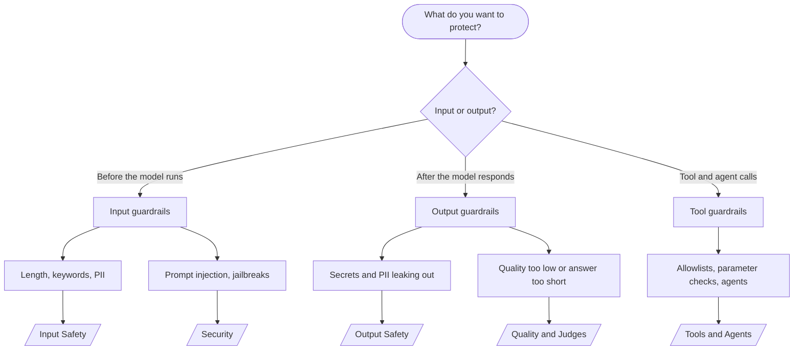

Every recipe on these pages comes from a script in the [`packages/examples`](https://github.com/jagreehal/ai-sdk-guardrails/tree/main/packages/examples) folder. The code is real, and so is the terminal output shown beneath it. The output blocks were captured by running each script against a local [Ollama](https://ollama.com) `llama3.2` model, so your wording will differ but the guardrail behaviour matches.

## Pick a recipe by what you want to protect



## The five recipe pages

| Page | Use it when |
| --- | --- |
| [Input Safety](/cookbook/input-safety/) | You need to stop bad input before it reaches the model: oversized prompts, banned terms, or PII. |
| [Output Safety](/cookbook/output-safety/) | You need to catch secrets, API keys, or PII in what the model sends back. |
| [Quality and Judges](/cookbook/quality-and-judges/) | You want to reject low-quality answers and retry, optionally using a second model as a judge. |
| [Security](/cookbook/security/) | You face prompt injection, jailbreak attempts, or role-confusion attacks. |
| [Tools and Agents](/cookbook/tools-and-agents/) | You run tool calls or agents and need allowlists, parameter checks, and retries. |

## Run any recipe yourself

```bash
# 1. Point the examples at a model. Local Ollama needs no API key:
ollama pull llama3.2

# 2. Run any script with tsx
cd packages/examples
npx tsx 01-input-length-limit.ts
```

To use a hosted provider instead, set the matching key (`OPENAI_API_KEY`, `GROQ_API_KEY`, `MISTRAL_API_KEY`) and swap the import in [`model.ts`](https://github.com/jagreehal/ai-sdk-guardrails/blob/main/packages/examples/model.ts).

## Full example index

The recipe pages cover the most common patterns. The repository holds 50+ scripts. Here is the complete list, grouped by intent.

### Input safety

| Example | Script |
| --- | --- |
| Input length limit | [`01-input-length-limit.ts`](https://github.com/jagreehal/ai-sdk-guardrails/blob/main/packages/examples/01-input-length-limit.ts) |
| Blocked keywords | [`02-blocked-keywords.ts`](https://github.com/jagreehal/ai-sdk-guardrails/blob/main/packages/examples/02-blocked-keywords.ts) |
| PII detection | [`03-pii-detection.ts`](https://github.com/jagreehal/ai-sdk-guardrails/blob/main/packages/examples/03-pii-detection.ts) |
| Rate limiting | [`13-rate-limiting.ts`](https://github.com/jagreehal/ai-sdk-guardrails/blob/main/packages/examples/13-rate-limiting.ts) |
| Business logic rules | [`14-business-logic.ts`](https://github.com/jagreehal/ai-sdk-guardrails/blob/main/packages/examples/14-business-logic.ts) |
| Memory minimization | [`26-memory-minimization.ts`](https://github.com/jagreehal/ai-sdk-guardrails/blob/main/packages/examples/26-memory-minimization.ts) |

### Output safety

| Example | Script |
| --- | --- |
| Output length check | [`04-output-length-check.ts`](https://github.com/jagreehal/ai-sdk-guardrails/blob/main/packages/examples/04-output-length-check.ts) |
| Sensitive output filter | [`05-sensitive-output-filter.ts`](https://github.com/jagreehal/ai-sdk-guardrails/blob/main/packages/examples/05-sensitive-output-filter.ts) |
| Schema validation | [`09-schema-validation.ts`](https://github.com/jagreehal/ai-sdk-guardrails/blob/main/packages/examples/09-schema-validation.ts) |
| Object content filter | [`10-object-content-filter.ts`](https://github.com/jagreehal/ai-sdk-guardrails/blob/main/packages/examples/10-object-content-filter.ts) |
| Secret leakage scan | [`18-secret-leakage-scan.ts`](https://github.com/jagreehal/ai-sdk-guardrails/blob/main/packages/examples/18-secret-leakage-scan.ts) |
| Hallucination detection | [`19-hallucination-detection.ts`](https://github.com/jagreehal/ai-sdk-guardrails/blob/main/packages/examples/19-hallucination-detection.ts) |
| Logging redaction | [`27-logging-redaction.ts`](https://github.com/jagreehal/ai-sdk-guardrails/blob/main/packages/examples/27-logging-redaction.ts) |

### Quality and judges

| Example | Script |
| --- | --- |
| Quality assessment | [`06-quality-assessment.ts`](https://github.com/jagreehal/ai-sdk-guardrails/blob/main/packages/examples/06-quality-assessment.ts) |
| LLM as judge | [`15-llm-as-judge.ts`](https://github.com/jagreehal/ai-sdk-guardrails/blob/main/packages/examples/15-llm-as-judge.ts) |
| Simple quality judge | [`15a-simple-quality-judge.ts`](https://github.com/jagreehal/ai-sdk-guardrails/blob/main/packages/examples/15a-simple-quality-judge.ts) |
| Response consistency | [`22-response-consistency.ts`](https://github.com/jagreehal/ai-sdk-guardrails/blob/main/packages/examples/22-response-consistency.ts) |
| Auto-retry on output | [`32-auto-retry-output.ts`](https://github.com/jagreehal/ai-sdk-guardrails/blob/main/packages/examples/32-auto-retry-output.ts) |
| Judge-driven auto-retry | [`35-judge-auto-retry.ts`](https://github.com/jagreehal/ai-sdk-guardrails/blob/main/packages/examples/35-judge-auto-retry.ts) |
| Autoevals integration | [`31-autoevals-guardrails.ts`](https://github.com/jagreehal/ai-sdk-guardrails/blob/main/packages/examples/31-autoevals-guardrails.ts) |

### Security

| Example | Script |
| --- | --- |
| Prompt injection detection | [`16-prompt-injection-detection.ts`](https://github.com/jagreehal/ai-sdk-guardrails/blob/main/packages/examples/16-prompt-injection-detection.ts) |
| Jailbreak detection | [`30-jailbreak-detection.ts`](https://github.com/jagreehal/ai-sdk-guardrails/blob/main/packages/examples/30-jailbreak-detection.ts) |
| Role hierarchy enforcement | [`23-role-hierarchy-enforcement.ts`](https://github.com/jagreehal/ai-sdk-guardrails/blob/main/packages/examples/23-role-hierarchy-enforcement.ts) |
| SQL and code safety | [`24-sql-code-safety.ts`](https://github.com/jagreehal/ai-sdk-guardrails/blob/main/packages/examples/24-sql-code-safety.ts) |
| Toxicity and de-escalation | [`29-toxicity-harassment-deescalation.ts`](https://github.com/jagreehal/ai-sdk-guardrails/blob/main/packages/examples/29-toxicity-harassment-deescalation.ts) |
| Advanced security bundle | [`39-advanced-security-guardrails.ts`](https://github.com/jagreehal/ai-sdk-guardrails/blob/main/packages/examples/39-advanced-security-guardrails.ts) |
| MCP security tests | [`41-mcp-security-test.ts`](https://github.com/jagreehal/ai-sdk-guardrails/blob/main/packages/examples/41-mcp-security-test.ts) |

### Tools and agents

| Example | Script |
| --- | --- |
| Tool call validation | [`17-tool-call-validation.ts`](https://github.com/jagreehal/ai-sdk-guardrails/blob/main/packages/examples/17-tool-call-validation.ts) |
| Basic tool allowlist | [`17a-basic-tool-allowlist.ts`](https://github.com/jagreehal/ai-sdk-guardrails/blob/main/packages/examples/17a-basic-tool-allowlist.ts) |
| Tool parameter validation | [`17b-tool-parameter-validation.ts`](https://github.com/jagreehal/ai-sdk-guardrails/blob/main/packages/examples/17b-tool-parameter-validation.ts) |
| Browsing domain allowlist | [`25-browsing-domain-allowlist.ts`](https://github.com/jagreehal/ai-sdk-guardrails/blob/main/packages/examples/25-browsing-domain-allowlist.ts) |
| Expected tool use + retry | [`34-expected-tool-use-retry.ts`](https://github.com/jagreehal/ai-sdk-guardrails/blob/main/packages/examples/34-expected-tool-use-retry.ts) |
| Agent + guardrails | [`36-agent-example.ts`](https://github.com/jagreehal/ai-sdk-guardrails/blob/main/packages/examples/36-agent-example.ts) |
| Agent routing reliability | [`38-agent-routing-reliability.ts`](https://github.com/jagreehal/ai-sdk-guardrails/blob/main/packages/examples/38-agent-routing-reliability.ts) |
| Comprehensive tool security | [`40-tool-guardrails.ts`](https://github.com/jagreehal/ai-sdk-guardrails/blob/main/packages/examples/40-tool-guardrails.ts) |

### Streaming and operations

| Example | Script |
| --- | --- |
| Streaming limits | [`11-streaming-limits.ts`](https://github.com/jagreehal/ai-sdk-guardrails/blob/main/packages/examples/11-streaming-limits.ts) |
| Streaming quality | [`12-streaming-quality.ts`](https://github.com/jagreehal/ai-sdk-guardrails/blob/main/packages/examples/12-streaming-quality.ts) |
| Streaming early termination | [`28-streaming-early-termination.ts`](https://github.com/jagreehal/ai-sdk-guardrails/blob/main/packages/examples/28-streaming-early-termination.ts) |
| Human review escalation | [`20-human-review-escalation.ts`](https://github.com/jagreehal/ai-sdk-guardrails/blob/main/packages/examples/20-human-review-escalation.ts) |
| Regulated advice compliance | [`21-regulated-advice-compliance.ts`](https://github.com/jagreehal/ai-sdk-guardrails/blob/main/packages/examples/21-regulated-advice-compliance.ts) |
| Telemetry integration | [`52-guardrails-with-telemetry.ts`](https://github.com/jagreehal/ai-sdk-guardrails/blob/main/packages/examples/52-guardrails-with-telemetry.ts) |
| SAIF governance bridge | [`55-saif-governance.ts`](https://github.com/jagreehal/ai-sdk-guardrails/blob/main/packages/examples/55-saif-governance.ts) |
