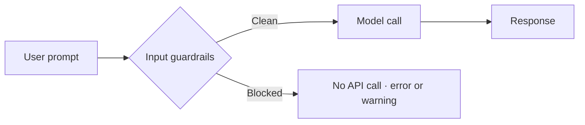

Input guardrails run before the model is called. A blocked request never spends a token, so these checks pay for themselves on the first abusive prompt. Each recipe below is a complete script you can run.



## Limit prompt length

A runaway prompt burns tokens and widens your prompt-injection surface. This guardrail rejects anything over 100 characters and shows the three ways to react: throw, warn, or proceed.

From [`01-input-length-limit.ts`](https://github.com/jagreehal/ai-sdk-guardrails/blob/main/packages/examples/01-input-length-limit.ts):

```ts
import { generateText } from 'ai';
import { defineInputGuardrail, withGuardrails } from 'ai-sdk-guardrails';
import { extractTextContent } from 'ai-sdk-guardrails/guardrails/input';

const lengthLimitGuardrail = defineInputGuardrail({
  name: 'input-length-limit',
  description: 'Limits input prompt length to prevent excessive usage',
  execute: async (params) => {
    const { prompt } = extractTextContent(params);
    const maxLength = 100;

    if (prompt.length > maxLength) {
      return {
        tripwireTriggered: true,
        message: `Input too long: ${prompt.length} characters (max: ${maxLength})`,
        severity: 'medium',
        metadata: { currentLength: prompt.length, maxLength },
      };
    }
    return { tripwireTriggered: false };
  },
});

const protectedModel = withGuardrails({
  model,
  inputGuardrails: [lengthLimitGuardrail],
  throwOnBlocked: true,
});
```

Running the script:

```text frame="terminal" title="npx tsx 01-input-length-limit.ts"
🛡️  Input Length Limit Example

Test 1: Short input (should pass)
✅ Success: AI stands for Artificial Intelligence, which refers to the simulation of human intelligence in machi...

Test 2: Long input (should be blocked)
❌ Input blocked: Input too long: 186 characters (max: 100)
❌ Expected blocking: Input blocked by guardrail: input-length-limit

Test 3: Long input with warning mode
⚠️  Warning: Input too long: 186 characters (max: 100)
✅ Proceeded with warning: [Input blocked: Input too long: 186 characters (max: 100)]...
```

`throwOnBlocked: true` turns a tripped guardrail into an error. Set it to `false` and the request continues while `onInputBlocked` logs the violation. Same guardrail, two policies.

## Block specific keywords

Sometimes the rule is a flat list of terms you never want to act on. This guardrail matches case-insensitively against `hack`, `exploit`, `malware`, and `virus`.

From [`02-blocked-keywords.ts`](https://github.com/jagreehal/ai-sdk-guardrails/blob/main/packages/examples/02-blocked-keywords.ts):

```ts
const blockedKeywordsGuardrail = defineInputGuardrail({
  name: 'blocked-keywords',
  description: 'Blocks prompts containing harmful or inappropriate keywords',
  execute: async (params) => {
    const { prompt } = extractTextContent(params);
    const blockedWords = ['hack', 'exploit', 'malware', 'virus'];

    const foundKeyword = blockedWords.find((keyword) =>
      prompt.toLowerCase().includes(keyword.toLowerCase()),
    );

    if (foundKeyword) {
      return {
        tripwireTriggered: true,
        message: `Blocked keyword detected: "${foundKeyword}"`,
        severity: 'high',
        metadata: { foundKeyword, blockedKeywords: blockedWords },
      };
    }
    return { tripwireTriggered: false };
  },
});
```

```text frame="terminal" title="npx tsx 02-blocked-keywords.ts"
🚫 Blocked Keywords Example

Test 1: Clean prompt (should pass)
✅ Success: Cybersecurity best practices are essential for protecting individuals, organizations, and sensitive ...

Test 2: Prompt with blocked keyword (should be blocked)
🛡️ Blocked: Blocked keyword detected: "hack"
   Keywords checked: [ 'hack', 'exploit', 'malware', 'virus' ]
❌ Expected blocking: Input blocked by guardrail: blocked-keywords

Test 3: Case-insensitive keyword detection
🛡️ Blocked: Blocked keyword detected: "virus"
   Keywords checked: [ 'hack', 'exploit', 'malware', 'virus' ]
❌ Expected blocking: Input blocked by guardrail: blocked-keywords
```

Note test 3: the prompt said `VIRUS` in caps and still tripped, because the check lowercases both sides before comparing.

## Detect and redact PII

A user pasting an email or SSN into your app is a compliance problem the moment it leaves your servers. This guardrail catches four PII shapes and demonstrates two responses: block the request, or redact the values and continue.

From [`03-pii-detection.ts`](https://github.com/jagreehal/ai-sdk-guardrails/blob/main/packages/examples/03-pii-detection.ts):

```ts
const patterns = [
  { name: 'SSN', regex: /\b\d{3}-\d{2}-\d{4}\b/, description: 'Social Security Number' },
  { name: 'Email', regex: /\b[A-Za-z0-9._%+-]+@[A-Za-z0-9.-]+\.[A-Z|a-z]{2,}\b/, description: 'Email address' },
  { name: 'Phone', regex: /\b(?:\+?1[-.\s]?)?\(?\d{3}\)?[-.\s]?\d{3}[-.\s]?\d{4}\b/, description: 'Phone number' },
  { name: 'Credit Card', regex: /\b(?:\d{4}[-\s]?){3}\d{4}\b/, description: 'Credit card number' },
];

const piiDetectionGuardrail = defineInputGuardrail({
  name: 'pii-detection',
  description: 'Detects and blocks personally identifiable information',
  execute: async (params) => {
    const { prompt } = extractTextContent(params);
    const detected = patterns.filter((p) => p.regex.test(prompt));

    if (detected.length > 0) {
      return {
        tripwireTriggered: true,
        message: `PII detected: ${detected.map((p) => p.name).join(', ')}`,
        severity: 'high',
        metadata: { detectedTypes: detected, count: detected.length },
      };
    }
    return { tripwireTriggered: false };
  },
});
```

```text frame="terminal" title="npx tsx 03-pii-detection.ts"
🔒 PII Detection Example

Test 1: Clean prompt (should pass)
✅ Success: Best practices for data privacy include:

1. Data minimization: Collect only the data that is necess...

Test 2: Prompt with email (should be blocked)
🛡️ PII Blocked: PII detected: Email
   Detected types:
   - Email: Email address
❌ Expected blocking: Input blocked by guardrail: pii-detection

Test 3: Prompt with SSN (should be blocked)
🛡️ PII Blocked: PII detected: SSN
   Detected types:
   - SSN: Social Security Number
❌ Expected blocking: Input blocked by guardrail: pii-detection

Test 5: Multiple PII types in one prompt
🛡️ PII Blocked: PII detected: Email, Phone
   Detected types:
   - Email: Email address
   - Phone: Phone number
❌ Expected blocking: Input blocked by guardrail: pii-detection

Test 6: PII Redaction Example
   Redacted prompt: Contact [EMAIL REDACTED] or [PHONE REDACTED]
✅ Processed with redaction
```

Blocking suits a banking assistant that must never see raw PII. Redaction suits a support bot that still needs the surrounding question. The library ships a maintained [`piiDetector()`](/reference/built-in-guardrails/) so you rarely write these regexes by hand; the inline version here shows what it does underneath.

## Combine input and output checks

Real apps stack guardrails. This recipe runs a length check and a keyword filter on input, plus a minimum-length check on output, all in one model wrapper. It uses warning mode so every violation is logged without throwing.

From [`07a-simple-combined-protection.ts`](https://github.com/jagreehal/ai-sdk-guardrails/blob/main/packages/examples/07a-simple-combined-protection.ts):

```ts
const protectedModel = withGuardrails({
  model,
  inputGuardrails: [lengthGuardrail, keywordGuardrail],
  outputGuardrails: [outputLengthGuardrail],
  throwOnBlocked: false,
  onInputBlocked: (summary) => {
    console.log('🚫 Input blocked:');
    for (const result of summary.blockedResults) {
      console.log(`   ${result.context?.guardrailName}: ${result.message}`);
    }
  },
  onOutputBlocked: (summary) => {
    console.log('⚠️  Output issue:');
    for (const result of summary.blockedResults) {
      console.log(`   ${result.context?.guardrailName}: ${result.message}`);
    }
  },
});
```

```text frame="terminal" title="npx tsx 07a-simple-combined-protection.ts"
🛡️  Simple Combined Protection Example

Test 1: Normal request (should pass all guards)
✅ Success: The benefits of renewable energy are numerous and significant. Some of the most notable advantages i...

Test 2: Long input (should be blocked)
🚫 Input blocked:
   length-check: Input too long: 610 characters (max: 200)

Test 3: Harmful keyword (should be blocked)
🚫 Input blocked:
   keyword-filter: Blocked keyword: hack

Test 4: Brief response request (may trigger output warning)
⚠️  Output issue:
   output-length: Response too short
Response: "[Output blocked: Response too short]"
```

Three guardrails, one wrapper. The input checks run in parallel before the call; the output check runs after. Each violation names the guardrail that fired (`length-check`, `keyword-filter`, `output-length`), which is what you want in logs.

## Next steps

- [Output Safety](/cookbook/output-safety/) catches problems in what the model sends back.
- [Security](/cookbook/security/) handles adversarial input: injection and jailbreaks.
- [Built-in Guardrails Reference](/reference/built-in-guardrails/) lists the maintained guardrails so you skip the hand-written regex.
