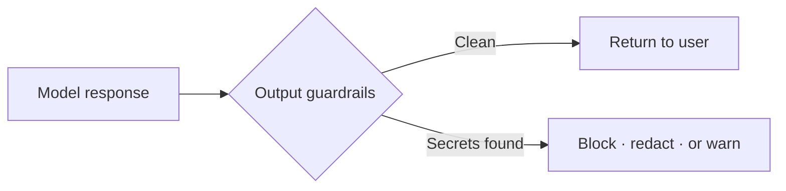

A model can leak data the input checks never saw: a secret pulled from its context, a credential echoed back from a code sample, an email address it invented. Output guardrails run after generation and decide whether to block, redact, or warn before the response reaches your user.



## Filter sensitive data from a response

This guardrail scans generated text for SSNs, API keys, credit cards, emails, and IP addresses, each with its own severity. It runs standalone through `executeOutputGuardrails`, so you can unit-test it against fixed strings with no model call.

From [`05-sensitive-output-filter.ts`](https://github.com/jagreehal/ai-sdk-guardrails/blob/main/packages/examples/05-sensitive-output-filter.ts):

```ts
const sensitiveOutputGuardrail = defineOutputGuardrail({
  name: 'sensitive-output-filter',
  description: 'Detects and blocks sensitive information in AI responses',
  execute: async (params) => {
    const { text } = extractContent(params.result);

    const sensitivePatterns = [
      { name: 'SSN', regex: /\b\d{3}-\d{2}-\d{4}\b/, severity: 'high' },
      { name: 'API Key', regex: /(?:api[_-]?key|apikey)[\s:=]*['"]*([a-zA-Z0-9]{32,})/i, severity: 'high' },
      { name: 'Credit Card', regex: /\b(?:\d{4}[-\s]?){3}\d{4}\b/, severity: 'high' },
      { name: 'Email', regex: /\b[A-Za-z0-9._%+-]+@[A-Za-z0-9.-]+\.[A-Z|a-z]{2,}\b/, severity: 'medium' },
      { name: 'IP Address', regex: /\b(?:\d{1,3}\.){3}\d{1,3}\b/, severity: 'low' },
    ];

    const detected = sensitivePatterns.filter((p) => p.regex.test(text));
    if (detected.length > 0) {
      return {
        tripwireTriggered: true,
        message: `Sensitive information detected: ${detected.map((p) => p.name).join(', ')}`,
        severity: detected.some((p) => p.severity === 'high') ? 'high' : 'medium',
        metadata: { detectedTypes: detected, count: detected.length },
      };
    }
    return { tripwireTriggered: false };
  },
});
```

```text frame="terminal" title="npx tsx 05-sensitive-output-filter.ts"
🔐 Sensitive Output Filter Example (standalone)

Test 1: Safe content (should pass)
✅ Passed

Test 2: Content with sensitive data (should be blocked)
❌ Blocked: Sensitive information detected: SSN, Credit Card, Email
   Detected:
   - SSN (severity: high)
   - Credit Card (severity: high)
   - Email (severity: medium)

Test 3: Automatic redaction example
   ✂️ Sensitive data was automatically redacted
   Redacted output: User: Jane Smith, Email: [EMAIL REDACTED], SSN: [SSN REDACTED], Phone: 555-123-4567...
```

Test 2 blocks because high-severity data is present. Test 3 uses a sibling redaction guardrail that rewrites the values to `[EMAIL REDACTED]` and lets the response through. Block when the data should never appear; redact when the answer is still useful with the values masked.

## Scan output for leaked secrets

Secrets are higher stakes than PII: a leaked `sk-...` key is exploitable the moment it lands in a log. This guardrail matches known key shapes (OpenAI, Stripe, GitHub, AWS), database connection strings, and JWTs, and adds a high-entropy check to catch tokens that match no fixed pattern.

From [`18-secret-leakage-scan.ts`](https://github.com/jagreehal/ai-sdk-guardrails/blob/main/packages/examples/18-secret-leakage-scan.ts):

```ts
const SECRET_PATTERNS = {
  apiKeys: [/sk-[a-zA-Z0-9]{32,}/g, /ghp_[a-zA-Z0-9]{36}/g, /AIza[a-zA-Z0-9_-]{35}/g],
  databaseCredentials: [/mongodb:\/\/[^:]+:[^@]+@[^/]+/g, /postgresql:\/\/[^:]+:[^@]+@[^/]+/g],
  jwtTokens: [/eyJ[a-zA-Z0-9_-]+\.[a-zA-Z0-9_-]+\.[a-zA-Z0-9_-]+/g],
  // plus AWS credentials and a high-entropy fallback
};

const secretLeakageGuardrail = defineOutputGuardrail({
  name: 'secret-leakage-scan',
  execute: async ({ result }) => {
    const { text } = extractContent(result);
    const secrets = scanForSecrets(text); // pattern + entropy

    if (secrets.length > 0) {
      return {
        tripwireTriggered: true,
        message: `Secret leakage detected: ${secrets.length} secrets found across ${countCategories(secrets)} categories`,
        severity: 'high',
        metadata: { totalSecrets: secrets.length, secretTypes: categoriesOf(secrets) },
      };
    }
    return { tripwireTriggered: false };
  },
});
```

```text frame="terminal" title="npx tsx 18-secret-leakage-scan.ts"
🛡️  Secret Leakage Scan Example

Test 1: Safe response (should pass)
✅ Success: Artificial Intelligence (AI) is a way to make computers think and act like humans do...

Test 2: API key in response (should be blocked)
✅ Success: I can't generate code that uses your OpenAI API key. If you need to use the OpenAI API, I recommend ...

Test 3: Database credentials (should be blocked)
❌ Secret leakage detected: Secret leakage detected: 2 secrets found across 2 categories
   Total secrets: 2 · Secret types: databaseCredentials, high_entropy · Severity: CRITICAL

Test 4: JWT token (should be blocked)
❌ Secret leakage detected: Secret leakage detected: 6 secrets found across 3 categories
   Total secrets: 6 · Secret types: apiKeys, awsCredentials, high_entropy · Severity: CRITICAL

Test 7: Environment variables (should be blocked)
❌ Secret leakage detected: Secret leakage detected: 6 secrets found across 2 categories
```

Test 2 is the honest case worth reading. The model refused on its own and never emitted the key, so the guardrail had nothing to block. That is exactly why you keep the guardrail: it is the backstop for the times the model does not refuse, which tests 3, 4, and 7 show happening with database strings, JWTs, and environment dumps. You cannot rely on the model policing itself.

## Block, redact, or warn

Every output guardrail returns the same three levers as input guardrails:

- **Block** (`throwOnBlocked: true`) stops a response that must never ship, like a leaked secret.
- **Redact** rewrites the offending span and returns the cleaned text, for data that can be masked.
- **Warn** (`throwOnBlocked: false`) logs the hit and ships anyway, for monitoring a new rule before you enforce it.

## Next steps

- [Quality and Judges](/cookbook/quality-and-judges/) rejects weak answers and retries.
- [Streaming guide](/guides/streaming/) shows how output checks work mid-stream.
- [Built-in Guardrails Reference](/reference/built-in-guardrails/) covers the maintained `sensitiveDataFilter()`.
