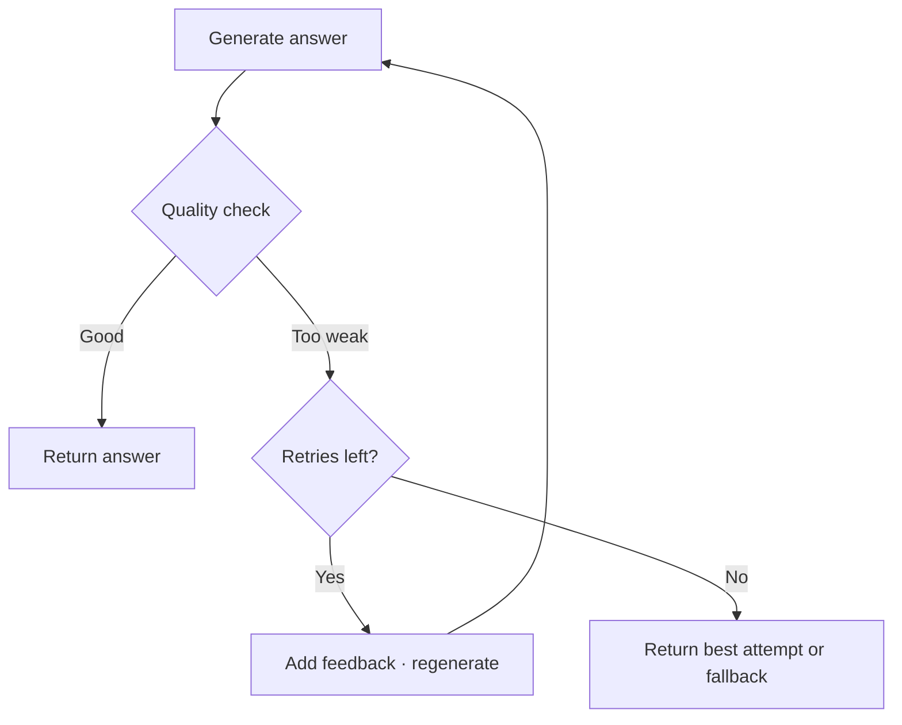

Safety guardrails ask "is this allowed?" Quality guardrails ask "is this good enough?" A too-short answer, a vague one, or one that skips the question all pass every security check and still fail your user. These recipes grade the output and, when it falls short, retry with corrective feedback instead of shipping it.



## Retry until the output meets a rule

The `retry` option turns a blocked output into another attempt. Your `buildRetryParams` function reads why it failed and rewrites the request, usually by raising the token budget and appending a corrective note. This recipe uses a deliberately strict rule (the answer must always be one character longer than it is) to force the retry path so you can watch it work.

From [`32-auto-retry-output.ts`](https://github.com/jagreehal/ai-sdk-guardrails/blob/main/packages/examples/32-auto-retry-output.ts):

```ts
const guarded = withGuardrails({
  model,
  outputGuardrails: [minLengthGuardrail],
  replaceOnBlocked: false, // let retry run first
  retry: {
    maxRetries: 1,
    buildRetryParams: ({ summary, lastParams }) => {
      const reason = summary.blockedResults[0]?.message ?? 'failed a guardrail';
      return {
        ...lastParams,
        maxOutputTokens: Math.max(800, (lastParams.maxOutputTokens ?? 400) + 300),
        prompt: [
          ...(Array.isArray(lastParams.prompt) ? lastParams.prompt : []),
          {
            role: 'user',
            content: [{ type: 'text', text: `Note: the previous answer ${reason}. Provide a comprehensive, detailed answer.` }],
          },
        ],
      };
    },
  },
});
```

```text frame="terminal" title="npx tsx 32-auto-retry-output.ts"
🛡️  Auto Retry Output Example

🔍 Checking output length: 806 chars (need 807)
❌ Output too short, will trigger retry
🔄 Retry triggered! Reason: Answer too short: 806 < 807
📝 Enhancing parameters for retry...
🔍 Checking output length: 2189 chars (need 2190)
❌ Output too short, will trigger retry
✅ Final: The Turing Test, proposed by Alan Turing in 1950, is a measure of a machine's ability...
📊 Length: 806 characters
```

Follow the loop. The first answer is 806 characters and fails. The retry appends feedback, raises the token cap, and produces a 2189-character answer. The rule is impossible by design, so after `maxRetries` the wrapper returns the best attempt rather than looping forever. In a real rule, the second attempt would pass and ship.

## Use a cheap model as a quality judge

You do not need a hand-written rubric. Send the answer to a model and ask for a score. This guardrail asks for a 1-to-10 rating and flags anything under 6. It runs in warning mode here, so every answer is graded and logged without blocking, which is how you calibrate a threshold before enforcing it.

From [`15a-simple-quality-judge.ts`](https://github.com/jagreehal/ai-sdk-guardrails/blob/main/packages/examples/15a-simple-quality-judge.ts):

```ts
const qualityJudgeGuardrail = defineOutputGuardrail({
  name: 'quality-judge',
  execute: async (context) => {
    const { text } = extractContent(context.result);
    if (text.length < 10) return { tripwireTriggered: false };

    const judgment = await generateText({
      model,
      prompt: `Rate this response on a scale of 1-10 for quality and helpfulness:\n\n"${text}"\n\nRespond with just a number (1-10):`,
    });
    const score = Number.parseInt(judgment.text.trim());

    if (Number.isNaN(score) || score < 6) {
      return {
        tripwireTriggered: true,
        message: `Response quality too low (score: ${score}/10)`,
        severity: score < 4 ? 'high' : 'medium',
        metadata: { qualityScore: score },
      };
    }
    return { tripwireTriggered: false, metadata: { qualityScore: score } };
  },
});
```

```text frame="terminal" title="npx tsx 15a-simple-quality-judge.ts"
⚖️ Simple Quality Judge Example

Test 1: Request for detailed explanation
✅ Response evaluated by quality judge
Response: The water cycle, also known as the hydrologic cycle, is the continuous process by which water...

Test 2: Request for very brief response
✅ Response processed (check quality evaluation above)
Response: "Yes"

Test 3: Normal informational request
✅ Response evaluated
Response: Regular exercise provides numerous physical and mental health benefits...
```

The judge call costs tokens, so reserve it for output you cannot grade with a regex. The example falls back to approving the answer if the judge call fails, so a flaky judge never blocks a good response.

## Feed the judge's reasons back into a retry

Combine the two: a judge scores the answer, and when the score is low its reasons drive the retry. The next attempt sees exactly what was wrong. This recipe forces a low score on the first try to make the loop visible.

From [`35-judge-auto-retry.ts`](https://github.com/jagreehal/ai-sdk-guardrails/blob/main/packages/examples/35-judge-auto-retry.ts):

```ts
const judgedModel = withGuardrails({
  model,
  outputGuardrails: [llmJudgeGuardrail],
  retry: {
    maxRetries: 2,
    backoffMs: (n) => n * 250,
    buildRetryParams: ({ summary, lastParams }) => {
      const meta = summary.blockedResults[0]?.metadata?.llmJudgment;
      const feedback = `Previous answer was judged score ${meta?.score}/10. Issues: ${meta?.issues?.join(', ')}. Improve clarity, structure, and add concrete details.`;
      return {
        ...lastParams,
        maxOutputTokens: Math.max(800, (lastParams.maxOutputTokens ?? 400) + 200),
        prompt: [
          ...(Array.isArray(lastParams.prompt) ? lastParams.prompt : []),
          { role: 'user', content: [{ type: 'text', text: feedback }] },
        ],
      };
    },
  },
});
```

```text frame="terminal" title="npx tsx 35-judge-auto-retry.ts"
🛡️  LLM-as-Judge Auto-Retry Example

🔄 Forcing retry on first attempt (demo)
✅ Final (after retries if needed):
The Turing Test is a measure of a machine's ability to exhibit intelligent behavior equivalent to,
or indistinguishable from, that of a human. In 1950, Alan Turing proposed the test as a way to
assess a machine's capacity for thought and communication...

🔄 Feedback: Previous answer was judged score 3/10. Issues: First attempt - forcing retry for demo.
Reason: Demonstrating auto-retry functionality. Improve clarity, structure, and add concrete details.
```

The feedback line is the whole point. The model does not just try again blindly; it gets told the previous answer scored 3 out of 10 and why. That turns a retry from a coin flip into a directed correction.

## Next steps

- [Output Safety](/cookbook/output-safety/) covers secret and PII checks that run alongside quality checks.
- [Tools and Agents](/cookbook/tools-and-agents/) applies the same retry mechanism to enforce tool use.
- [Advanced Features](/guides/advanced-features/) documents every `retry` option.
