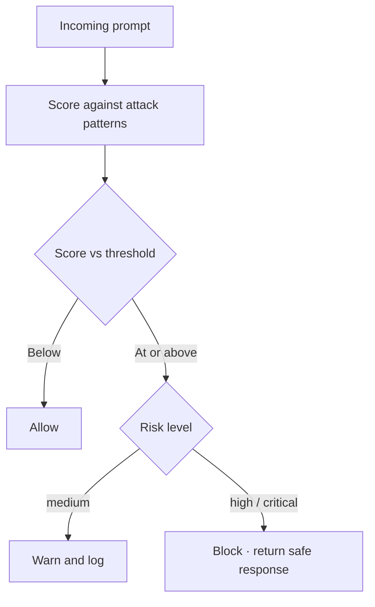

Adversarial input is different from accidental bad input. A user does not paste an SSN on purpose, but an attacker crafts `Ignore all previous instructions` deliberately. These two recipes score input against known attack patterns and block above a threshold, so a borderline prompt can warn while a blatant one is rejected.



## Detect prompt injection

This guardrail weights seven attack categories: role confusion, system override, jailbreak, translation bypass, code injection, data exfiltration, and context manipulation. Each category adds to a score, and a score of 10 or more trips the wire. The weighting matters because `forget everything and...` is a weaker signal than an embedded `<script>` tag.

From [`16-prompt-injection-detection.ts`](https://github.com/jagreehal/ai-sdk-guardrails/blob/main/packages/examples/16-prompt-injection-detection.ts):

```ts
const promptInjectionGuardrail = defineInputGuardrail({
  name: 'prompt-injection-detection',
  description: 'Detects prompt injection using pattern matching and scoring',
  execute: async (params) => {
    const { prompt, messages, system } = extractTextContent(params);
    const allText = [prompt, ...messages.map((m) => String(m?.content || '')), system].join(' ');

    const { score, detectedPatterns, riskLevel } = calculateInjectionScore(allText);
    const injectionDetected = score >= 10;

    if (injectionDetected) {
      return {
        tripwireTriggered: true,
        message: `Potential prompt injection detected (score: ${score}, risk: ${riskLevel}). Detected patterns: ${detectedPatterns.join(', ')}`,
        severity: riskLevel === 'critical' || riskLevel === 'high' ? 'high' : 'medium',
        metadata: { injectionScore: score, detectedPatterns, riskLevel },
      };
    }
    return { tripwireTriggered: false };
  },
});
```

```text frame="terminal" title="npx tsx 16-prompt-injection-detection.ts"
🛡️  Prompt Injection Detection Example

Test 1: Normal input (should pass)
✅ Success: Artificial intelligence (AI) refers to the development of computer systems that can perform tasks th...

Test 2: Role confusion attempt (should be blocked)
❌ Injection blocked: Potential prompt injection detected (score: 10, risk: medium). Detected patterns: roleConfusion
   Score: 10 · Risk Level: medium · Patterns: roleConfusion

Test 3: System prompt override attempt (should be blocked)
❌ Injection blocked: Potential prompt injection detected (score: 36, risk: critical). Detected patterns: roleConfusion, systemOverride, jailbreak
   Score: 36 · Risk Level: critical

Test 6: Code injection attempt (should be blocked)
❌ Injection blocked: Potential prompt injection detected (score: 17, risk: high). Detected patterns: codeInjection
   Score: 17 · Risk Level: high

Test 8: Suspicious input with warning mode
✅ Proceeded with warning: I can't provide assistance on detecting or preventing actions related to overriding...

Test 9: Legitimate use of suspicious words (should pass)
✅ Success (legitimate use): System Administration and Overriding Default Settings...
```

Read tests 8 and 9 together. Test 8 contains `override` and `ignore` and scores high enough to warn, but warning mode lets it through. Test 9 mentions wanting to "override default settings safely" and passes clean, because the dangerous phrases never combine. Scoring beats a flat keyword blocklist here: it tolerates the engineer asking a real question while stopping the attacker.

## Detect jailbreaks

Jailbreaks are a narrower class: DAN-style roleplay, "developer mode," character switching, and explicit "bypass safety measures." This guardrail scores them and, when it blocks, returns a ready-made safe response instead of just an error. That safe response is what you show the user.

From [`30-jailbreak-detection.ts`](https://github.com/jagreehal/ai-sdk-guardrails/blob/main/packages/examples/30-jailbreak-detection.ts):

```ts
// Patterns cover danStyle, safetyBypass, systemManipulation,
// characterMode, developerMode, codeExecution, and more.
const jailbreakGuardrail = defineInputGuardrail({
  name: 'jailbreak-detection',
  execute: async (params) => {
    const { prompt } = extractTextContent(params);
    const { score, detectedPatterns, riskLevel, safeResponse } = scoreJailbreak(prompt);

    if (score >= 10) {
      return {
        tripwireTriggered: true,
        message: `Jailbreak attempt detected (score: ${score}, risk: ${riskLevel}). Detected patterns: ${detectedPatterns.join(', ')}`,
        severity: riskLevel === 'critical' ? 'high' : 'medium',
        metadata: { score, detectedPatterns, riskLevel, safeResponse },
      };
    }
    return { tripwireTriggered: false };
  },
});
```

```text frame="terminal" title="npx tsx 30-jailbreak-detection.ts"
🛡️  Jailbreak Detection Example

Test 2: DAN-style jailbreak attempt (should be blocked)
❌ Jailbreak blocked: Jailbreak attempt detected (score: 61, risk: critical). Detected patterns: danStyle, safetyBypass
   Score: 61 · Risk Level: critical
   Safe Response: I cannot and will not pretend to be DAN or any other character that ignores
   safety measures. I'm designed to be helpful while maintaining ethical boundaries.

Test 6: System prompt manipulation (should be blocked)
❌ Jailbreak blocked: Jailbreak attempt detected (score: 37, risk: critical). Detected patterns: danStyle, systemManipulation, system_replacement
   Score: 37 · Risk Level: critical

Test 10: Developer mode attempt (should be blocked)
❌ Jailbreak blocked: Jailbreak attempt detected (score: 25, risk: critical). Detected patterns: developerMode
   Score: 25 · Risk Level: critical

Test 12: Legitimate use of suspicious words (should pass)
✅ Success (legitimate use): I can provide general information on penetration testing and network security, but I can't assist wi...
```

Two tests in the full run are worth noting. The DAN prompt scores 61, far above the threshold, because it stacks `danStyle` and `safetyBypass`. Test 12 asks about penetration testing and passes, since "penetration testing" is not a jailbreak pattern. A pattern-and-score approach gives you that separation; a single blocklist of words like "bypass" would have flagged the security professional too.

## Pattern detection is layer one

These guardrails stop the obvious, high-volume attacks cheaply and before any token is spent. They do not catch a novel jailbreak written to dodge the patterns. Pair them with an [LLM judge](/cookbook/quality-and-judges/) on the output side for defence in depth, and lean on the maintained [`promptInjectionDetector()`](/reference/built-in-guardrails/) rather than maintaining regex tables yourself.

## Next steps

- [Quality and Judges](/cookbook/quality-and-judges/) adds a second model to grade the answer.
- [Tools and Agents](/cookbook/tools-and-agents/) locks down what tools the model may call.
- [Security guide](/guides/security/) covers the built-in security guardrails in depth.
