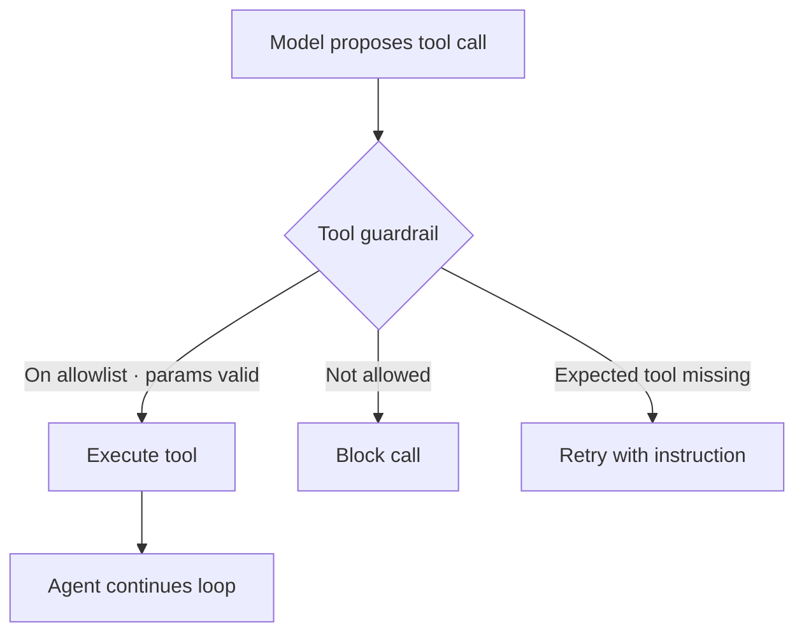

When a model can call tools, a bad output stops being just text and becomes an action: a deleted file, a charged card, a request to an internal host. Tool guardrails sit between the model deciding to call a function and that function running. The same wrappers extend to full agent loops.



## Allowlist the tools a model may call

Start with the simplest rule that matters: only these functions may run. This guardrail checks every proposed call against a fixed list and blocks anything else, so a model that decides to call `deleteAllFiles` is stopped before the call leaves your process.

From [`17a-basic-tool-allowlist.ts`](https://github.com/jagreehal/ai-sdk-guardrails/blob/main/packages/examples/17a-basic-tool-allowlist.ts):

```ts
const ALLOWED_FUNCTIONS = ['calculate', 'formatDate', 'getWeather'];

const toolAllowlistGuardrail = defineOutputGuardrail({
  name: 'tool-allowlist',
  description: 'Only allows specific functions to be called',
  execute: async (context) => {
    const toolCalls = extractToolCalls(context.result);

    for (const call of toolCalls) {
      const fn = call.function ?? call.functionName ?? call.name;
      if (!ALLOWED_FUNCTIONS.includes(fn)) {
        return {
          tripwireTriggered: true,
          message: `Function '${fn}' is not allowed. Allowed functions: ${ALLOWED_FUNCTIONS.join(', ')}`,
          severity: 'high',
          metadata: { blockedFunction: fn, allowedFunctions: ALLOWED_FUNCTIONS },
        };
      }
    }
    return { tripwireTriggered: false };
  },
});
```

```text frame="terminal" title="npx tsx 17a-basic-tool-allowlist.ts"
🛡️  Basic Tool Allowlist Example

Test 1: Valid function call (should pass)
✅ Success: {
  "calculation": { "function": "calculate", "arguments": { "expression": "[[2, '+', 2]]" } }
}

Test 2: Invalid function call (should be blocked)
❌ Expected blocking: Function 'deleteAllFiles' is not allowed. Allowed functions: calculate, formatDate, getWeather

Test 3: Multiple valid function calls
✅ Success: {
  "calculation": { "function": "calculate", "arguments": { "expression": "5*3" } },
  "weather": { "function": "getWeather", "arguments": { "location": "London" } }
}
```

Test 2 is the one that earns its keep. The model produced a `deleteAllFiles` call and the guardrail rejected it by name before any handler saw it. An allowlist fails closed: a tool you forgot to add is blocked, not run.

## Require a tool to be used, then retry if it was not

Sometimes the failure is the opposite: the model answers from memory when it should have called a tool. `expectedToolUse` blocks an answer that skipped the required tool, and with `retry` it re-prompts the model to use it. In older versions this needed a hand-written `buildRetryParams`; now the guardrail builds the corrective instruction itself.

From [`34-expected-tool-use-retry.ts`](https://github.com/jagreehal/ai-sdk-guardrails/blob/main/packages/examples/34-expected-tool-use-retry.ts):

```ts
import { expectedToolUse } from 'ai-sdk-guardrails/guardrails/tools';

const toolGuarded = withGuardrails({
  model,
  outputGuardrails: [
    expectedToolUse({
      tools: 'calculator',
      retry: { maxRetries: 2 }, // that's it, no buildRetryParams needed
    }),
  ],
  replaceOnBlocked: false,
  throwOnBlocked: false,
});

const { text } = await generateText({
  model: toolGuarded,
  prompt: 'Add 17 and 29. Provide your reasoning and final answer.',
  tools: calculatorTool,
});
```

```text frame="terminal" title="npx tsx 34-expected-tool-use-retry.ts"
🛠️  Expected Tool Use + Auto-Retry Example (v5.0 Simplified DX)

Calculator: 17 + 29 = 46
✅ Final (tool should be used):
```

The `Calculator: 17 + 29 = 46` line is the tool's own log: it confirms the model called the calculator rather than guessing the sum. The guardrail saw the expected tool and let the answer through. Had the model skipped the tool, the retry would have re-prompted it with an instruction to use `calculator`.

## Guard a full agent loop

`agentGuardrails` applies the same machinery to a `ToolLoopAgent`, so an output guardrail governs the agent's final answer across all its steps. Here a quality guardrail requires the research agent to write at least 50 characters and cite a source, with auto-retry to correct a weak first answer.

From [`36-agent-example.ts`](https://github.com/jagreehal/ai-sdk-guardrails/blob/main/packages/examples/36-agent-example.ts):

```ts
import { ToolLoopAgent, stepCountIs } from 'ai';
import { agentGuardrails } from 'ai-sdk-guardrails';

const researchAgent = new ToolLoopAgent({
  ...agentGuardrails({
    model,
    outputGuardrails: [qualityGuardrail], // min length + must cite a source
    throwOnBlocked: false,
    replaceOnBlocked: true,
    retry: { maxRetries: 2 },
  }),
  instructions: 'You are a research assistant. Use the search tool, then cite your sources.',
  tools: { search: searchTool, analyze: analysisTool },
  stopWhen: stepCountIs(5),
  toolChoice: 'auto',
});

const result = await researchAgent.generate({ prompt: 'What is the tallest mountain in the world?' });
```

```text frame="terminal" title="npx tsx 36-agent-example.ts"
🤖 Agent Class + Guardrails Example
🔬 Starting research task...

✅ Research Result:
[Output blocked: Response too short - provide more detailed information]

📊 Steps taken: 1
🔧 Tools used: 0
```

This run is honest about what the guardrail does. The local `llama3.2` model returned a short answer without calling the search tool, so the quality guardrail blocked it and, because `replaceOnBlocked` is set, returned the safe replacement message instead of the weak answer. That is the guardrail doing its job: a substandard agent response never reached the user. A stronger model would call the tool, clear the length and citation checks, and return the real answer. The guardrail is what guarantees the floor regardless of which model you run.

## Next steps

- [Quality and Judges](/cookbook/quality-and-judges/) explains the retry mechanism these tool guardrails reuse.
- [Security](/cookbook/security/) blocks adversarial input before it ever proposes a tool call.
- [Custom Guardrails](/guides/custom-guardrails/) shows how to write parameter-level tool validation.
