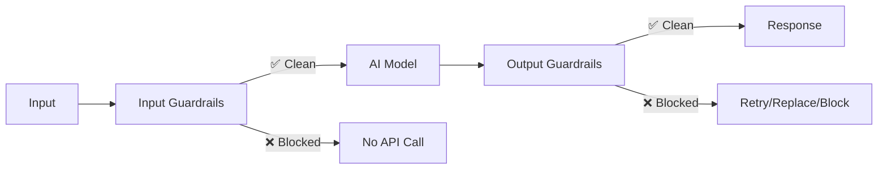

Guardrails run **in parallel** with your AI calls as middleware, providing a non-invasive way to add safety and quality controls.

## Architecture



## Three-Step Workflow

1. **Receive**: Input or output arrives
2. **Check**: Guardrails run (PII detection, validation, etc.)
3. **Decide**: Pass through, block, or retry

## Middleware Pattern

Guardrails are implemented as middleware, which means:

- **Non-invasive**: Your existing code doesn't change
- **Composable**: Stack multiple guardrails together
- **Observable**: Works with your existing telemetry and logging
- **Flexible**: Add, remove, or modify guardrails without touching core logic

## Input Guardrails

Input guardrails run **before** the AI model is called:

```ts
const model = withGuardrails(openai('gpt-4o'), {
  inputGuardrails: [
    piiDetector(),           // Check for PII
    promptInjectionDetector(), // Check for injection
  ],
});
```

**Benefits:**
- ✅ Block bad requests before API costs
- ✅ Prevent compliance violations
- ✅ Protect against prompt injection
- ✅ No wasted tokens

## Output Guardrails

Output guardrails run **after** the AI model responds:

```ts
const model = withGuardrails(openai('gpt-4o'), {
  outputGuardrails: [
    sensitiveDataFilter(),    // Remove secrets
    minLengthRequirement(100), // Enforce quality
  ],
});
```

**Behaviors:**
- **Block**: Prevent response from being returned
- **Replace**: Return a safe fallback message
- **Retry**: Automatically retry with modified parameters
- **Warn**: Log violation but allow response

## Streaming Support

Guardrails work seamlessly with streaming:

### Buffer Mode (Default)

Wait for the entire stream to complete, then check:

```ts
const model = withGuardrails(openai('gpt-4o'), {
  outputGuardrails: [minLengthRequirement(100)],
  streamMode: 'buffer', // Default
});
```

**When to use:**
- Need to validate complete responses
- Running quality checks that require full text
- Checking output length or structure

### Progressive Mode

Check guardrails as tokens arrive (early termination):

```ts
const model = withGuardrails(openai('gpt-4o'), {
  outputGuardrails: [toxicityFilter()],
  streamMode: 'progressive',
});
```

**When to use:**
- Need to stop generation early
- Detecting violations in real-time
- Saving costs by early termination

## Parallel Execution

All guardrails in a group run in parallel for maximum performance:

```ts
const model = withGuardrails(openai('gpt-4o'), {
  inputGuardrails: [
    piiDetector(),           // Runs in parallel
    promptInjectionDetector(), // Runs in parallel
    profanityFilter(),        // Runs in parallel
  ],
});
```

**Result**: Fastest possible validation with minimal latency.

## Error Handling

Guardrails can be configured to handle errors gracefully:

```ts
const model = withGuardrails(openai('gpt-4o'), {
  inputGuardrails: [piiDetector()],
  throwOnBlocked: true,  // Throw errors
  continueOnFailure: true, // Continue if guardrail fails
});
```

See [Error Handling](/error-handling/) for detailed strategies.
