# AI SDK Guardrails

## Safety and quality controls for Vercel AI SDK

Add guardrails to your AI applications in one line of code. Block PII, prevent prompt injection, enforce output quality - while keeping your existing telemetry and observability stack intact.

[](https://www.npmjs.com/package/ai-sdk-guardrails)
[](https://www.npmjs.com/package/ai-sdk-guardrails)
[](https://bundlephobia.com/package/ai-sdk-guardrails)
[](../../LICENSE)


## Drop-in Guardrails for any AI model

```ts
import { withGuardrails, piiDetector } from 'ai-sdk-guardrails';
const model = openai('gpt-4o'); // or any other AI model

// Everything else stays the same
const safeModel = withGuardrails(model, {
  inputGuardrails: [piiDetector()],
});

// Your existing code, telemetry, and logging still works
await generateText({ model: safeModel, prompt: '...' });
```

**That's it.** Your AI now blocks PII automatically.

## Installation

```bash
npm install ai-sdk-guardrails
```

## 🧙‍♂️ No-Code Wizard (New!)

**Don't want to write code?** Use our visual wizard to configure guardrails:

1. **Open the wizard**: [wizard-prototype/index.html](../../wizard-prototype/index.html)
2. **Choose your use case**: Content moderation, data protection, quality assurance, or security
3. **Select guardrails**: Pick from 40+ built-in guardrails
4. **Configure settings**: Adjust thresholds and parameters with sliders and toggles
5. **Copy generated code**: Get production-ready TypeScript code instantly

**Perfect for:**

- 🎯 **Non-technical users** who need AI safety
- 🚀 **Quick prototyping** of guardrail configurations
- 📚 **Learning** how to use the library
- 👥 **Team onboarding** and training

The wizard generates code that works out of the box - just copy, paste, and run!

## Why Guardrails Matter

Real problems that guardrails solve:

❌ **Without guardrails:**

```ts
// User: "My email is john@company.com, help me..."
// → Sends PII to model → Compliance violation → $$$
```

✅ **With guardrails:**

```ts
const model = withGuardrails(baseModel, {
  inputGuardrails: [piiDetector()], // Blocks before API call
});
// → Request blocked → No PII leak → No cost → Compliant
```

Common use cases:

- 🛡️ **Compliance**: Block PII before it reaches your model
- 💰 **Cost control**: Stop bad requests before they cost money
- 🔒 **Security**: Prevent prompt injection and data exfiltration
- ✅ **Quality**: Enforce minimum response standards
- 🔧 **Production**: Works with your existing observability tools

## Copy-Paste Examples

### Basic Protection (Most Common)

```ts
import { generateText } from 'ai';
import { openai } from '@ai-sdk/openai';
import {
  withGuardrails,
  piiDetector,
  promptInjectionDetector,
} from 'ai-sdk-guardrails';

const model = withGuardrails(openai('gpt-4o'), {
  inputGuardrails: [piiDetector(), promptInjectionDetector()],
});

// Use exactly like before - nothing else changes
const { text } = await generateText({
  model,
  prompt: 'Write a friendly email',
});
```

### Input + Output Protection

```ts
import {
  withGuardrails,
  piiDetector,
  sensitiveDataFilter,
  minLengthRequirement,
} from 'ai-sdk-guardrails';

const model = withGuardrails(openai('gpt-4o'), {
  inputGuardrails: [piiDetector()], // Block PII in prompts
  outputGuardrails: [
    sensitiveDataFilter(), // Remove secrets from responses
    minLengthRequirement(100), // Enforce quality standards
  ],
});
```

### Works With Streaming

```ts
import { streamText } from 'ai';

const model = withGuardrails(openai('gpt-4o'), {
  outputGuardrails: [minLengthRequirement(100)],
});

// Streaming just works - guardrails run after stream completes
const { textStream } = await streamText({ model, prompt: '...' });
for await (const chunk of textStream) {
  process.stdout.write(chunk);
}
```

### Production Setup (With Error Handling)

```ts
import { isGuardrailsError } from 'ai-sdk-guardrails';

const model = withGuardrails(openai('gpt-4o'), {
  inputGuardrails: [piiDetector(), promptInjectionDetector()],
  outputGuardrails: [sensitiveDataFilter()],
  throwOnBlocked: true, // Throw errors instead of silent blocking
});

try {
  const { text } = await generateText({ model, prompt: '...' });
  console.log(text);
} catch (error) {
  if (isGuardrailsError(error)) {
    console.error('Blocked by guardrail:', error.message);
    // Show user-friendly message
  }
}
```

## How It Works

Guardrails run **in parallel** with your AI calls as middleware:

```mermaid
flowchart LR
  A[Input] --> B[Input Guardrails]
  B -->|✅ Clean| C[AI Model]
  B -->|❌ Blocked| X[No API Call]
  C --> D[Output Guardrails]
  D -->|✅ Clean| E[Response]
  D -->|❌ Blocked| R[Retry/Replace/Block]
```



**Three-step workflow:**

1. **Receive**: Input or output arrives
2. **Check**: Guardrails run (PII detection, validation, etc.)
3. **Decide**: Pass through, block, or retry

**Key benefit**: Non-invasive. Your existing telemetry, logging, and observability tools keep working because guardrails are just middleware.

## Built-in Guardrails

### Input Guardrails (Run Before Model)

| Guardrail                   | Purpose                          | Example             |
| --------------------------- | -------------------------------- | ------------------- |
| `piiDetector()`             | Block emails, phones, SSNs       | Compliance, privacy |
| `promptInjectionDetector()` | Detect injection attempts        | Security            |
| `blockedKeywords()`         | Block specific terms             | Content policy      |
| `inputLengthLimit()`        | Enforce max input length         | Cost control        |
| `rateLimiting()`            | Per-user rate limits             | Abuse prevention    |
| `profanityFilter()`         | Block offensive language         | Content moderation  |
| `toxicityDetector()`        | Detect toxic content             | Safety              |
| `allowedToolsGuardrail()`   | Restrict which tools can be used | Tool security       |

### Output Guardrails (Run After Model)

| Guardrail                 | Purpose                     | Example                   |
| ------------------------- | --------------------------- | ------------------------- |
| `sensitiveDataFilter()`   | Remove secrets, API keys    | Security                  |
| `minLengthRequirement()`  | Enforce minimum length      | Quality control           |
| `outputLengthLimit()`     | Enforce maximum length      | Cost/UX control           |
| `toxicityFilter()`        | Block toxic responses       | Safety                    |
| `jsonValidation()`        | Validate JSON structure     | Structured output         |
| `schemaValidation()`      | Validate against Zod schema | Type safety               |
| `confidenceThreshold()`   | Require minimum confidence  | Quality                   |
| `hallucinationDetector()` | Detect uncertain claims     | Accuracy                  |
| `secretRedaction()`       | Redact secrets from output  | Security                  |
| `mcpSecurityGuardrail()`  | MCP tool security           | Prevent data exfiltration |

### MCP Security Guardrails

Protect against prompt injection and data exfiltration when using Model Context Protocol (MCP) tools:

```ts
import { mcpSecurityGuardrail, mcpResponseSanitizer } from 'ai-sdk-guardrails';

const model = withGuardrails(openai('gpt-4o'), {
  outputGuardrails: [
    mcpSecurityGuardrail({
      detectExfiltration: true, // Detect data exfiltration attempts
      scanEncodedContent: true, // Scan base64/hex encoded content
      allowedDomains: ['api.company.com'], // Domain allowlist
      maxContentSize: 51200, // 50KB limit
      injectionThreshold: 0.7, // Sensitivity (lower = stricter)
    }),
    mcpResponseSanitizer(), // Clean malicious content vs blocking
  ],
});
```

**Attack vectors prevented:**

- ✅ Direct prompt injection
- ✅ Tool response poisoning
- ✅ Data exfiltration via URLs
- ✅ Encoded attacks (base64/hex)
- ✅ Cascading exploits
- ✅ Context poisoning

See [MCP Security documentation](#mcp-security-guardrails-advanced) for full details.

## Advanced Features

### Custom Guardrails

Create domain-specific guardrails:

```ts
import { defineInputGuardrail, defineOutputGuardrail } from 'ai-sdk-guardrails';
import { extractContent } from 'ai-sdk-guardrails/guardrails/output';

// Custom input guardrail
const businessHours = defineInputGuardrail({
  name: 'business-hours',
  execute: async () => {
    const hour = new Date().getHours();
    return hour >= 9 && hour <= 17
      ? { tripwireTriggered: false }
      : { tripwireTriggered: true, message: 'Outside business hours' };
  },
});

// Custom output guardrail
const minQuality = defineOutputGuardrail({
  name: 'min-quality',
  execute: async ({ result }) => {
    const { text } = extractContent(result);
    return text.length >= 100
      ? { tripwireTriggered: false }
      : { tripwireTriggered: true, message: 'Response too short' };
  },
});

const model = withGuardrails(openai('gpt-4o'), {
  inputGuardrails: [businessHours],
  outputGuardrails: [minQuality],
});
```

### Auto-Retry on Failures

Automatically retry when output doesn't meet requirements:

```ts
import {
  wrapWithOutputGuardrails,
  minLengthRequirement,
} from 'ai-sdk-guardrails';

const model = wrapWithOutputGuardrails(
  openai('gpt-4o'),
  [minLengthRequirement(100)],
  {
    retry: {
      maxRetries: 2,
      buildRetryParams: ({ lastParams }) => ({
        ...lastParams,
        // Increase max tokens on retry
        maxOutputTokens: (lastParams.maxOutputTokens ?? 400) + 200,
        // Add context about the failure
        prompt: [
          ...lastParams.prompt,
          {
            role: 'user',
            content: 'Please provide a more detailed response.',
          },
        ],
      }),
    },
  },
);
```

### Reusable Configurations

Create reusable guardrail sets:

```ts
import {
  createGuardrails,
  piiDetector,
  sensitiveDataFilter,
} from 'ai-sdk-guardrails';

// Define once
const productionGuards = createGuardrails({
  inputGuardrails: [piiDetector()],
  outputGuardrails: [sensitiveDataFilter()],
  throwOnBlocked: true,
});

// Apply to multiple models
const gpt4 = productionGuards(openai('gpt-4o'));
const claude = productionGuards(anthropic('claude-3-sonnet'));
```

### Streaming Modes

Control when guardrails run during streaming:

```ts
const model = withGuardrails(openai('gpt-4o'), {
  outputGuardrails: [minLengthRequirement(100)],
  streamMode: 'progressive', // Run guardrails as tokens arrive
  replaceOnBlocked: true, // Replace blocked output with fallback
});
```

- `buffer` (default): Wait for stream to complete, then check
- `progressive`: Check guardrails as tokens arrive (early termination)

### Agent Support

Guardrails work with AI SDK Agents:

```ts
import { withAgentGuardrails } from 'ai-sdk-guardrails';
import { tool } from 'ai';

const agent = withAgentGuardrails(
  {
    model: openai('gpt-4o'),
    tools: { search: searchTool },
    system: 'You are a helpful assistant.',
  },
  {
    inputGuardrails: [piiDetector()],
    outputGuardrails: [sensitiveDataFilter()],
    toolGuardrails: [
      toolEgressPolicy({
        allowedHosts: ['api.company.com'],
        scanForUrls: true,
      }),
    ],
  },
);

const result = await agent.generate({ prompt: '...' });
```

## Advanced Stopping Mechanisms

Control exactly **when and how** guardrails stop execution with powerful, composable stopping mechanisms:

### 1. AbortSignal-Based Stopping

Clean, standard API for canceling AI operations:

```ts
import { createGuardrailAbortController } from 'ai-sdk-guardrails';

const { signal, abortOnViolation } = createGuardrailAbortController();

const model = withGuardrails(openai('gpt-4o'), {
  outputGuardrails: [toxicityFilter()],
  onOutputBlocked: abortOnViolation('critical'), // Abort on critical violations
});

// Signal will be aborted if critical violation detected
await streamText({ model, prompt: '...', abortSignal: signal });
```

**Features:**

- Standard AbortController API
- Severity-based abortion (`'low' | 'medium' | 'high' | 'critical'`)
- Custom abort conditions
- Manual abortion support

### 2. Stream Transform with Source-Level Stopping

Stop streaming at the **source** (most efficient):

```ts
import { createGuardrailStreamTransform } from 'ai-sdk-guardrails';

const result = streamText({
  model,
  prompt: 'Tell me a story',
  experimental_transform: createGuardrailStreamTransform(
    [toxicityFilter(), piiDetector()],
    {
      stopOnSeverity: 'high', // Stop on high/critical
      checkInterval: 1, // Check every chunk
      onViolation: (summary) => {
        // Violation callback
        console.log('Stopped:', summary);
      },
    },
  ),
});
```

**Modes:**

- `createGuardrailStreamTransform` - Progressive checking (each chunk)
- `createGuardrailStreamTransformBuffered` - Buffered checking (on flush)

### 3. Token-Level Control

Reduce overhead with smart token-based checking:

```ts
import {
  createTokenBudgetTransform,
  createTokenAwareGuardrailTransform,
} from 'ai-sdk-guardrails';

experimental_transform: [
  // Hard token limit
  createTokenBudgetTransform({
    maxTokens: 1000,
    onBudgetExceeded: (info) => console.log(info),
  }),

  // Check guardrails every N tokens (not every chunk!)
  createTokenAwareGuardrailTransform([toxicityFilter()], {
    checkEveryTokens: 50, // Check every 50 tokens
    maxTokens: 1000, // Combined with budget
    stopOnSeverity: 'high',
  }),
];
```

**Benefits:**

- Reduce guardrail overhead by 80%+
- Cost control with token budgets
- Custom tokenizer support

### 4. Adaptive Multi-Step Execution

Self-correcting behavior across multi-step agent execution:

```ts
import {
  createAdaptivePrepareStep,
  type GuardrailViolation,
} from 'ai-sdk-guardrails';

const violations: GuardrailViolation[] = [];

const agent = new Agent({
  model,
  tools: { search: searchTool },
  prepareStep: createAdaptivePrepareStep({
    violations,
    escalateAfter: 3, // Stop after 3 violations
    strategy: (violations) => ({
      temperature: Math.max(0.1, 0.7 - violations.length * 0.1),
      system: `${violations.length} violations detected. Be careful.`,
    }),
  }),
});

// Track violations
withAgentGuardrails(agent, {
  outputGuardrails: [toxicityFilter()],
  onOutputBlocked: (summary, context, step) => {
    violations.push({ step, summary });
  },
});
```

**Features:**

- Progressive temperature reduction
- Custom adaptive strategies
- Escalation to auto-stop
- Lookback window configuration

### 5. Tool Execution Abortion

Prevent dangerous tool execution before or during execution:

```ts
import { wrapToolWithAbortion } from 'ai-sdk-guardrails';

const safeTool = wrapToolWithAbortion(
  dangerousApiTool,
  [urlValidator, paramValidator],
  {
    checkBefore: true, // Validate before execution
    monitorDuring: true, // Monitor during execution
    monitorInterval: 1000, // Check every second
    checkInputDelta: true, // Monitor streaming inputs
    abortOnSeverity: 'critical',
  },
);
```

**Protection:**

- Pre-execution validation
- Real-time monitoring
- Streaming input checking
- Manual abortion control

### 6. Finish Reason & Metadata

Better observability with proper finish reasons and metadata:

```ts
import { createFinishReasonEnhancement } from 'ai-sdk-guardrails';

// Automatically set in middleware, or manually:
const enhanced = createFinishReasonEnhancement(summary, result);

console.log(enhanced.finishReason); // 'content_filter' for blocks
console.log(enhanced.providerMetadata.guardrails);
// {
//   blocked: true,
//   violations: [{ message: '...', severity: 'high', ... }],
//   executionTime: 50,
//   stats: { passed: 2, blocked: 1, failed: 0 }
// }
```

**Features:**

- Standard `content_filter` finish reason
- Structured violation metadata
- Execution statistics
- Custom metadata preservation

## MCP Security Guardrails (Advanced)

**Production-Ready**: Protect against the ["lethal trifecta" vulnerability](https://simonwillison.net/2025/Jun/16/the-lethal-trifecta/) when using Model Context Protocol (MCP) tools.

### The Problem

AI agents with MCP tools are vulnerable when they have:

1. **Access to private data** (through tools)
2. **Process untrusted content** (from tool responses)
3. **Can communicate externally** (make web requests)

Malicious tool responses can contain hidden instructions that trick the AI into exfiltrating sensitive data.

### Production Configuration

Full configurability with sensible defaults:

```ts
import {
  withGuardrails,
  promptInjectionDetector,
  mcpSecurityGuardrail,
  mcpResponseSanitizer,
  toolEgressPolicy,
} from 'ai-sdk-guardrails';

// Conservative production setup (high security)
const secureModel = withGuardrails(openai('gpt-4o'), {
  inputGuardrails: [
    promptInjectionDetector({ threshold: 0.6, includeExamples: true }),
  ],
  outputGuardrails: [
    mcpSecurityGuardrail({
      injectionThreshold: 0.5, // Lower = more sensitive
      maxSuspiciousUrls: 0, // Zero tolerance
      maxContentSize: 25600, // 25KB limit
      minEncodedLength: 15, // Detect shorter encoded attacks
      encodedInjectionThreshold: 0.2, // Combined threshold
      highRiskThreshold: 0.3, // High-risk cascade blocking
      authorityThreshold: 0.5, // Authority manipulation detection
      allowedDomains: ['api.company.com', 'trusted-partner.com'],
      customSuspiciousDomains: ['evil.com'],
      blockCascadingCalls: true,
      scanEncodedContent: true,
      detectExfiltration: true,
    }),
    mcpResponseSanitizer(), // Clean vs block
    toolEgressPolicy({
      allowedHosts: ['api.company.com'],
      blockedHosts: ['webhook.site', 'requestcatcher.com'],
      scanForUrls: true,
    }),
  ],
});
```

### Environment-Based Configuration

```ts
function getSecurityConfig(env: 'production' | 'staging' | 'development') {
  const configs = {
    production: {
      injectionThreshold: 0.5, // High security
      maxContentSize: 25600, // 25KB
      authorityThreshold: 0.5,
    },
    staging: {
      injectionThreshold: 0.7, // Balanced
      maxContentSize: 51200, // 50KB
      authorityThreshold: 0.7,
    },
    development: {
      injectionThreshold: 0.8, // Permissive
      maxContentSize: 102400, // 100KB
      authorityThreshold: 0.8,
    },
  };
  return configs[env];
}

const model = withGuardrails(openai('gpt-4o'), {
  outputGuardrails: [mcpSecurityGuardrail(getSecurityConfig('production'))],
});
```

### Configuration Options

| Option                      | Default | Description                                      |
| --------------------------- | ------- | ------------------------------------------------ |
| `injectionThreshold`        | 0.7     | Prompt injection confidence threshold (0-1)      |
| `maxSuspiciousUrls`         | 0       | Max allowed suspicious URLs (0 = zero tolerance) |
| `maxContentSize`            | 51200   | Max content size in bytes (50KB default)         |
| `minEncodedLength`          | 20      | Min encoded content length to analyze            |
| `encodedInjectionThreshold` | 0.3     | Combined encoded + injection threshold           |
| `authorityThreshold`        | 0.7     | Authority manipulation detection sensitivity     |
| `allowedDomains`            | []      | Allowed domains for URL construction             |
| `customSuspiciousDomains`   | []      | Additional suspicious domain patterns            |

See complete examples:

- [Production MCP Configuration](../examples/44-production-mcp-config.ts)
- [MCP Security Test Suite](../examples/41-mcp-security-test.ts)
- [Enhanced Security Testing](../examples/43-enhanced-mcp-security-test.ts)

## Error Handling

### Throw Errors on Block

```ts
const model = withGuardrails(openai('gpt-4o'), {
  inputGuardrails: [piiDetector()],
  throwOnBlocked: true, // Throw errors instead of silent blocking
});

try {
  const { text } = await generateText({ model, prompt: '...' });
} catch (error) {
  if (isGuardrailsError(error)) {
    console.error('Blocked:', error.message);
    // error.results gives details per guardrail
  }
}
```

### Error Types

- `GuardrailsInputError` - Input guardrail blocked
- `GuardrailsOutputError` - Output guardrail blocked
- `GuardrailExecutionError` - Guardrail threw an error
- `GuardrailTimeoutError` - Guardrail exceeded timeout
- `GuardrailConfigurationError` - Invalid configuration

## API Reference

### Primary Functions

| Function                  | Purpose                                  |
| ------------------------- | ---------------------------------------- |
| `withGuardrails`          | Wrap model with guardrails (main API)    |
| `createGuardrails`        | Create reusable guardrail configurations |
| `withAgentGuardrails`     | Wrap AI SDK Agents with guardrails       |
| `defineInputGuardrail`    | Create custom input guardrail            |
| `defineOutputGuardrail`   | Create custom output guardrail           |
| `executeInputGuardrails`  | Run input guardrails programmatically    |
| `executeOutputGuardrails` | Run output guardrails programmatically   |

### Error Utilities

| Function            | Purpose                              |
| ------------------- | ------------------------------------ |
| `isGuardrailsError` | Check if error is from guardrails    |
| `extractErrorInfo`  | Extract structured error information |

### Retry Utilities

| Function                     | Purpose                           |
| ---------------------------- | --------------------------------- |
| `retry`                      | Standalone retry utility          |
| `exponentialBackoff`         | Exponential backoff strategy      |
| `linearBackoff`              | Linear backoff strategy           |
| `jitteredExponentialBackoff` | Jittered exponential backoff      |
| `backoffPresets`             | Pre-configured backoff strategies |

See source for all built-in guardrails:

- Input helpers: [`./src/guardrails/input.ts`](./src/guardrails/input.ts)
- Output helpers: [`./src/guardrails/output.ts`](./src/guardrails/output.ts)
- Tool helpers: [`./src/guardrails/tools.ts`](./src/guardrails/tools.ts)
- MCP security: [`./src/guardrails/mcp-security.ts`](./src/guardrails/mcp-security.ts)

## Examples

Browse 48+ runnable examples: [examples/README.md](../examples/README.md) |

### Quick Starts

| Example                    | Description                     | File                                                                              |
| -------------------------- | ------------------------------- | --------------------------------------------------------------------------------- |
| Simple combined protection | Minimal input and output setup  | [07a-simple-combined-protection.ts](../examples/07a-simple-combined-protection.ts) |
| Auto retry on output       | Retry until output meets a rule | [32-auto-retry-output.ts](../examples/32-auto-retry-output.ts)                     |
| LLM judge auto-retry       | Judge feedback drives retry     | [35-judge-auto-retry.ts](../examples/35-judge-auto-retry.ts)                       |
| Weather assistant          | End-to-end input/output + retry | [33-blog-post-weather-assistant.ts](../examples/33-blog-post-weather-assistant.ts) |

### Input Safety

| Example            | Description                         | File                                                            |
| ------------------ | ----------------------------------- | --------------------------------------------------------------- |
| Input length limit | Enforce max input length            | [01-input-length-limit.ts](../examples/01-input-length-limit.ts) |
| Blocked keywords   | Block specific terms                | [02-blocked-keywords.ts](../examples/02-blocked-keywords.ts)     |
| PII detection      | Detect PII before calling the model | [03-pii-detection.ts](../examples/03-pii-detection.ts)           |
| Rate limiting      | Simple per-user rate limit          | [13-rate-limiting.ts](../examples/13-rate-limiting.ts)           |

### Output Safety

| Example                 | Description                         | File                                                                      |
| ----------------------- | ----------------------------------- | ------------------------------------------------------------------------- |
| Output length check     | Require min/max output length       | [04-output-length-check.ts](../examples/04-output-length-check.ts)         |
| Sensitive output filter | Filter secrets and PII in responses | [05-sensitive-output-filter.ts](../examples/05-sensitive-output-filter.ts) |
| Hallucination detection | Flag uncertain factual claims       | [19-hallucination-detection.ts](../examples/19-hallucination-detection.ts) |

### Streaming

| Example           | Description                        | File                                                                              |
| ----------------- | ---------------------------------- | --------------------------------------------------------------------------------- |
| Streaming limits  | Apply limits in buffered streaming | [11-streaming-limits.ts](../examples/11-streaming-limits.ts)                       |
| Streaming quality | Quality checks with streaming      | [12-streaming-quality.ts](../examples/12-streaming-quality.ts)                     |
| Early termination | Stop streams early when blocked    | [28-streaming-early-termination.ts](../examples/28-streaming-early-termination.ts) |

### Advanced

| Example                    | Description                   | File                                                                            |
| -------------------------- | ----------------------------- | ------------------------------------------------------------------------------- |
| Simple quality judge       | Cheaper model judges quality  | [15a-simple-quality-judge.ts](../examples/15a-simple-quality-judge.ts)           |
| Secret leakage scan        | Scan responses for secrets    | [18-secret-leakage-scan.ts](../examples/18-secret-leakage-scan.ts)               |
| SQL code safety            | Basic SQL safety checks       | [24-sql-code-safety.ts](../examples/24-sql-code-safety.ts)                       |
| Role hierarchy enforcement | Enforce role rules in prompts | [23-role-hierarchy-enforcement.ts](../examples/23-role-hierarchy-enforcement.ts) |

## Migration from v3.x

API naming has been improved in v4.x (old names still work but are deprecated):

```ts
// Before (v3.x - still works but deprecated)
import { wrapWithGuardrails, InputBlockedError } from 'ai-sdk-guardrails';
const model = wrapWithGuardrails(openai('gpt-4o'), { ... });

// After (v4.x - recommended)
import { withGuardrails, GuardrailsInputError } from 'ai-sdk-guardrails';
const model = withGuardrails(openai('gpt-4o'), { ... });
```

Changes:

- `wrapWithGuardrails` → `withGuardrails`
- `wrapAgentWithGuardrails` → `withAgentGuardrails`
- `InputBlockedError` → `GuardrailsInputError`
- `OutputBlockedError` → `GuardrailsOutputError`

## Compatibility

- **Runtime**: Node.js 18+ recommended
- **AI SDK**: Compatible with AI SDK 5.x (`ai@^5`)
- **TypeScript**: Full type safety with TypeScript 5+
- **Works with any model**: OpenAI, Anthropic, Mistral, Groq, etc.

## Why This Library?

**Non-invasive**: Guardrails are middleware. Your existing code, telemetry (Langfuse, Helicone), and logging stay intact.

**Production-ready**: Used in production by teams who need compliance, security, and cost control without rebuilding their infrastructure.

**Developer experience**: One line to add safety. Progressive complexity - start simple, add advanced features when needed.

**Type-safe**: Rich TypeScript types and inference throughout.

**Comprehensive**: 40+ built-in guardrails covering security, quality, compliance, and performance.

**Advanced features**: Early detection, parallel execution, enhanced prompt injection detection, MCP security, and more.

## Contributing

Issues and PRs are welcome.

## License

MIT © Jag Reehal. See [LICENSE](../../LICENSE) for details.
